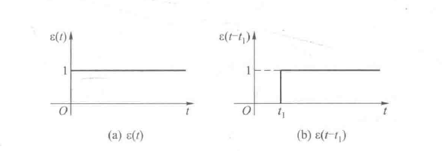
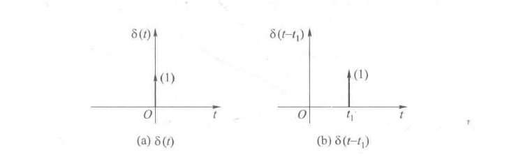
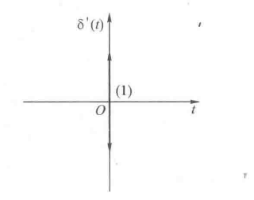

# 信号与系统1：绪论

## 前提摘要

1. 个人说明：

   **限于时间紧迫以及作者水平有限，本文错误、疏漏之处恐不在少数，恳请读者批评指正。意见请留言或者发送邮件至：“noahpanzzz@gmail.com”**

2. 参考

   - 《信号与线性系统》管致中
   - 《信号与系统》郑君里

3. 日期：2024-02-13

---

## 正文

### 信号的定义

信号是一个随**时间变化**的**物理量**。

1. 信号必须是一个物理量。
2. 信号必须是一个变化量。
3. 信号的自变量必须是时间。

### 信号的描述

1. 时域法：将信号表示成时间的函数$f(t)$
2. 频域法：通过正交变换，将信号表示成其他变量的函数。

### 信号的分类

- 确定性信号：信号可以用一个确定的时间函数加以确定。
- 随机信号：信号不可以用一个确定的时间函数加以确定。

---

- 连续信号：除若干不连续的时间点外，每个时间点上都有对应的信号值。

- 离散信号：信号只在某些不连续的时间点上有信号值，其他时间点上信号没有定义。

---

- 周期信号：
  - 连续信号$f(t)=f(t+mT)$——最小的$T$值周期；

  - 离散信号$f(k)=f(k+mN)$——最小的整数N值。

- 非周期信号：不满足上述定义的信号。

注意：

1. 连续的正弦（或余弦）函数${\sin}{\omega}t[{\cos}{\omega}t]$一定是周期信号，其周期$T=\frac{2\pi}{\omega}$

2. 离散的正弦（或余弦）序列${\sin}{\theta}k[{\cos}{\theta}k]$（其中${\theta}$称为数字角频率，单位为$rad$）。

   只有当$\frac{2\pi}{\theta}$为有理数时才是周期序列，其周期为$N=M*\frac{2\pi}{\theta}$，M取使N为整数的最小整数。

3. 两个连续周期信号之和不一定是周期信号，只有当两连续信号的周期$T_{1}$与$T_{2}$之比为有理数时，其和信号才是周期信号，其周期$T$等于$T_{1}$、$T_{2}$的最小公倍数。
4. 两个离散周期序列之和一定是周期序列，其周期$N$等于两个序列周期的最小公倍数。

补充：在实际应用中，绝对的周期信号是不存在的，一般只要在很长的时间内信号满足周期性就可以了。

---

- 能量信号($0<E<\infty,P=0$)：平均功率为零，总能量有限的信号。
- 功率信号($0<P<\infty,E=\infty$)：平均功率有限且非零，总能量无限的信号。

将信号施加到1$\Omega$电阻上，消耗的能量$E=\int_{-\infty}^{\infty}|f(t)|^{2}dt$，$E=\sum_{k=-\infty}^{\infty}|f(t)|^{2}$；消耗的功率$P=\lim\limits_{T\to\infty}\frac{1}{T}\int_{-\frac{T}{2}}^{\frac{T}{2}}|f(t)|^{2}dt$，$P=\lim\limits_{N\to\infty}\frac{1}{2N+1}\sum_{K=-N}^{N}|f(k)|^{2}$

---

- 奇信号：满足等式$f(-t)=-f(t)$的信号。
- 偶信号：满足等式$f(-t)=f(t)$的信号。

---

### 信号的简单处理

1. 加(减)：$f(t) = f_{1}(t)+f_{2}(t)$。

2. 乘：$f(t)=f_{1}(t)*f_{2}(t)$。

3. 延时或平移：$f(t)\rightarrow f(t-t_{0}),t_{0}>0:右移;t_{0}<0:左移$。

4. 反褶：$f(t)\rightarrow f(-t)$。

5. 尺度变化：$f(t) \rightarrow f(at),|a|>1:尺度缩小;|a|<1:尺度放大;当a<0时，还必须包含反褶$。

6. 标量乘法：$f(t)\rightarrow af(t)$。

7. 混合计算：$f(t) \rightarrow f(at+b)$,做该类题目建议按照移位$\rightarrow$尺度$\rightarrow$反褶，即$f(t) \rightarrow f(at) \rightarrow f(at+b)$。

8. 反向计算：$f(at+b) \rightarrow f(t)$,做该类题目建议按照反褶$\rightarrow$尺度$\rightarrow$移位，即$f(at+b) \rightarrow f(at) \rightarrow  f(t)$。

**进行混合计算的目的：已知简单信号的特性，求解未知信号的特性；未知信号可以由简单信号经过有限次的混合计算而得；那么就可以通过简单信号的特性来求解未知信号的特性。**

---

混合计算举例：

例1：$f(t)\rightarrow f(3-4t)$

a:（常规方法）
$$
f(t)\rightarrow f(4t)\rightarrow f(-4t)\rightarrow f(-4(t-\frac{3}{4}))
$$
b：(移尺反)
$$
f(t) \rightarrow f(t+3) \rightarrow f(4t+3) \rightarrow f(-4t+3)
$$

---

### 典型信号

1. 指数信号，衰减指数信号

   - 指数信号：

   $$
   f(t)=Ke^{at}
   $$

   - 衰减指数信号：

   $$
   f(t)=
   \begin{align}
   \left\{\begin{matrix}
   0 \qquad &(t<0)\\
   e^{-\frac{t}{\tau}} \qquad &(t<0)
   \end{matrix}\right.
   \end{align}
   $$

2. 正弦信号:$f(t)=Ksin({\omega}t+\theta)$

   $K$是振幅，$\omega$是角频率，$f$为频率，$\theta$为初相位。关系$T=\frac{2\pi}{\omega}=\frac{1}{f}$

3. 衰减正弦信号
   $$
   f(t)=
   \begin{align}
   \left\{\begin{matrix}
   0 \qquad &(t<0)\\
   e^{-at}\sin({\omega}t) \qquad &(t≥0)
   \end{matrix}\right.
   \end{align}
   $$
   注意：

   **画图题要求**

   - 包络趋势（虚线）
   - 起始点
   - 第一个过零点

   附：欧拉公式
   $$
   \begin{align}
   \left\{\begin{matrix}
   e^{j{\omega}t}&= \cos({\omega}t)+j\sin({\omega}t)\\
   e^{-j{\omega}t}&= \cos({\omega}t)-j\sin({\omega}t)\\
   \end{matrix}\right.
   \end{align}
   $$

   $$
   \begin{align}
   \left\{\begin{matrix}
   \sin({\omega}t) &=\frac{1}{2j}(e^{j{\omega}t}-e^{-j{\omega}t})\\
   \cos({\omega}t) &=\frac{1}{2}(e^{j{\omega}t}+e^{-j{\omega}t})
   \end{matrix}\right.
   \end{align}
   $$

   $$
   e^{j0}=1,e^{j\frac{\pi}{2}}=j,e^{j\pi}=-1,e^{-j\frac{\pi}{2}}=-j
   $$

4. $Sa(t)$信号(抽样信号)：$Sa(t)=\frac{\sin t}{t}$

   性质：偶函数，在$t$正负两方向振幅都在递减，当$t=\pm \pi,\pm 2\pi,...,\pm n\pi$，函数值为0
   $$
   \begin{align}
   \left\{\begin{matrix}
   \int_{0}^{+\infty}Sa(t)\mathrm{dt}&=\frac{\pi}{2}\\
   \int_{-\infty}^{+\infty}Sa(t)\mathrm{dt}&=\pi\\
   \end{matrix}\right.
   \end{align}
   \qquad
   Sa(\omega t)=\frac{\sin\omega t}{\omega t}
   $$

   注意：

   求解$\int_{-\infty}^{+\infty}Sa(t)\mathrm{dt}=\pi$：
   $$
   S_{\triangle}=
   \begin{align}
   \left\{\begin{matrix}
   1.求顶点:Sa(0)=\lim\limits_{x \to 0} \frac{\sin t}{t}=1\\
   2.求第一个过零点:Sa(\pi)=0
   \end{matrix}\right.
   \end{align}
   \qquad \int_{-\infty}^{+\infty}Sa(t)\mathrm{dt}=S_{\triangle}=\frac{1}{2}*d*h=\frac{1}{2}*2\pi*1=\pi
   $$

   求解$\int_{-\infty}^{+\infty}\frac{\sin\pi t}{3t}\mathrm{dt}=\frac{\pi}{3}$：
   $$
   \int_{-\infty}^{+\infty}\frac{\sin\pi t}{3t}\mathrm{dt}=S_{\triangle}=\frac{1}{2}*d*h=\frac{1}{2}*2*\frac{\pi}{3}=\frac{\pi}{3}
   $$

5. 冲激信号和阶跃信号

   - 单位斜边信号$r(t)$
     $$
     r(t)=t\varepsilon (t)=
     \left\{\begin{matrix}
     t &t>0\\
     0 &t<0
     \end{matrix}\right.
     $$
     

   - 阶跃函数$\varepsilon(t)$
     $$
     \varepsilon (t)= 
     \left\{\begin{matrix}
     1 &t> 0\\
     无定义&t=0\\
     0 &t< 0
     \end{matrix}\right.
     $$
     

     注意：

     1. 任意函数乘以ε(t)以后，其t＜0的部分等于0，成为有始函数。
     2. t=0,不可导点。
     3. 在很多文件中，用u(t)表示阶跃函数。

   - 冲激函数$\delta(t)$

     冲激函数的定义：

     - 导数定义：$\delta(t)=\frac{d\varepsilon(t)}{dt}$。

     - 面积定义：$\int_{-\infty}^{+\infty}\delta(t)\mathrm{dt}=1$,$\delta(t)=0(t≠0)$。

     - 广义定义：$\int_{-\infty}^{+\infty}f(t)\delta(t-t_{0})\mathrm{dt}=f(t_{0})$。

     

   - 冲激偶函数$\delta^{'}(t)$

     

     **性质：**
   
     1. 与普通函数的积分：
   
     $$
     \begin{align}
     &f(t)\delta(t)=f(0)\delta(t) \\[2mm]
     &\int_{-\infty}^{+\infty} f(t)\delta (t)\mathrm{dt}=f(0)  \\[2mm]
     &f(t){\delta}'(t)= f(0){\delta}'(t)-{f}'(0)\delta(t) \\[2mm]
     &\int_{-\infty}^{+\infty} f(t){\delta}'(t)\mathrm{dt}=-{f}'(0) \\[2mm]
     \end{align}
     $$
   
     2. 与普通函数的积分（移位）：
   
     $$
     \begin{align}
     &f(t)\delta(t-t_{0})=f(t_{0})\delta(t-t_{0})\\[2mm]
     &\int_{-\infty}^{+\infty} f(t)\delta (t-t_{0})\mathrm{dt}=f(t_{0})\\[2mm]
     &f(t){\delta}'(t-t_{0})= f(t_{0}){\delta}'(t-t_{0})-{f}'(t_{0})\delta(t)\\[2mm]
     &\int_{-\infty}^{+\infty} f(t){\delta}'(t-t_{0})\mathrm{dt}=-{f}'(t_{0})\\[2mm]
     \end{align}
     $$
   
     3. 尺度变换：
        $$
        \begin{align}
        &\delta(at)=\frac{1}{|a|}\delta(t)\\[2mm]
        &\delta(at+b)=\frac{1}{|a|}\delta(t+\frac{b}{a})\\[2mm]
        &{\delta}'(at)=\frac{1}{|a|}\frac{1}{a}{\delta}'(t)\\[2mm]
        &{\delta}^{(n)}(at)=\frac{1}{|a|}\frac{1}{a^{n}}{\delta}^{(n)}(t)\\[2mm]
        &\delta(\varphi (t))=\sum_{k}\frac{\delta(t-t_{k})}{|{\varphi}'(t_{k})|}(t_{k}为{\varphi}(t)的单零点,不需要考虑重根)\\[2mm]
        \end{align}
        $$
        举例：求解$\delta(t^{2}-4)$
        $$
        \begin{align}
        &\varphi(t)=(t-2)(t+2)=0\qquad t_{1}=2,t_{2}=-2\\
        &\varphi^{'}(t)=2t\\
        &\delta(t^{2}-2)=\frac{1}{|2*2|}\delta(t-2)+\frac{1}{|2*-2|}\delta(t+2)=\frac{1}{4}\delta(t-2)+\frac{1}{4}\delta(t+2)
        \end{align}
        $$
   
     4. 奇偶性：
   
        冲激函数是偶函数，冲激偶函数是奇函数。
        $$
        \begin{align}
        &\delta(-t)=\delta(t)\\[2mm]
        &{\delta}'(-t)=-{\delta}'(t)\\[2mm]
        &{\delta}^{(n)}(-t)=(-1)^{n}{\delta}^{(n)}(t)\\[2mm]
        \end{align}
        $$
   
     上式中，**函数与冲激偶函数$\delta^{'}(t)$的运算容易被忽略，需要注意**。
     $$
     \ce{斜边信号<=>[微分][积分]阶跃信号<=>[微分][积分]冲激信号<=>[微分][积分]冲激偶信号}
     $$
   
   - 门函数$g_{\tau}(t)$
   
     $$
     g_{\tau}(t)= 
     \left\{\begin{matrix} 
     1 &|t|<\frac{\tau}{2}\\
     0 &|t|>\frac{\tau}{2}
     \end{matrix}\right.=\varepsilon(t+\frac{\tau}{2})-\varepsilon(t-\frac{\tau}{2})
     $$
   
   - 符号函数$sgn(t)$
     $$
     sgn(t)= 
     \left\{\begin{matrix} 
     1 &t>0\\
     -1 &t<0
     \end{matrix}\right.=2u(t)-1
     $$
     与阶跃函数的关系：$sgn(t)= 2u(t)-1$，容易被忽略，牢记（**易考察符号函数的傅里叶变换，就是以此等式求得**）。

### 信号的分解

直流分量和交流分量：$f(t)=f_{D}(t)+f_{A}(t)$
$$
\left\{\begin{matrix} 
f_{D}=\frac{1}{T}\int_{-\frac{T}{2}}^{\frac{T}{2}}f(t)\mathrm{dt}\\
f_{A}=f(t)-f_{D}(t)
\end{matrix}\right.
$$
奇分量和偶分量：$f(t)=f_{e}(t)+f_{o}(t)$
$$
\left\{\begin{matrix} 
f_{e}=\frac{1}{2}[f(t)+f(-t)]\\
f_{o}=\frac{1}{2}[f(t)-f(-t)]
\end{matrix}\right.
$$

---

### 系统定义

系统是一个由若干互有关联的单元组成的、具有某种功能、用来达到某些特定目标的有机整体。

### 系统模型与分类

### 系统性质

线性时不变系统的性质和判断

1. 线性系统与非线性系统

   - 可分解性：$y(\cdot)=y_{zi}(\cdot)+y_{zs}(\cdot)$

   - 齐次性(含零输入响应齐次性和零状态响应齐次性)即
     $$
     \{ax(0)\} \rightarrow \{ay_{zi}(\cdot)\}\\
     \{af(\cdot)\} \rightarrow \{ay_{zs}(\cdot)\}\\
     $$

   - 叠加性(含零输入响应叠加性和零状态响应叠加性)即
     $$
     \{x_{1}(0)+x_{2}(0)\} \rightarrow \{y_{zi1}(\cdot)+y_{zi2}(\cdot)\}\\
     \{f_{1}(\cdot)+f_{2}(\cdot)\} \rightarrow \{y_{zs1}(\cdot)+y_{zs2}(\cdot)\}\\
     $$

   满足上述三个性质，则称为线性系统，三个条件缺一不可，否则就是非线性系统。

2. 时不变系统与时变系统

   若系统满足输入延迟多少时间，其**零状态响应**也延迟多少时间，即
   $$
   f(t-t_{0}) \rightarrow y_{zs}(t-t_{0}) \qquad ——\qquad 连续系统\\
   f(k-k_{0}) \rightarrow y_{zs}(k-k_{0}) \qquad ——\qquad 离散系统\\
   $$
   则称该系统具有时不变特性，具有时不变特性的系统称为时不变系统，否则称为时变系统。

   

3. 因果系统与非因果系统

   因果系统是指当且仅当输入信号激励系统时，才会出现零状态输出的系统。具体地说，因果系统的输出不会出现在输入之前，即因果系统满足下列因果性：

   连续系统：若$t<t_{0}$时，$f(t)=0$，则当$t<t_{0}$时，$y_{zs}(t)=0$。

   离散系统：若$k<k_{0}$时，$f(k)=0$，则当$k<k_{0}$时，$y_{zs}(k)=0$。

   不满足因果性的系统称为非因果系统。

   注意：

   反因果系统：当$t>0$时，$f(t)$输入，则当$t≤0$时，$y_{zs}(t)$输出。

   **反因果系统也是非因果系统**。

   注意：分析系统因果性问题，只要发生了尺度变换，系统就是非因果的。

4. 稳定系统与非稳定系统

   如果系统的输入有界，输出也有界，即若$|f(\cdot)|<\infty$，$|y_{zs}(\cdot)|<\infty$，则该系统称为稳定系统，否则称为不稳定系统。

   注意：

   1. 分析系统时，反褶，尺度变换，时移会影响系统的时不变特性
   2. 分析系统时，反褶，尺度变换会影响系统的因果特性。

注意：

- 若系统满足线性性质，又满足时不变特性，则称该系统为线性时不变系统，即$LTI$系统。$LTI$系统满足微分性和积分性，即若$f(t)\rightarrow y_{zs}(t)$，则
  $$
  \frac{df(t)}{dt}\rightarrow \frac{dy_{zs}(t)}{dt} \qquad \int_{-\infty}^{t}f(\tau)\mathrm{d\tau}\rightarrow \int_{-\infty}^{t}y_{zs}(\tau)\mathrm{d\tau}
  $$

- 下列因素导致微分（差分）方程所描述的系统是非线性的或时变的：

  1. 若方程中任何一项是常数或是$y(\cdot)$或$f(\cdot)$的非线性函数，则它是非线性的。
  2. 若$y(\cdot)$或$f(\cdot)$中任意一项的系数是t或k的显函数，或对$y(\cdot)$或$f(\cdot)$中的任意一项进行尺度变换或反转运算，则它是时变的。

- 对系统的时不变性、因果性、稳定性的判别只需要针对零状态响应。

---

### 系统分析

对系统进行研究的内容包括：

1. 已知系统特性和激励信号，求系统的输出---分析。
2. 已知系统的输入和输出信号，求系统特性---时别。
3. 已知输入信号和欲得到的输出信号，构造系统---设计。

上述内容中，1和2属于系统分析，3属于系统综合。信号与系统主要研究的是1和2。

进行系统分析的步骤：

1. 建立数学模型
2. 进行分析
3. 物理解释

系统分析的方法：

1. 时域法
   - 经典法
   - 算子法
2. 变换域法
   - 频域法
   - 复频域法
3. 状态方程法

时域法直接求解方程，结果直观，但是求解困难。

近代时域法将信号分解为子信号，利用线性系统的齐次性和叠加性进行计算，很容易求出系统对特定信号的响应。但是无法得到具有普遍性的结论。

变换域法通过积分变换将求解微分或差分方程的问题转变为求解代数方程的问题，求解容易，但是要经过两个变换计算，计算量比较大。

状态变量分式

1. 提供系统更多的信息，特别适用于多输入输出系统
2. 表达简明，易于用计算机表达和求解。
3. 不仅可以分析线性非事变系统，而且可以求解事变和非时变系统，但是，用它解决简单问题反而复杂。它适合于分析复杂系统。

## 总结

**本文均为原创，欢迎转载，请注明文章出处：。百度和各类采集站皆不可信，搜索请谨慎鉴别。技术类文章一般都有时效性，本人习惯不定期对自己的博文进行修正和更新，因此请访问出处以查看本文的最新版本。**

