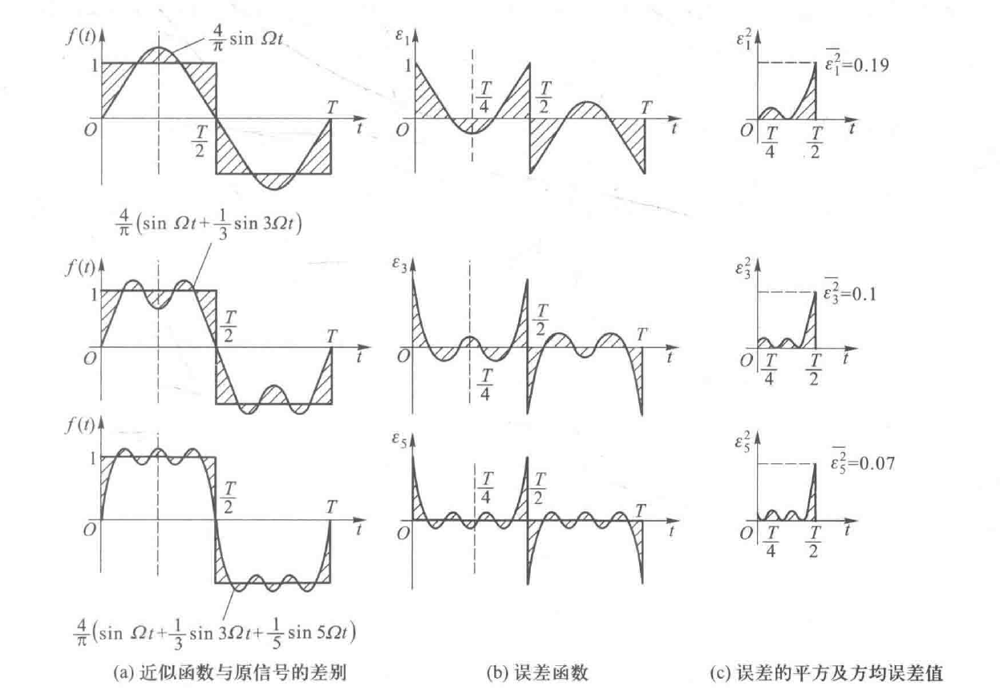

# 信号与系统（10）：信号分解为傅里叶级数

## 前提摘要

1. 个人说明：

   **限于时间紧迫以及作者水平有限，本文错误、疏漏之处恐不在少数，恳请读者批评指正。意见请留言或者发送邮件至：“noahpanzzz@gmail.com”**

2. 参考

   - 《信号与线性系统》管致中
   - 《信号与系统》郑君里

3. 日期：2024-02-02

---

## 正文

标准信号集有很多比如：

1. 泰勒级数

$$
\{1,x,x^2,...,x^k,...\}
$$

2. 三角函数
   $$
   \{1,\cos t,\sin t,\cos 2t,\sin 2t,...,\cos kt,\sin kt,...\}
   $$

任何一个函数都可以分解为上述的标准信号集，但是不一定所有的标准信号集都满足上面所讲述的信号分解。

对标准信号集得要求：

1. 归一化：
   $$
   \int_{t_{1}}^{t_{2}}f_{i}(t)f_{i}^{*}(t)\mathrm{dt}=1
   $$

2. 正交化：
   $$
   \int_{t_{1}}^{t_{2}}f_{i}(t)f_{j}^{*}(t)\mathrm{dt}=0,i≠j
   $$

3. 完备性：

   可以用其线性组合表示任意信号。

**完备的正交函数集一般都包含无穷多个函数。但是在实际的应用中不可能用无穷多个，只可能使用有限个函数，所以只能近似表示任意函数。**

三角函数是工程中最常用的正交函数集。

---

### 信号表示为傅里叶级数

#### 三角傅里叶级数

三角傅里叶级数采用的正交函数集为：
$$
\{1,{\cos}{\Omega}t,{\sin}{\Omega}t,{\cos}2{\Omega}t,{\sin}2{\Omega}t,...,{\cos}n{\Omega}t,{\sin}n{\Omega}t\},{\Omega}=\frac{2\pi}{T}=\frac{2\pi}{t_{2}-t_{1}}
$$

或将正交函数集表示为：
$$
\{\cos(n{\Omega}t),\sin(n{\Omega}t)|n=0,1,2,...\}
$$
可以证明其中的函数之间具有以下关系：

- 正交性：函数集中的子函数两两相正交。

$$
\left\{\begin{matrix} 
\begin{align}
&\int_{t_{1}}^{t_{1}+T}{\cos}m{\Omega}t{\cos}n{\Omega}t\mathrm{dt}=\int_{t_{1}}^{t_{1}+T}{\sin}m{\Omega}t{\sin}n{\Omega}t\mathrm{dt}=0&m≠n\\
&\int_{t_{1}}^{t_{1}+T}{\sin}m{\Omega}t{\cos}n{\Omega}t\mathrm{dt}=0&m、n为任何整数\\
\end{align}
\end{matrix}\right.\\
$$

- 归一化

$$
\left\{\begin{matrix} 
\begin{align}
&\int_{t_{1}}^{t_{1}+T}{\cos}^{2}n{\Omega}t\mathrm{dt}=\int_{t_{1}}^{t_{1}+T}{\sin}^{2}n{\Omega}t\mathrm{dt}=\frac{T}{2}&当n≠0时\\
&\int_{t_{1}}^{t_{1}+T}1\mathrm{dt}=T&当n=0时\\
\end{align}
\end{matrix}\right.\\
$$

可以将任意函数f（t）在这个正交函数集中展开（表示成该正交函数集函数的线性组合）：

$$
\begin{align}
f(t)=&a_{0}+a_{1}{\cos}{\Omega}t+a_{2}{\cos}2{\Omega}t+...+a_{n}{\cos}n{\Omega}t+...\\
&b_{1}{\sin}{\Omega}t+b_{2}{\sin}2{\Omega}t+...+b_{n}{\sin}n{\Omega}t+...\\
=&a_{0}+\sum_{n=1}^{+\infty}(a_{n}{\cos}n{\Omega}t+b_{n}{\sin}n{\Omega}t)
\end{align}
$$
其中系数a~n~和b~n~根据上节正交函数集和信号分解章节中最佳系数c~i~可以得到
$$
\begin{align}
a_{n}&=\frac{\int_{t_{1}}^{t_{2}}f(t){\cos}(n{\Omega}t)\mathrm{dt}}{\int_{t_{1}}^{t_{2}}{\cos}^{2}(n{\Omega}t)\mathrm{dt}}=
\left\{\begin{matrix} 
 \frac{2}{t_{2}-t_{1}}\int_{t_{1}}^{t_{2}}f(t){\cos}(n{\Omega}t)\mathrm{dt}\qquad &n≠0 \\
 \frac{1}{t_{2}-t_{1}}\int_{t_{1}}^{t_{2}}f(t)\mathrm{dt} \qquad &n=0
\end{matrix}\right.\\
b_{n}&=\frac{\int_{t_{1}}^{t_{2}}f(t){\sin}(n{\Omega}t)\mathrm{dt}}{\int_{t_{1}}^{t_{2}}{\sin}^{2}(n{\Omega}t)\mathrm{dt}}=
\frac{2}{t_{2}-t_{1}}\int_{t_{1}}^{t_{2}}f(t){\sin}(n{\Omega}t)\mathrm{dt}
\end{align}
$$

为了方便表达，将分解式改写为：
$$
f(t)=\frac{a_{0}}{2}+\sum_{n=1}^{+\infty}(a_{n}{\cos}n{\Omega}t+b_{n}{\sin}n{\Omega}t)
$$
则系数为：
$$
\begin{align}
a_{n}&= \frac{2}{t_{2}-t_{1}}\int_{t_{1}}^{t_{2}}f(t){\cos}(n{\Omega}t)\mathrm{dt}\\
b_{n}&= \frac{2}{t_{2}-t_{1}}\int_{t_{1}}^{t_{2}}f(t){\sin}(n{\Omega}t)\mathrm{dt}\\
\end{align}
$$
所以信号可以表示成为直流信号和一系列正弦信号之和。

同样对分解式还可以改写，将a~n~cosnΩt和b~n~sinnΩt合成一个正弦分量为
$$
f(t)=\frac{a_{0}}{2}+\sum_{n=1}^{\infty}A_{n}{\cos}(n{\Omega}t+{\varphi}_{n})
$$
它可以看成是下列正交信号集：{cos（nΩt）|n=0，1，2，...}的平移后的线性组合。

系数a~n~，b~n~和幅度A~n~、相位φ~n~之间的关系为
$$
\left\{\begin{matrix} 
A_{n}=\sqrt{a_{n}^{2}+b_{n}^{2}} \qquad {\varphi}_{n}=-\arctan(\frac{b_{n}}{a_{n}})\\
a_{n}=A_{n}{\cos}{\varphi}_{n} \qquad b_{n}=-A_{n}{\sin}{\varphi}_{n}
\end{matrix}\right.
$$
**系数a~n~和幅度A~n~都是频率nΩ的偶函数，系数b~n~和相位φ~n~都是频率nΩ的奇函数（如果f（t）是实数信号）**。

上面4个等式有奇偶性，但是实际n可以为负数吗？n只是正整数。

**注：**

1. **a~0~/2实际上就是函数f（t）在该区间内的平均值，亦即直流分量。**
2. **a~1~cosΩt、 a~1~sinΩt或A~1~cos（Ωt+φ~1~）称为信号的基波分量。**
3. **a~n~cosnΩt、 a~n~sinnΩt或A~n~cos（nΩt+φ~n~）称为信号的n次谐波分量。**

4. b~n~sinnΩt称为信号的正弦分量。
5. a~n~cosnΩt称为信号的余弦分量。

---

##### 狄利克雷（Dirichlet）条件（**充分条件，非必要条件**）

要使一周期信号分解为谐波分量的公式的等号严格成立，函数f（t）应该满足三个条件（狄利克雷条件）：

1. 在一个周期内，函数是绝对可积的，即$\int_{t_{1}}^{t_{1}+T}|f(t)|\mathrm{dt}$应为有限值。
2. 在一个周期内，函数的极值数目为有限。
3. 在一个周期内，函数f（t）或者为连续的，或者具有有限个这样的间断点，即当t从较大的时间值和较小的时间值分别趋向于间断点时，函数具有两个不同的有限的极限值。

实际工程中的周期信号，大都能满足该条件。

---

$$
f(t)=\frac{a_{0}}{2}+\sum_{n=1}^{\infty}A_{n}{\cos}(n{\Omega}t+{\varphi}_{n})
$$
等式右边是多个周期为T的函数的和，那么等式右边整体仍然是周期为T的函数。

这种分解可以应用在两个场合：

1. 研究非周期函数在（t~1~,t~2~）区间内的分解。
2. 研究周期为T的函数在整个时间区间内的分解。

正常研究居多的是第二种场合。如果可以研究一个信号的其中一个周期T的特性，那么扩展到整个时间区间都满足这个特性。

用三角傅里叶级数表示方波信号f(t)：
$$
f(t)=
\left\{\begin{matrix} 
1  \qquad  &0<t<\frac{T}{2}\\
-1 \qquad  &\frac{T}{2}<t<T
\end{matrix}\right.
$$

$$
\begin{align}
a_{n}&= \frac{2}{T}\int_{0}^{T}f(t){\cos}(n{\Omega}t)\mathrm{dt}=0 \qquad(奇函数)\\
b_{n}&=\frac{2}{T}\int_{0}^{T}f(t){\sin}(n{\Omega}t)\mathrm{dt}=\frac{4}{T}\int_{0}^{\frac{T}{2}}{\sin}(n{\Omega}t)\mathrm{dt}\\
&=\frac{4}{n{\Omega}T}[1-\cos n\Omega\frac{T}{2}]\qquad(T=\frac{2\pi}{\Omega})\\
&=\frac{2}{n{\pi}}[1-\cos n\pi]\\
&=
\left\{\begin{matrix} 
\frac{4}{n{\pi}}  \qquad  &当n为奇数\\
0 \qquad  &当n为偶数
\end{matrix}\right.
\end{align}
$$
因此，该非周期性方波在区间（0,T）内可以表示为：
$$
f(t)=\frac{4}{{\pi}}(\sin{\Omega}t+\frac{1}{3}\sin3{\Omega}t+\frac{1}{5}\sin5{\Omega}t+...)
$$

##### 吉布斯（Gibbs）现象

一般情况下，n无法计算到无穷大，只能取有限值。这时，这种正交展开是有误差的，当n越大，误差越小。

下图分别表示用基波、基波与三次谐波和基波与三次谐波、五次谐波去近似表示该矩形波的情况，图中画阴影线的部分是用近似函数来代表原矩形信号时两者相差的部分。很易看出，随着所取项数增多，近似程度也更多了，即合成函数的边沿更陡峭了，而顶部虽然有较多起伏，但更趋平坦了。

对于具有不连续点的函数,即使所取级数的项数无限增大,在不连续处,级数之和仍不收敛于函数f(t);在跃变点附近的波形,总是不可避免地存在有起伏振荡,从而使跃变点附近某些点的函数值超过1而形成过冲。随着级数所取项数的增多,这种起伏振荡存在的时间将缩短。但**其引起的过冲值则趋于信号跳变值的约9%(8.948987%)的固定值**。这种现象称为**吉布斯(Gibbs)现象**。

狄利克雷条件的等式成立的条件，是求解的最佳系数c~i~（方均误差趋向于0），而有些信号（比如冲激信号）的方均误差趋向于0。

实际工程中的信号一般不存在这样的间断点,即使信号的值在某个时间点附近出现了很快的变化,但是也是在一个有限的时间内(虽然可能非常非常短)完成的。这时不会出现吉布斯现象,当级数项数趋向无穷大时,合成的信号在每个时间点上都会收敛于原函数。

方均误差是没有能量的，电路中存在电感电容，会被其吸收，也就不会存在吉布斯现象,三角波没有出现跳变，就不存在吉布斯现象。

---

#### 指数傅里叶级数

指数傅里叶级数采用的正交函数集为：
$$
\{1,e^{j{\Omega}t},e^{-j{\Omega}t},e^{j2{\Omega}t},e^{-j2{\Omega}t},e^{j3{\Omega}t},e^{-j3{\Omega}t},...,e^{jn{\Omega}t},e^{-jn{\Omega}t},...\}
$$
或者记为：
$$
\{e^{jn{\Omega}t}|n\in I\}
$$
可以证明其中的函数之间具有以下关系：

- 正交化：函数集中的子函数两两相正交。
  $$
  \int_{t_{1}}^{t_{1}+T}e^{jm{\Omega}t}e^{jn{\Omega}t}\mathrm{dt}=\int_{t_{1}}^{t_{1}+T}e^{jm{\Omega}t}(e^{jn{\Omega}t})^{*}\mathrm{dt}=0 \qquad m≠n
  $$

- 归一化
  $$
  \int_{t_{1}}^{t_{1}+T}e^{jn{\Omega}t}(e^{jn{\Omega}t})^{*}\mathrm{dt}=T
  $$

可以将任意函数f（t）在这个正交函数集中展开（表示成该正交函数集函数的线性组合）：
$$
\begin{align}
f(t)=&c_{0}+c_{1}e^{j{\Omega}t}++c_{2}e^{j2{\Omega}t}+...++c_{n}e^{jn{\Omega}t}+...\\
&+c_{-1}e^{-j{\Omega}t}+c_{-2}e^{-j2{\Omega}t}+...+c_{-n}e^{-j{n\Omega}t}+...\\
=&\sum_{-\infty}^{+\infty}c_{n}e^{jn{\Omega}t}
\end{align}
$$
其中系数C~n~为：
$$
c_{n}=\frac{\int_{t_{1}}^{t_{1}+T}f(t)(e^{jn{\Omega}t})^{*}\mathrm{dt}}{\int_{t_{1}}^{t_{1}+T}(e^{jn{\Omega}t})(e^{jn{\Omega}t})^{*}\mathrm{dt}}=\frac{1}{T}\int_{t_{1}}^{t_{1}+T}f(t)e^{-jn{\Omega}t}\mathrm{dt}
$$

指数傅里叶级数也可以从三角傅里叶级数直接推导：
$$
\begin{align}
f(t)&=\frac{a_{0}}{2}+\sum_{n=1}^{+\infty}A_{n}{\cos}(n{\Omega}t+{\varphi}_{n})\\
&=\frac{a_{0}}{2}+\sum_{n=1}^{+\infty}A_{n}\frac{e^{j(n{\Omega}t+{\varphi}_{n})}+e^{-j(n{\Omega}t+{\varphi}_{n})}}{2}\\
&=\frac{a_{0}}{2}+\sum_{n=1}^{+\infty}[\frac{A_{n}}{2}e^{j(n{\Omega}t+{\varphi}_{n})}+\frac{A_{n}}{2}e^{j((-n){\Omega}t-{\varphi}_{n})}]\\
\end{align}
$$
**系数a~n~和幅度A~n~都是频率nΩ的偶函数，系数b~n~和相位φ~n~都是频率nΩ的奇函数（如果f（t）是实数信号）**。
$$
\left\{\begin{matrix} 
A_{n}=\sqrt{a_{n}^{2}+b_{n}^{2}} \qquad {\varphi}_{n}=-\arctan(\frac{b_{n}}{a_{n}})\\
a_{n}=A_{n}{\cos}{\varphi}_{n} \qquad b_{n}=-A_{n}{\sin}{\varphi}_{n}
\end{matrix}\right.
$$
令φ~-n~=-φ~n~，A~-n~=A~n~，可以得到：
$$
\begin{align}
f(t)&=\frac{a_{0}}{2}+\sum_{n=1}^{+\infty}[\frac{A_{n}}{2}e^{j(n{\Omega}t+{\varphi}_{n})}+\frac{A_{-n}}{2}e^{j((-n){\Omega}t+{\varphi}_{-n})}]\\
&=\frac{a_{0}}{2}+\sum_{n=1}^{+\infty}\frac{A_{n}}{2}e^{j(n{\Omega}t+{\varphi}_{n})}+\sum_{n=-1}^{-\infty}\frac{A_{n}}{2}e^{j(n{\Omega}t+{\varphi}_{n})}\\

\end{align}
$$
令φ~0~=0，A~0~=a~0~，可以得到:
$$
\begin{align}
f(t)&=\frac{a_{0}}{2}+\sum_{n=1}^{+\infty}\frac{A_{n}}{2}e^{j(n{\Omega}t+{\varphi}_{n})}+\sum_{n=-1}^{-\infty}\frac{A_{n}}{2}e^{j(n{\Omega}t+{\varphi}_{n})}\\
&=\frac{1}{2}\sum_{n=-\infty}^{+\infty}A_{n}e^{j(n{\Omega}t+{\varphi}_{n})}\\
&=\frac{1}{2}\sum_{n=-\infty}^{+\infty}(A_{n}e^{j{\varphi}_{n}})e^{j(n{\Omega}t)}\\
&=\frac{1}{2}\sum_{n=-\infty}^{+\infty}\dot{A_{n}}e^{jn{\Omega}t}
\end{align}
$$
通过上式可以看出，函数可以分解为一系列的线性组合。

其中的系数为：
$$
\dot{A_{n}}=A_{n}e^{j{\varphi}_{n}}=\sqrt{a_{n}^{2}+b_{n}^{2}}(\cos\varphi_{n}+j\sin\varphi_{n})\\
{\varphi}_{n}=-\arctan(\frac{b_{n}}{a_{n}}) \Rightarrow \tan({\varphi}_{n})=-\frac{b_{n}}{a_{n}}\\
\Rightarrow \sin\varphi_{n}=-\frac{b_{n}}{\sqrt{a_{n}^{2}+b_{n}^{2}}} \qquad \cos\varphi_{n}=\frac{a_{n}}{\sqrt{a_{n}^{2}+b_{n}^{2}}}\\
\begin{align}
\dot{A_{n}}&=\sqrt{a_{n}^{2}+b_{n}^{2}}(\frac{a_{n}}{\sqrt{a_{n}^{2}+b_{n}^{2}}}-j\frac{b_{n}}{\sqrt{a_{n}^{2}+b_{n}^{2}}})\\
&=a_{n}-jb_{n}\\
&=\frac{2}{T}\int_{t_{1}}^{t_{1}+T}f(t){\cos}(n{\Omega}t)\mathrm{dt}-j\frac{2}{T}\int_{t_{1}}^{t_{1}+T}f(t){\sin}(n{\Omega}t)\mathrm{dt}\\
&=\frac{2}{T}\int_{t_{1}}^{t_{1}+T}f(t)e^{-jn{\Omega}t}\mathrm{dt}
\end{align}
$$
根据两种推导过程得到的答案应该是相同的，对比两个系数计算公式可以得到。
$$
c_{n}=\frac{\dot{A_{n}}}{2}=\frac{A_{n}e^{j{\varphi}_{n}}}{2}=\frac{a_{n}-jb_{n}}{2}
$$

注：**指数傅里叶级数$\ e^{jnwt}$，其中n可以为正，也可以为负，这时候就出现负频率。负频率是为了和正频率合成一个物理上真正能看见的物理信号，并没有实际的物理意义。**

总结，信号表示傅里叶级数的形式有：
$$
\begin{align}
f(t)&=\frac{a_{0}}{2}+\sum_{n=1}^{+\infty}(a_{n}{\cos}n{\Omega}t+b_{n}{\sin}n{\Omega}t)\\
&=\frac{a_{0}}{2}+\sum_{n=1}^{\infty}A_{n}{\cos}(n{\Omega}t+{\varphi}_{n})\\
&=\sum_{-\infty}^{+\infty}c_{n}e^{jn{\Omega}t}\\
&=\frac{1}{2}\sum_{n=-\infty}^{+\infty}\dot{A_{n}}e^{jn{\Omega}t}\\
\end{align}
$$

---

#### 函数的奇偶性及其与谐波含量的关系

##### 奇偶性

函数的奇偶性对于傅里叶级数的系数有一定的影响。

1. 如果函数是**偶函数**，则其傅里叶级数中只有**直流和余弦分量**（偶函数之和仍然是偶函数）。
2. 如果函数是**奇函数**，则其傅里叶级数中只有**正弦分量**（奇函数之和仍然是奇函数）。

任何的函数都可以分解为一个奇函数和偶函数的和。
$$
f(t)=f_{e}(t)+f_{o}(t)=\frac{f(t)+f(-t)}{2}+\frac{f(t)-f(-t)}{2}
$$
信号的平移可以使函数的奇偶性改变，但并不是绝对的。

##### 奇谐信号和偶谐信号

1. 奇谐函数的傅里叶级数中只有奇次谐波分量。

   定义：满足f（t+T/2）=-f（t）的周期为T的函数。

2. 偶谐函数的傅里叶级数中只有直流和偶次谐波分量。

   定义：满足f（t+T/2）=f（t）的周期为T的函数。

偶谐函数实际上是周期为T/2的函数。

**注：奇谐信号和偶谐信号与信号的奇偶性没有关系。**

## 总结

**本文均为原创，欢迎转载，请注明文章出处：。百度和各类采集站皆不可信，搜索请谨慎鉴别。技术类文章一般都有时效性，本人习惯不定期对自己的博文进行修正和更新，因此请访问出处以查看本文的最新版本。**
