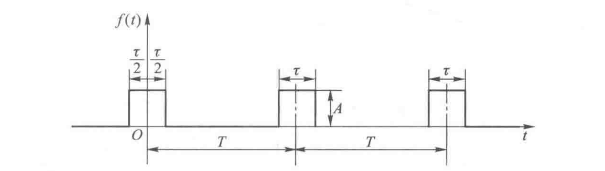
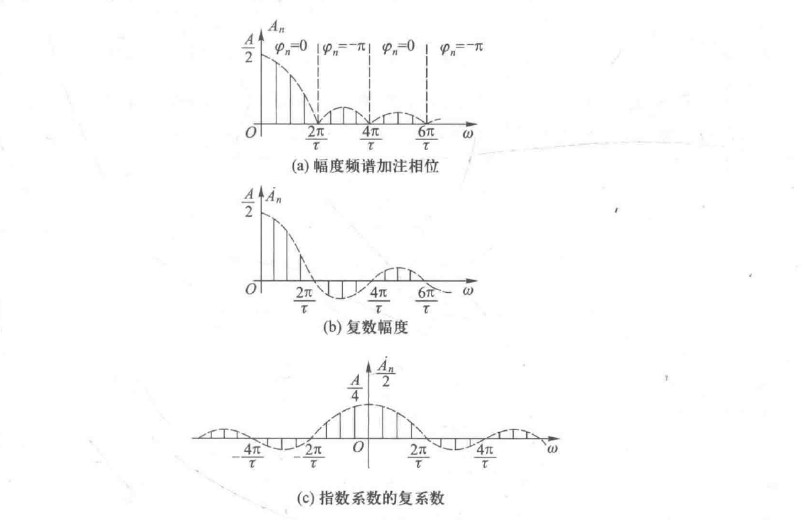
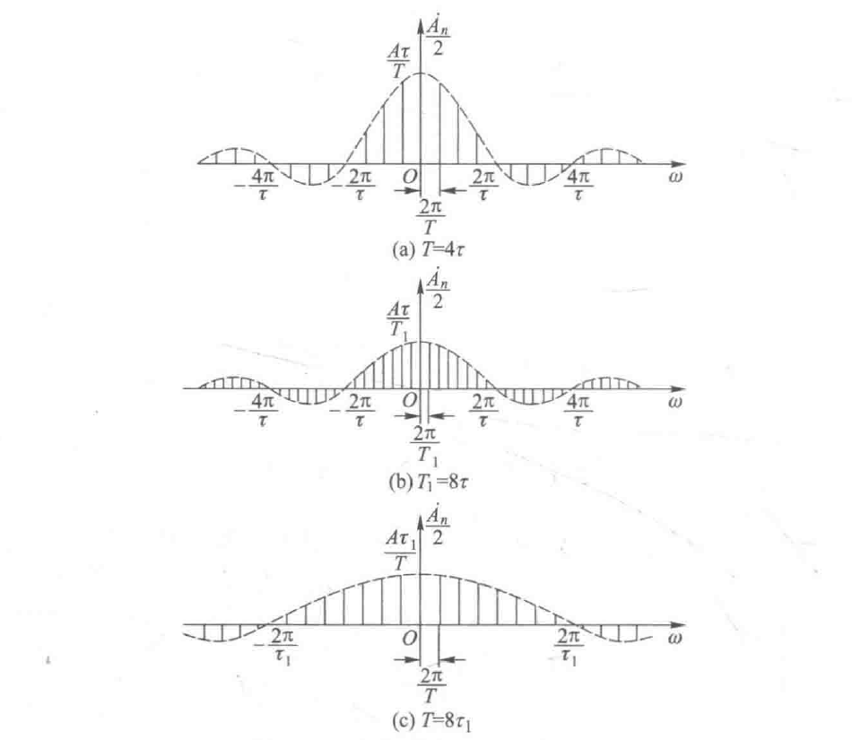
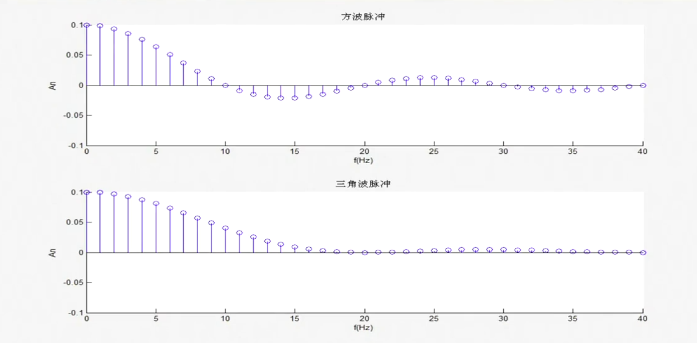
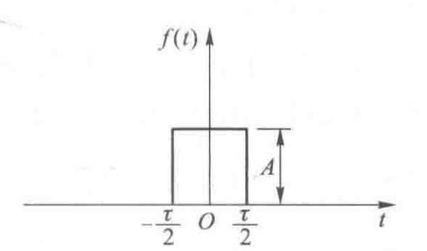
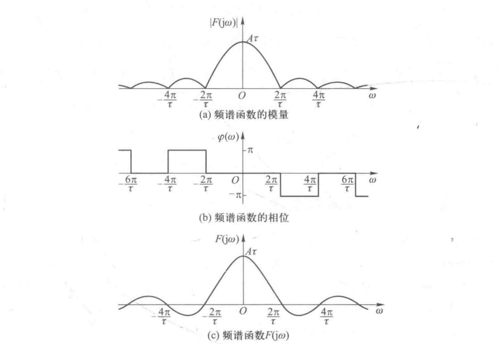

# 信号与系统（12）：信号的频谱

## 前提摘要

1. 个人说明：

   **限于时间紧迫以及作者水平有限，本文错误、疏漏之处恐不在少数，恳请读者批评指正。意见请留言或者发送邮件至：“noahpanzzz@gmail.com”**

2. 参考

   - 《信号与线性系统》管致中
   - 《信号与系统》郑君里

3. 日期：2024-02-

---

## 正文

频谱是信号的一种图形表示方法，它将信号各个频率分量上的系数关系用图形的方法表示出来。

信号频谱的三个要素：

1. 幅度

2. 频率
3. 相位

所以频谱图有两个组成部分：

- 振幅频谱：表示信号含有的各个频率分量的幅度。其横坐标为频率，纵坐标为各个对应频率分量的幅度。
- 相位频谱：表示信号含有的各个频率分量的相位。其横坐标为频率，纵坐标为各个对应频率分量的相位。

---

### 周期信号的频谱

周期信号的频谱图有两种形式：

1. 如果用正弦函数展开式形式的傅里叶级数，则相应的表达式为：
   $$
   f(t)=\frac{a_{0}}{2}+\sum_{n=1}^{+\infty}A_{n}\cos(n\omega t+\varphi_{n})
   $$
   振幅频谱为： A~n~=$\sqrt{a_{n}^{2}+b_{n}^{2}}$

   相位频谱为：$\varphi_{n}=-\arctan \frac{b_{n}}{a_{n}}$

   按照这种定义做出的频谱，因为只有n≥0（ω≥0）是才有意义，做出的图只有n≥0的一边，所以又被称为**单边频谱**。

   单边频谱中，对于n=0点上的幅度频谱，信号真正的直流分量应该为$\ \frac{A_{0}}{2}$,所以频谱在ω=0上的分量的大小应该为$\ \frac{A_{0}}{2}$。

   
   
2. 如果用复数正弦函数展开式形式的傅里叶级数，则相应的表达式为：
   $$
   f(t)=\sum_{-\infty}^{+\infty}c_{n}e^{jn\omega t}
   $$
   振幅频谱为：$\left |c_{n} \right |$

   相位频谱为： $ang(c_{n})$

   按照这种定义做出的频谱在n>0和n<0的两边都有意义，做出的图又被称为双边频谱。

   在频谱形状上，单边频谱和双边频谱的相位频谱相同，但是振幅频谱的幅度大小是单边频谱的一半。
   
   幅度偶对称，相位奇对称。
   
   

---

### 频谱图的特点

周期信号的频谱有三个特点：

1. 离散性：它有不连续的线条组成。
2. 谐波性：线条只出现在0和基波频率的整数倍点上。
3. 收敛性：实际信号的幅频特性总是随频率趋向于无穷大而趋向于零。

#### 时域参数对频谱的影响

$$
\begin{align}
f(t)=\left\{\begin{matrix} 
&A \qquad &-\frac{\tau}{2}+kT<t<\frac{\tau}{2}+kT \\
&0 \qquad &others
\end{matrix}\right. 
\end{align}
$$

求该信号的频谱，可以先求出傅里叶级数的复数幅度。
$$
\begin{align}
\dot{A_{n}}&=\frac{2}{T}\int_{t_{1}}^{t_{1}+T}f(t)e^{-jn{\Omega}t}\mathrm{dt}\\
&=\frac{2}{T}A\int_{-\frac{\tau}{2}}^{\frac{\tau}{2}}(\cos n\Omega t-j\sin n\Omega t) \mathrm{dt}\\
&=\frac{4}{T}A\int_{0}^{\frac{\tau}{2}}\cos n\Omega t \mathrm{dt}\\
&=\frac{4A}{n\Omega T}\sin(n\Omega\frac{\tau}{2})\\
&=\frac{2A\tau}{T}\frac{\sin(n\Omega\frac{\tau}{2})}{n\Omega\frac{\tau}{2}}\\
&=\frac{2A\tau}{T}Sa(n\Omega\frac{\tau}{2})\\
A_{0}&=\frac{2A\tau}{T}
\end{align}
$$
由于A~n~是实数，所以相位只有0或者π。令T=4$\tau$，则频谱如下：

根据周期性方波的频谱，可以得到关于信号特性的一般性结论：

1. T增加，Sa()函数不变，频谱的包络不变，收敛性不变。但是:

   - 谱线幅度降低。

   - 谱线密度加大。信号周期加大，对振幅的收敛性没有影响，但会使谱线密度增加。

   当T趋向无穷大时，信号成为非周期信号，这时，谱线幅度降低为无穷小，谱线密度加大，信号分量出现在所有频率上。

2. $\tau$下降，Sa()尺度扩大，收敛性变差，但是谱线间隔不变。

   信号时间宽度变小，将使信号能量向高频扩散，信号的频带增加。

---

### 信号的频带：

由于信号的频谱的收敛性，一般可以在一个信号分量主要集中的频率区间内研究信号的特性,而忽略信号其它部分的分量。相应的频率区间就是信号的频带。

信号的频带有很多种定义方法:

1. 以信号最大幅度的1/ 10为限，其它部分忽略不计。
2. 以信号振幅频谱中的第一个过零点为限，零点以外部分忽略不计。
3. 以包含信号总能量的90%处为限，其余部分忽略不计。

### 信号的边沿对信号频带的影响

信号的边沿变化越快，信号的频带越宽。

三角脉冲函数的频谱:
$$
\dot{A_{n}}=\frac{\tau}{T}[Sa(\frac{n\Omega\tau}{4})]^2
$$

---

### 非周期信号的频谱

非周期信号可以看成周期信号在周期趋向无穷大时的极限。

这里省略推导过程。

傅里叶变换FT：
$$
F(j\omega)=\int_{-\infty}^{+\infty}f(t)e^{-j{\omega}t}\mathrm{dt}
$$

傅里叶反变换IFT：
$$
f(t)=\frac{1}{2\pi}\int_{-\infty}^{+\infty}F(j\omega)e^{j{\omega}t}\mathrm{dt}
$$
**如果$f(t)$是实数函数，$F(j\omega)$的幅度是$\omega$的偶函数，$F(j\omega)$的相位是$\omega$的奇函数。**

- $f(t)$和$F(j\omega)$之间是一一对应的，根据其中的一个可以确定另外一个。可以认为,它们包含了相同的信息，只不过自变量不同，它们是相同信号的不同表达形式。

- 正变换将以时间为自变量的函数变成了以频率为变量的函数，将信号从**时域变换到了频域**。所以建立在这种变换上的系统分析方法称为**变换域法**。这种变换通常经过积分计算得出，所以也称为积分变换。

- 傅利叶变换所牵涉的两个函数都是连续函数,所以它完成的是从连续函数到连续函数的变换;而傅利叶级数则是完成从连续函数到离散函数的变换。

- 傅利叶变换存在的条件依然是Direchlet条件,只不过这时考虑的时间区间为$(-\infty,+\infty)$。

  狄利克雷（Dirichlet）条件（**充分条件，非必要条件**）

  要使一周期信号分解为谐波分量的公式的等号严格成立，函数$f(t)$应该满足三个条件（狄利克雷条件）：

  1. 在一个周期内，函数是绝对可积的，即$\int_{-\infty}^{+\infty}|f(t)|\mathrm{dt}$应为有限值（$\int_{-\infty}^{+\infty}|f(t)|\mathrm{dt}<\infty$）。
  2. 在一个周期内，函数的极值数目为有限。
  3. 在一个周期内，函数$f(t)$或者为连续的，或者具有有限个这样的间断点，即当t从较大的时间值和较小的时间值分别趋向于间断点时，函数具有两个不同的有限的极限值。

注：例如$f(t)=1$不满足上述条件，但是在频域中引入单位脉冲函数就可以求得它的傅里叶变换为$2\pi\delta(\omega)$。

####  时域参数对频谱的影响

$$
\begin{align}
f(t)=\left\{\begin{matrix} 
&A \qquad &-\frac{\tau}{2}<t<\frac{\tau}{2} \\
&0 \qquad &others
\end{matrix}\right. 
\end{align}
$$

求解频谱过程
$$
F(jw)=...
$$

$$

$$

1. 与周期信号的频谱相比，仍然满足收敛性。

2. 当脉冲持续时间T减小时,频谱通过零点的频率也随之提高,频谱的收敛速度变慢,这表明脉冲的频带宽度和脉冲持续时间成反比变化。

## 总结

**本文均为原创，欢迎转载，请注明文章出处：。百度和各类采集站皆不可信，搜索请谨慎鉴别。技术类文章一般都有时效性，本人习惯不定期对自己的博文进行修正和更新，因此请访问出处以查看本文的最新版本。**
