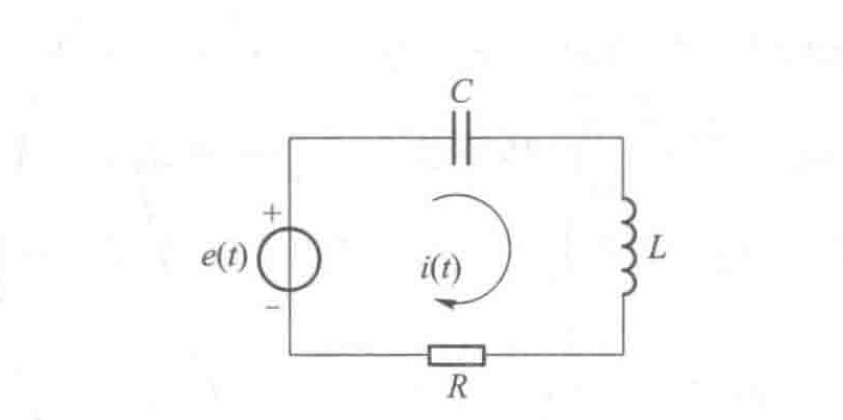

# 信号与系统（5）：系统的零输入响应

## 前提摘要

1. 个人说明：

   **限于时间紧迫以及作者水平有限，本文错误、疏漏之处恐不在少数，恳请读者批评指正。意见请留言或者发送邮件至：“noahpanzzz@gmail.com”**

2. 参考

   - 《信号与线性系统》管致中
   - 《信号与系统》郑君里

3. 日期：2024-01-18

---

## 正文

零输入响应是下列齐次方程的解：
$$
D(p)r(t)=(p^{n}+a_{n-1}p^{n-1}+...+a_{1}p+a_{0})r(t)=0\\[1mm]
初始条件(标准):r^{<n-1>}(0),r^{<n-2>}(0),...,r(0)
$$
对它有两种解法：

1. 时域法（经典法）
2. 初始条件法
3. 等效源法（将t=0的初始条件转变为激励源，由零输入响应转变为零状态响应）

### 初始条件法

求解零输入响应由如下两步构成

1. 确定系统的自然频率。

   令D（p）=0，将p看成一个代数量，解得其中n个特征值λ。

2. 确定零输入响应的形式解。

   - 如果没有重根，则可以确定其形式解为：
     $$
     r_{zi}(t)=C_{1}e^{\lambda_{1}t}+C_{2}e^{\lambda_{2}t}+...+C_{n}e^{\lambda_{n}t}=\sum_{i=1}^{n}C_{i}e^{\lambda_{i}t}\\
     其中C_{1},C_{2},...,C_{n}为待定系数。
     $$

   - 如果有重根，假设λ是一个k重根：
     $$
     r_{zi}(t)=C_{1}e^{\lambda t}+C_{2}te^{\lambda t}+C_{3}t^{2}e^{\lambda t}+...+C_{k}t^{k-1}e^{\lambda t}\\
     +C_{k+1}t^{k+1}e^{\lambda t}+...+C_{n}e^{\lambda_{n}t}=\\
     \sum_{i=1}^{k}C_{i}t^{i-1}e^{\lambda t}+\sum_{i=k+1}^{n}C_{i}e^{\lambda_{i}t}\\
     其中C_{1},C_{2},...,C_{n}为待定系数。
     $$
     **由于零输入响应没有激励信号，所以特解为0。**

3. 根据初始条件，确定待定系数。

   一般的，初始条件为已知零时刻的响应及其各阶导数，带入形式解中就可以确定待定系数。

   由于此时就是求解n元一次方程组，如果数据过大，可以借助矩阵求解（Matlab）。

---

系统零输入响应求解举例：

**初始条件法**

图所示RLC串联电路中，设L=1H，C=1F,R=2Ω。若激励电压源e(t)为零，且电路的初始条件为：
$$
i(0)=0,{i}'(0)=1A/s;\\
i(0)=0,U_{C}(0)=10V;\\
$$
这里压降Uc的正方向与电流i的正方向一致。分别求上述两种初始条件时电路的零输入响应电流。

/
$$
i(t)=\frac{1}{\frac{1}{Cp}+Lp+R}u(t)\\\\
i(t)=\frac{p}{Lp^{2}+Rp+\frac{1}{C}}e(t)\\
将L=1H,c=1F,R=2\Omega 代入得\\
H(p)=\frac{p}{p^{2}+2p+1}\\
D(p)=p^{2}+2p+1\\
\lambda_{1}=\lambda_{2}=-1\\
i(t)=C_{1}e^{-t}+C_{2}te^{-t}\\
$$
初始条件1：
$$
i(0)=0,{i}'(0)=1A/s;\\
\left\{\begin{matrix} 
i(0)=C_{1}=0 \\
{i}'(0)=-C_{1}+C_{2}=1\\
\end{matrix}\right.\\
\left\{\begin{matrix} 
C_{1}=0 \\
C_{2}=-1\\
\end{matrix}\right.\\
i(t)=-te^{-t},t≥0\\
$$
初始条件2：
$$
i(0)=0,U_{C}(0)=10V;\\
U_{C}(t)=e(t)-Ri(t)-Lpi(t)=-2i(t)-{i}'(t)=-C_{1}e^{-t}-C_{2}(e^{-t}+te^{-t})\\
U_{C}(0)=-2i(0)-{i}'(0)=-C_{1}-C_{2}\\

\left\{\begin{matrix} 
U_{C}(0)=-C_{1}-C_{2}=10\\
i(0)=C_{1}=0
\end{matrix}\right.\\

\left\{\begin{matrix} 
C_{1}=0 \\
C_{2}=-10\\
\end{matrix}\right.\\
i(t)=-10te^{-t},t≥0\\
$$

**题中给出的是t=0时刻的初始条件，零状态响应计算出的是其对t=0以后的时间内响应的影响，所以这里在零输入响应的结果后都加一个t≥0的限制条件，表示结论只对t≥0的时间区间成立。**

**等效源法**

将t=0的初始条件转变为激励源，由零输入响应转变为零状态响应。

## 总结

**本文均为原创，欢迎转载，请注明文章出处：。百度和各类采集站皆不可信，搜索请谨慎鉴别。技术类文章一般都有时效性，本人习惯不定期对自己的博文进行修正和更新，因此请访问出处以查看本文的最新版本。**

