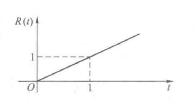

# 信号与系统（6）：系统的零状态响应（Q1：选取什么样的子信号？）

## 前提摘要

1. 个人说明：

   **限于时间紧迫以及作者水平有限，本文错误、疏漏之处恐不在少数，恳请读者批评指正。意见请留言或者发送邮件至：“noahpanzzz@gmail.com”**

2. 参考

   - 《信号与线性系统》管致中
   - 《信号与系统》郑君里

3. 日期：2024-01-

---

## 正文

系统零状态响应的求解过程

1. 将任意信号分解为一系列“标准统一”的子信号之和（或积分）。
2. 求线性系统对各个子信号的响应。
3. 将各个子信号的响应相叠加，从而得到系统对激励信号的响应。

**这里其中利用到了线性系统的齐次性和叠加性。**

为了求解线性系统的零状态响应，必须解决以下几个问题：

1. 选取什么样的子信号？
2. 如何将信号分解为子信号的和或者积分？
3. 如何求系统对子信号的响应？
4. 如何求得最后的响应？

### 奇异函数（Q1：选取什么样的子信号？）

子信号具备：

- 完备性：任意函数（或绝大数函数）都可以分解为该子信号的和，没有（或几乎没有）例外。
- 简单性：容易求得系统对该子信号的响应。
- 相似性：不同子信号的响应具有内在联系，可以类推。

奇异函数是一种理想化的函数，它具有一个或多个间断点，在这些间断点无法确定函数或其导数值。常用的有阶跃函数和冲激函数。

#### 阶跃函数和冲激函数

**单位斜边函数r(t)**

定义：
$$
r(t)=t\varepsilon (t)=
\left\{\begin{matrix}
t &t>0\\
0 &t<0
\end{matrix}\right.
$$

**单位阶跃函数ε(t)**

定义：
$$
\varepsilon (t)= 
\left\{\begin{matrix}
1 &t> 0\\
无定义&t=0\\
0 &t< 0
\end{matrix}\right.
$$

任意函数乘以ε(t)以后，其t＜0的部分等于0，成为有始函数。

**在很多文件中，用u(t)表示阶跃函数**。

扩展：

1. 门函数
   $$
   g_{\tau}(t)= 
   \left\{\begin{matrix} 
   1 &|t|<\frac{\tau}{2}\\
   0 &|t|>\frac{\tau}{2}
   \end{matrix}\right.=\varepsilon(t+\frac{\tau}{2})-\varepsilon(t-\frac{\tau}{2})
   $$

   **(缺图，等什么时候有空学习一下matlab)**

2. 符号函数

$$
sgn(t)= 
\left\{\begin{matrix} 
1 &t>0\\
-1 &t<0
\end{matrix}\right.=2\varepsilon(t)-1
$$

​	**(缺图，等什么时候有空学习一下matlab)**

**冲激函数δ(t)**

定义1：

$$
\left\{\begin{matrix} 
\delta (t)=0,&t\ne 0\\
\int_{-\infty}^{+\infty} \delta (t)\mathrm{dt}=1
\end{matrix}\right.
$$

定义2（广义）：
$$
\int_{-\infty}^{+\infty} f(t)\delta (t-t_{0})\mathrm{dt}=f(t_{0})
$$

**冲激偶函数δ’(t)**

1. 与普通函数的积分：

$$
\begin{align}
&f(t)\delta(t)=f(0)\delta(t) \\[2mm]
&\int_{-\infty}^{+\infty} f(t)\delta (t)\mathrm{dt}=f(0)  \\[2mm]
&f(t){\delta}'(t)= f(0){\delta}'(t)-{f}'(0)\delta(t) \\[2mm]
&\int_{-\infty}^{+\infty} f(t){\delta}'(t)\mathrm{dt}=-{f}'(0) \\[2mm]
\end{align}
$$

2. 移位：

$$
\begin{align}
&f(t)\delta(t-t_{0})=f(t_{0})\delta(t-t_{0})\\[2mm]
&\int_{-\infty}^{+\infty} f(t)\delta (t-t_{0})\mathrm{dt}=f(t_{0})\\[2mm]
&f(t){\delta}'(t-t_{0})= f(t_{0}){\delta}'(t-t_{0})-{f}'(t_{0})\delta(t)\\[2mm]
&\int_{-\infty}^{+\infty} f(t){\delta}'(t-t_{0})\mathrm{dt}=-{f}'(t_{0})\\[2mm]
\end{align}
$$

3. 

$$
\begin{align}
&\delta(at)=\frac{1}{|a|}\delta(t)\\[0.5mm]
&\delta(at+b)=\frac{1}{|a|}\delta(t+\frac{b}{a})\\[0.5mm]
&{\delta}'(at)=\frac{1}{|a|}\frac{1}{a}{\delta}'(t)\\[0.5mm]
&{\delta}^{(n)}(at)=\frac{1}{|a|}\frac{1}{a^{n}}{\delta}^{(n)}(t)\\[0.5mm]
&\delta(\varphi (t))=\sum_{k}\frac{\delta(t-t_{k})}{|{\varphi}'(t_{k})|}(t_{k}为\varphi (t)的单零点)
\end{align}
$$

4. 奇偶性

   冲激函数是偶函数，冲激偶函数是奇函数。

$$
\begin{align}
&\delta(-t)=\delta(t)\\[0.5mm]
&{\delta}'(-t)=-{\delta}'(t)\\[0.5mm]
&{\delta}^{(n)}(-t)=(-1)^{n}{\delta}^{(n)}(t)\\[0.5mm]
\end{align}
$$

​	
$$
\ce{斜边信号<=>[微分][积分]阶跃信号<=>[微分][积分]冲激信号<=>[微分][积分]冲激偶信号}
$$

---

## 总结

**本文均为原创，欢迎转载，请注明文章出处：。百度和各类采集站皆不可信，搜索请谨慎鉴别。技术类文章一般都有时效性，本人习惯不定期对自己的博文进行修正和更新，因此请访问出处以查看本文的最新版本。**

