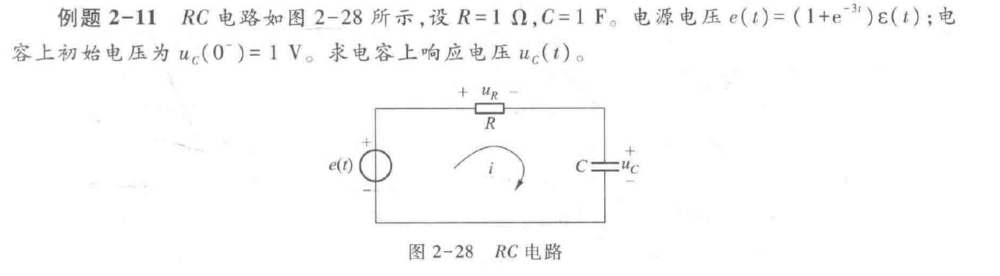
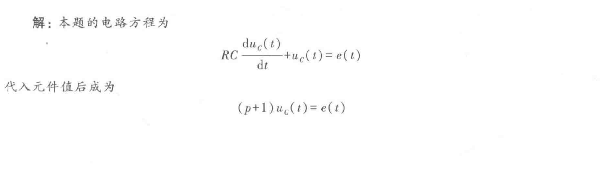
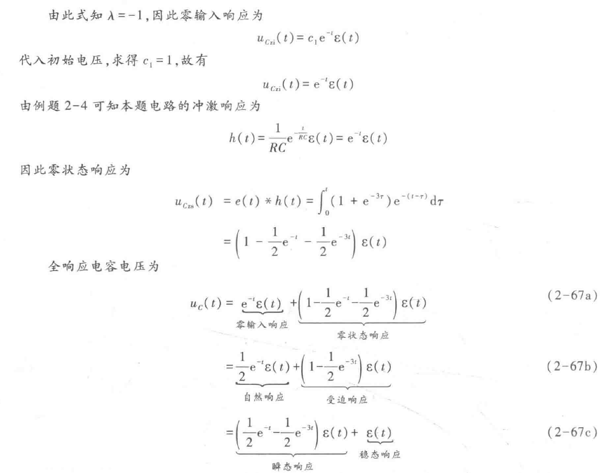

# 信号与系统（8）：系统全响应的时域求解法

## 前提摘要

1. 个人说明：

   **限于时间紧迫以及作者水平有限，本文错误、疏漏之处恐不在少数，恳请读者批评指正。意见请留言或者发送邮件至：“noahpanzzz@gmail.com”**

2. 参考

   - 《信号与线性系统》管致中
   - 《信号与系统》郑君里

3. 日期：2024-01-27

---

## 正文

### 线性系统响应的时域求解法

1. 求系统的转移算子H(p)
2. 求系统的零输入响应（如果系统的初始条件为零，则省略此步骤）
   - 经典法
   - 初始条件法
3. 求系统的零状态响应
   - 求系统的冲激响应
     - 系统方程法
     - LT变换法
   - 通过卷积积分，求系统对激励信号的响应

4. 将系统的零输入响应加上系统的零状态响应得到系统的全响应

---

1. 如果条件并不在起始状态（初始状态），则求解全响应则有所区别。

   1. 如果条件是t>0，需要将其代入到全响应，而不是带入到零输入响应。
      $$
      r_{全}(1)=r_{zi}(1)+r_{zs}(1);
      $$

   2. 如果条件是t<0,则响应肯定是零输入响应，因为零状态响应在t<0为零。

$$
r_{全}(-1)=r_{zi}(-1),r_{zs}(-1)=0;\\
r_{全}(-1)=r_{zi}(-1)\varepsilon(t+1);
$$

2. 零输入响应和零状态响应，自然响应和受迫响应，稳定响应和瞬态响应的关系。

   - 齐次方程的解是自然响应，非齐次方程的解是受迫响应；

   - 零输入响应是自然响应的一部分，但是自然响应还包括零状态响应的一部分；

   - 受迫响应是零状态响应，但零状态响应还包括自然响应的一部分。

   - 信号的响应包括三部分：
     - 既是零输入响应，又是自然响应；
     - 既是零状态响应，又是自然响应；
     - 既是零状态响应，又是受迫响应。

   - 稳定系统，自然响应必定属于瞬态响应；受迫响应可能是瞬态响应，也可能是稳态响应（**自然响应都属于瞬态响应，否则系统是不稳定的，使用此类系统会出现严重后果**）。

**扩展：**

解题步骤：

1. 求系统的转移算子。
   $$
   H(p)=\frac{\frac{1}{Cp}}{R+\frac{1}{Cp}}=\frac{1}{p+1}
   $$
   
2. 求零输入响应。
   $$
   特征方程 p+1=0 \to \lambda = -1 \\
   r_{zi}(t)=Ce^{-t}\\
   r_{zi}(0)=1 \to C=1\\
   r_{zi}(t)=e^{-t}u(t)\\
   $$
   此处的u(t)可以先不加，方便全响应的结合。

3. 求零状态响应。

   1. 求冲激响应h（t）
      $$
      h(t)=H(p)\delta(t)=\frac{1}{p+1}\delta(t)=e^{-t}u(t)
      $$

   2. 求零状态响应
      $$
      \begin{align}
      r_{zs}(t)=e(t)*h(t)&=[(1+e^{-3t})u(t)]*(e^{-t}u(t))\\
      &=\int_{0}^{t}(1+e^{-3\tau})e^{-(t-\tau)}\mathrm{d\tau}\\
      &=e^{-t}\int_{0}^{t}e^{\tau}+e^{-2\tau}\mathrm{d\tau}\\
      &=[1-\frac{1}{2}e^{-t}-\frac{1}{2}e^{-3t}]u(t)
      \end{align}
      $$

4. 求全响应
   $$
   r_{全}=r_{zi}(t)+r_{zs}(t)=e^{-t}u(t)+[1-\frac{1}{2}e^{-t}-\frac{1}{2}e^{-3t}]u(t)
   $$
   

   **并不一定需要按照顺序先求零输入响应然后再求零状态响应。这样做只是因为零输入响应求解比较简单，先进行求解。**

---

## 总结

**本文均为原创，欢迎转载，请注明文章出处：。百度和各类采集站皆不可信，搜索请谨慎鉴别。技术类文章一般都有时效性，本人习惯不定期对自己的博文进行修正和更新，因此请访问出处以查看本文的最新版本。**

