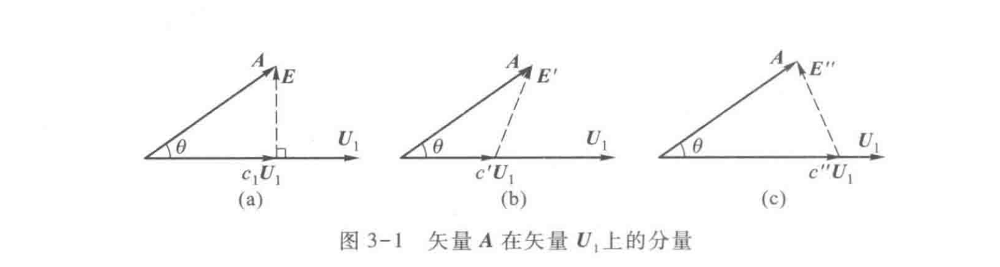
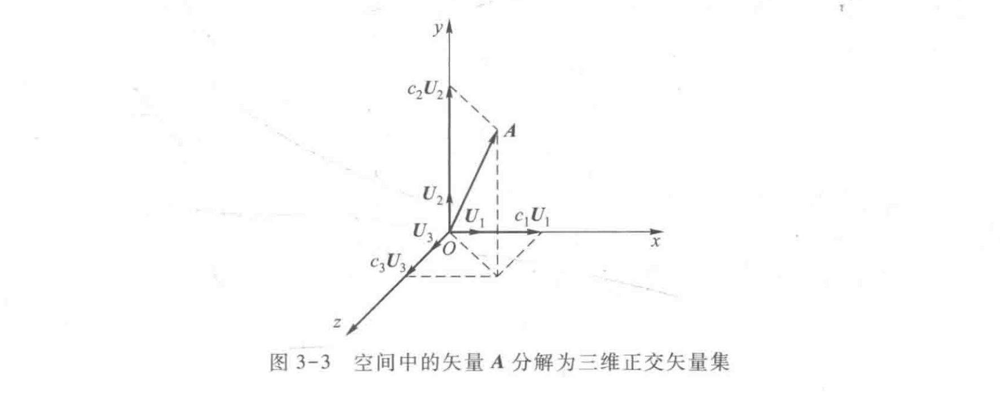

# 信号与系统（9）：正交函数集与信号分解

## 前提摘要

1. 个人说明：

   **限于时间紧迫以及作者水平有限，本文错误、疏漏之处恐不在少数，恳请读者批评指正。意见请留言或者发送邮件至：“noahpanzzz@gmail.com”**

2. 参考

   - 《信号与线性系统》管致中
   - 《信号与系统》郑君里

3. 日期：2024-02-02

---

## 正文

线性系统中，将**复杂信号**分解为**简单信号之和（或积分）**，通过系统对简单信号的响应求解系统对复杂信号的响应。

在时域中，近代时域法将信号分解为**冲激信号的积分**，根据系统的**冲激响应**，通过卷积计算得到了系统对于信号的响应。

在频域中，将信号分解为一系列**正弦信号的和（或积分）**，根据系统对**正弦信号的响应**，求解系统对于信号的响应。

等等...

---

上节中为了求解线性系统的零状态响应，必须解决以下几个问题：

1. 选取什么样的子信号？
2. 如何将信号分解为子信号的和或者积分？
3. 如何求系统对子信号的响应？
4. 如何求得最后的响应？

实际上子信号还有很多其他的选取方法。本节将介绍如何通过一个函数集（正弦信号集）完全地表示各种各样的复杂信号。

信号的分解，在某种意义上与矢量的分解有相似之处。

### 矢量的分解

矢量：既有**大小**又有**方向**的量。

矢量的计算主要有：

1. 加法计算
   $$
   \overrightarrow{A}+\overrightarrow{B}
   $$

2. 标量乘法
   $$
   c\overrightarrow{A}
   $$

3. 乘法（点乘，结果是标量）
   $$
   \overrightarrow{A} \cdot \overrightarrow{B}= \left | A  \right | \cdot \left |  B \right | \cos \alpha
   $$
   
4. 

将矢量A用标准矢量U~1~进行分解：

$$
\overrightarrow{A}=c\overrightarrow{U_{1}}+\varepsilon
$$

 其中c为用U~1~表示A的系数，ε为U~1~表示A的误差值。那么想要ε误差值最小，则需要找到最佳系数c值。可以发现误差E垂直于U~1~时的c~1~U~1~最接近于A。
$$
c_{1}\left| U_{1}\right| = \left| A\right| \cos\theta \\
c_{1}=\frac{\left| A\right| \cos\theta}{\left| U_{1}\right|}=\frac{\left| A\right|\left| U_{1}\right| \cos\theta}{\left| U_{1}\right|^{2}}=\frac{\overrightarrow{A} \cdot \overrightarrow{U_{1}}}{\overrightarrow{U_{1}} \cdot \overrightarrow{U_{1}}}
$$

其中的c~1~称为矢量**A**和**U~1~**的相似系数。如果c~1~=0（或**A**·**U~1~**=0），则表示矢量**A**和**U~1~**相互垂直（又称为**正交**）。

用一个标准矢量U~1~的加权c~1~U~1~来表示A总是有误差的。如果在引入另一个标准矢量U~2~，就可以解决这个问题。

$$
\overrightarrow{A}=c_{1}\overrightarrow{U_{1}}+c_{2}\overrightarrow{U_{2}}
$$

如果扩展到一个三维空间中的矢量A的分解，两个标准矢量就不能完全表示矢量A。应当用三个标准矢量的加权和来表示矢量A。

$$
\begin{align}
\overrightarrow{A}&=c_{1}\overrightarrow{U_{1}}+c_{2}\overrightarrow{U_{2}}+...+c_{n}\overrightarrow{U_{n}}\\
&=\sum_{i=1}^{n}c_{i}\overrightarrow{U_{i}}
\end{align}
$$

引申推广到N维空间。
$$
\overrightarrow A=c_{1}\overrightarrow U_{1}+c_{2}\overrightarrow U_{2}+...+c_{N}\overrightarrow U_{N}
$$
显然，如果知道了标准矢量U~i~和相应的系数c~i~，就可以确定任意矢量。但是对于最佳的系数c~i~不仅与特定的U~i~有关，还与其他的标准矢量有关系。

但是如果标准矢量U~i~相互两两正交，就可以得到：
$$
c_{i}=\frac{\overrightarrow{A} \cdot \overrightarrow{U_{i}}}{\overrightarrow{U_{i}} \cdot \overrightarrow{U_{i}}}
$$
所以对标准矢量基U~i~的3个限制条件：

1. 归一化：标准矢量的模等于1（公式分母可以化简）。
2. 正交化：标准矢量两两正交（便于计算各个系数）。
3. 完备性：可以不失真的组合出任意矢量。

注：标准矢量基U~i~，对于归一化和完备性不一定能完全满足，但是正交化是矢量分解中c~i~求解的必要前提。

---

### 信号的分解

与矢量的分解类似，信号的分解是指将任意信号分解为多个标准信号的加权和。

在时间区间（t~1~，t~2~）内，用单个标准信号g~1~（t）的加权和c~1~g~1~（t）近似表达任意函数f（t），并使误差最小。
$$
\varepsilon(t)=f(t)-c_{1}g_{1}(t)
$$

由于f（t）和标准信号g~1~（t）都是关于时间t的函数，那么两者的误差就一定是一个关于时间t的函数。那么将无法进行量化比较。

误差函数的方均值（方均误差，同样也是信号的平均功率）定义：
$$
\begin{align}
\overline{\varepsilon^{2}(t)}&=\frac{1}{t_{2}-t_{1}}\int_{t_{1}}^{t_{2}}\varepsilon^{2}(t)\mathrm{dt}\\
&=\frac{1}{t_{2}-t_{1}}\int_{t_{1}}^{t_{2}}[f(t)-c_{1}g_{1}(t)]^{2}\mathrm{dt}
\end{align}
$$
欲求最小值的c~1~,使得误差函数的方均值最小。
$$
\begin{align}
\frac{\partial}{\partial c_{1}}\int_{t_{1}}^{t_{2}}[f(t)-c_{1}g_{1}(t)]^{2}\mathrm{dt}=0
\end{align}
$$
解得：
$$
\begin{align}
\frac{\partial}{\partial c_{1}}\int_{t_{1}}^{t_{2}}[f(t)-c_{1}g_{1}(t)]^{2}\mathrm{dt}&=\frac{\partial}{\partial c_{1}}\int_{t_{1}}^{t_{2}}[f^{2}(t)-2c_{1}c_{1}f(t)g_{1}(t)+c_{1}^{2}g_{1}^{2}(t)]\mathrm{dt}\\
&=\int_{t_{1}}^{t_{2}}\frac{\partial}{\partial c_{1}c_{1}c_{1}}[f^{2}(t)-2c_{1}c_{1}f(t)g_{1}(t)+c_{1}^{2}g_{1}^{2}(t)]\mathrm{dt}\\
&=-2\int_{t_{1}}^{t_{2}}f(t)g_{1}(t)\mathrm{dt}+2c_{1}\int_{t_{1}}^{t_{2}}g_{1}^{2}(t)\mathrm{dt}=0
\end{align}
$$
最后可以得到：
$$
c_{1}=\frac{\int_{t_{1}}^{t_{2}}f(t)g_{1}(t)\mathrm{dt}}{\int_{t_{1}}^{t_{2}}g_{1}^{2}(t)\mathrm{dt}}\\
\frac{{\partial}^2}{\partial c_{1}^2}\int_{t_{1}}^{t_{2}}[f(t)-c_{1}g_{1}(t)]^{2}\mathrm{dt}=2\int_{t_{1}}^{t_{2}}g_{1}^{2}(t)\mathrm{dt}>0
$$

那么可以得到函数f（t）和g~1~（t）的最佳相似系数。

上式不难发现函数的最佳相似系数与矢量的最佳相似系数形式上几乎一样。
$$
\begin{align}
c_{1}&=\frac{\overrightarrow{A} \cdot \overrightarrow{U_{1}}}{\overrightarrow{U_{1}} \cdot \overrightarrow{U_{1}}}\\
c_{1}&=\frac{\int_{t_{1}}^{t_{2}}f(t)g_{1}(t)\mathrm{dt}}{\int_{t_{1}}^{t_{2}}g_{1}^{2}(t)\mathrm{dt}}\\
\end{align}
$$

同样的，如果f（t）和g~1~（t）是复函数，则同样可以得到误差函数的方均值：
$$
\begin{align}
\varepsilon(t)&=f(t)-c_{1}g_{1}(t)\\[2mm]
\overline{\varepsilon^{2}(t)}&=\frac{1}{t_{2}-t_{1}}\int_{t_{1}}^{t_{2}}\left| \varepsilon(t)\right|^{2}\mathrm{dt}\\[0.5mm]
&=\frac{1}{t_{2}-t_{1}}\int_{t_{1}}^{t_{2}}\varepsilon(t)\varepsilon^{*}(t)\mathrm{dt}\\[0.5mm]
c_{1}&=\frac{\int_{t_{1}}^{t_{2}}f(t)g_{1}^{*}(t)\mathrm{dt}}{\int_{t_{1}}^{t_{2}}g_{1}(t)g_{1}^{*}(t)\mathrm{dt}}
\end{align}
$$

为了不失真的分解信号，那么信号就将分解为多个标准信号的线性组合：
$$
f(t)=c_{1}g_{1}(t)+c_{2}g_{2}(t)+...+c_{n}g_{n}(t)=\sum_{i=1}^{n}c_{i}g_{i}(t)
$$
同样的这里的最佳系数c~i~是难以确定，不仅与特定的标准信号g~i~（t）有关，还与其他的标准信号有关系。但是如果标准信号g~i~（t）相互两两正交，就可以得到：
$$
c_{i}=\frac{\int_{t_{1}}^{t_{2}}f(t)g_{i}(t)\mathrm{dt}}{\int_{t_{1}}^{t_{2}}g_{i}^{2}(t)\mathrm{dt}}
$$
上述信号是实函数分解，对复函数也成立。
$$
c_{i}=\frac{\int_{t_{1}}^{t_{2}}f(t)g_{i}^{*}(t)\mathrm{dt}}{\int_{t_{1}}^{t_{2}}g_{i}(t)g_{i}^{*}(t)\mathrm{dt}}
$$

---

## 总结

**本文均为原创，欢迎转载，请注明文章出处：。百度和各类采集站皆不可信，搜索请谨慎鉴别。技术类文章一般都有时效性，本人习惯不定期对自己的博文进行修正和更新，因此请访问出处以查看本文的最新版本。**

