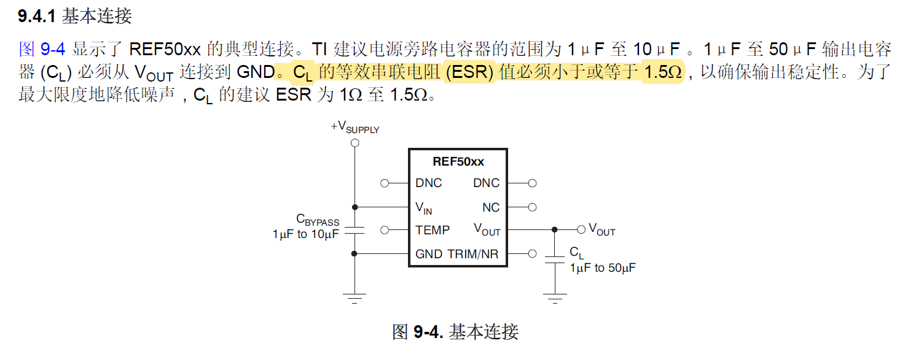
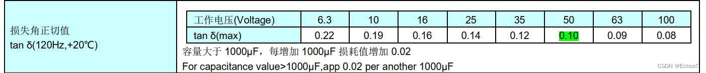
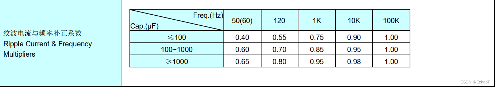

# 电容器ESR计算（没完全理解）

## 前提摘要

1. 个人说明：

   - **限于时间紧迫以及作者水平有限，本文错误、疏漏之处恐不在少数，恳请读者批评指正。意见请留言或者发送邮件至：“[Email:noahpanzzz@gmail.com](noahpanzzz@gmail.com)”**。
   - **本博客的工程文件均存放在：[GitHub:https://github.com/panziping](https://github.com/panziping)。**
   - **本博客的地址：[CSDN:https://blog.csdn.net/ZipingPan](https://blog.csdn.net/ZipingPan)**。
2. 参考：

   - [电解电容ESR计算](https://blog.csdn.net/little_chang/article/details/134587517)

---

## 正文

# # 注意：计算出来感觉不对！！！好像这个知识来源于开关电源，什么时候有空看一下！！！这里先记录一下！！！

在设计REF5040外围电路时，参考电路中有关于ESR的要求。通过网络搜索，所以这里总结一下ESR的知识（并不是经过体系学习，正确率无法保证）。

厂商下只给出120Hz下的电容损耗因子,这里通过换算计算100kHz工况下的ESR，下面给出具体计算方法。

**为什么是120Hz呢？电容器的损耗因数的测试标准是使用60Hz频率的国家首先提出的，故电容器的损耗因数的测试频率为60Hz交流电全波或桥式整流后的最低纹波频率（60Hz的两倍频）120Hz。**

以国内厂商承兴的220uF/50V 绿高频电解电容为例。

50V的损耗角正切值$\tan\delta$（120Hz,+20$^\circ C$）为0.10。

ESR计算公式：
$$
ESR=\frac{\tan\delta}{2\pi*f*C}
$$
220uF/50V电容的ESR在120Hz的ESR：
$$
ESR_{120Hz}=\frac{\tan\delta}{2\pi*f*C}=\frac{0.1}{2*3.14*120*220*10^{-6}}=0.603 \Omega 
$$

纹波电流-频率系数比为
$$
\frac{I_{120Hz}}{I_{100KHz}} = \frac{0.7}{1.0}
$$
$ESR_{100KHz}$换算公式：
$$
ESR_{100KHz} = (\frac{I_{120Hz}}{I_{100KHz}} )^{2} * ESR_{120Hz}= 0.7^{2}*0.603 = 0.295 \Omega 
$$

## 总结

---

**本文均为原创，欢迎转载，请注明文章出处：[CSDN:https://blog.csdn.net/ZipingPan/电路设计](https://blog.csdn.net/zipingpan/category_12627780.html)。百度和各类采集站皆不可信，搜索请谨慎鉴别。技术类文章一般都有时效性，本人习惯不定期对自己的博文进行修正和更新，因此请访问出处以查看本文的最新版本。**

**非原创博客会在文末标注出处，由于时效原因，可能并不是原创作者地址（已经无法溯源）。**

