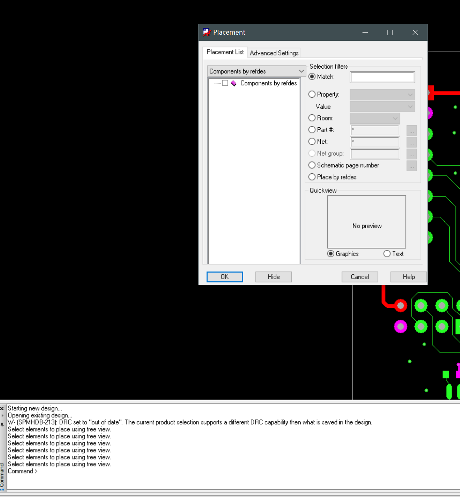
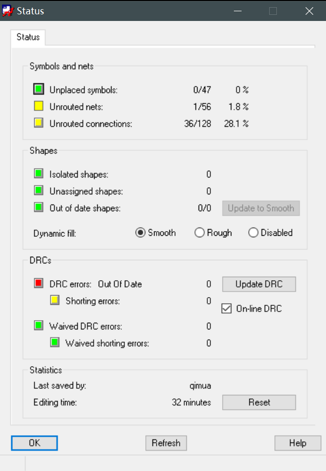

# Allegro Debug：无弹窗出现等问题

## 前提摘要

1. 个人说明：

   - **限于时间紧迫以及作者水平有限，本文错误、疏漏之处恐不在少数，恳请读者批评指正。意见请留言或者发送邮件至：“[Email:noahpanzzz@gmail.com](noahpanzzz@gmail.com)”**。
   - **本博客的工程文件均存放在：[GitHub:https://github.com/panziping](https://github.com/panziping)。**
   - **本博客的地址：[CSDN:https://blog.csdn.net/ZipingPan](https://blog.csdn.net/ZipingPan)**。
2. 参考：

   - 

---

## 正文

Allegro经常出现弹窗无法出现的情况。

情景一：手动放置元件Place Manually，无法跳出弹窗。

正常应该出现弹窗，但是有时候无法出现这个弹窗。

情景二：查看Status信息，点击前面颜色方块无反应，正常应该有弹窗出现。

解决办法：

网上查询了发现主要有两种解决办法：

1. Alt + Space（空格） + X（但是有时候无法解决）。
2. 关掉allegro PCB,然后把pcbenv目录（安装目录xxx\SPB_Data）下面的allegro.ini,allegro.geo,allegro.mru三个文件删除，重新打开软件即可。（推荐这个办法）。

## 总结

---

**本文均为原创，欢迎转载，请注明文章出处：[CSDN:https://blog.csdn.net/ZipingPan/Orcad Allegro](https://blog.csdn.net/zipingpan/category_12634775.html)。百度和各类采集站皆不可信，搜索请谨慎鉴别。技术类文章一般都有时效性，本人习惯不定期对自己的博文进行修正和更新，因此请访问出处以查看本文的最新版本。**

