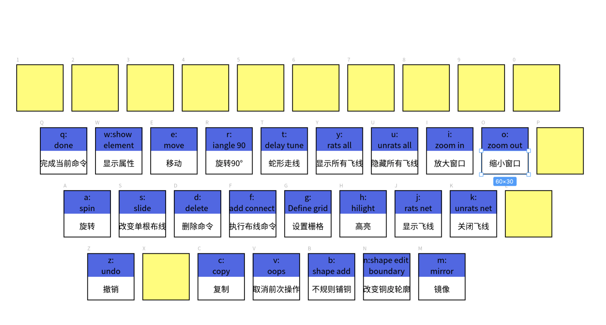

# Allegro：Allegro 快捷键

## 前提摘要

1. 个人说明：

   - **限于时间紧迫以及作者水平有限，本文错误、疏漏之处恐不在少数，恳请读者批评指正。意见请留言或者发送邮件至：“[Email:noahpanzzz@gmail.com](noahpanzzz@gmail.com)”**。
   - **本博客的工程文件均存放在：[GitHub:https://github.com/panziping](https://github.com/panziping)。**
   - **本博客的地址：[CSDN:https://blog.csdn.net/ZipingPan](https://blog.csdn.net/ZipingPan)**。
2. 参考：

   - [小哥Allegro:https://space.bilibili.com/456287853](https://space.bilibili.com/456287853)

---

## 正文

在Allegro中使用alias或funckey命令来定义快捷键，以代替常用的设计命令。

这两个命令的区别在于

- alias c copy：在设计过程中，按下字母‘c’后，还需要按下回车键，copy命令才会生效。
- funckey c copy：在设计过程中，按下字母‘c’后，copy命令直接就会生效。

命令存放在Cadence安装目录下，SPB_Data\pcbenv路径下env文件中，用记事本打开（需要确定环境变量正确）。

### 命令

|  命令   | 快捷键 |        操作         |              注释               |
| :-----: | :----: | :-----------------: | :-----------------------------: |
| funckey |   q    |        done         |          完成当前命令           |
| funckey |   w    |    show element     |            显示属性             |
| funckey |   e    |        move         |              移动               |
| funckey |   r    |      iangle 90      |             旋转90°             |
| funckey |   t    |     delay tune      |            蛇形走线             |
| funckey |   y    |      rats all       |       显示所有飞线xxxx与        |
| funckey |   u    |     unrats all      |          隐藏所有飞线           |
| funckey |   i    |       zoom in       | 放大窗口xxx（**好像与ix冲突**） |
| funckey |   o    |      zoom out       |            缩小窗口             |
|         |   p    |                     |                                 |
| funckey |   a    |        spin         |              旋转               |
| funckey |   s    |        slide        |          改变单根布线           |
| funckey |   d    |       delete        |            删除命令             |
| funckey |   f    |     add connect     |          执行布线命令           |
| funckey |   g    |     Define grid     |            设置栅格             |
| funckey |   h    |       hilight       |              高亮               |
| funckey |   j    |      rats net       |            显示飞线             |
| funckey |   k    |     unrats net      |            关闭飞线             |
|         |   l    |                     |                                 |
| funckey |   z    |        undo         |              撤销               |
|         |   x    |                     |       **与设置坐标冲突**        |
| funckey |   c    |        copy         |              复制               |
| funckey |   v    |        oops         |          取消前次操作           |
| funckey |   b    |      shape add      |           不规则铺铜            |
| funckey |   n    | shape edit boundary |          改变铜皮轮廓           |
| funckey |   m    |       mirror        |              镜像               |

---

//本人的快捷键，方便复制：

funckey q done
funckey w show element
funckey e move
funckey r iangle 90
funckey t delay tune
funckey y rats all
funckey u unrats all
funckey i zoom in
funckey o zoom out
funckey a spin
funckey s slide
funckey d delete
funckey f add connect
funckey g Define grid
funckey h hilight
funckey j rats net
funckey k unrats net
funckey z undo
funckey c copy
funckey v oops
funckey b shape add
funckey n shape edit boundary
funckey m mirror

---

// 注：小哥allegro的快捷键。

funckey A assign color			赋予颜色
funckey a spin				旋转	
funckey B shape add			不规则铺铜
funckey b change				修改
funckey C copy				复制
funckey c copy				复制
funckey D delete				删除命令
funckey d dehilight				取消高亮
funckey E move				移动
funckey e move				移动
funckey F add connect			执行布线命令
funckey f shape select			选择铜皮
funckey G next				下一个命令
funckey g Define grid			设置栅格
funckey H cancel				取消当前命令
funckey h hilight				高亮
funckey I zoom in				放大窗口
funckey J rats net				显示飞线
funckey j rats net				显示飞线
funckey K unrats net			关闭飞线
funckey k unrats net			关闭飞线
funckey M mirror				镜像

funckey N shape edit boundary		改变铜皮轮廓
funckey n cns show			显示对象信息
funckey O zoom out			缩小窗口
funckey P property edit			相当于菜单Edit -property
funckey p property edit			相当于菜单Edit -property
funckey Q done				完成当前命令
funckey q delay tune			蛇形走线
funckey R iangle 90			旋转90°
funckey r reports				相当于菜单tools-reports
funckey S slide				改变单根布线
funckey s spin 				旋转
funckey T swap components			交换器件
funckey u status				相当于菜单display-status
funckey U unrats all			隐藏所有飞线
funckey V oops				取消前一次操作
funckey W show element			显示属性
funckey w show element			显示属性
funckey X create fanout			扇出
funckey Y rats all				显示所有飞线
funckey y rats all				显示所有飞线
funckey Z undo				撤销
funckey z undo 				撤销

## 总结

---

**本文均为原创，欢迎转载，请注明文章出处：[CSDN:https://blog.csdn.net/ZipingPan/Orcad Allegro](https://blog.csdn.net/zipingpan/category_12634775.html)。百度和各类采集站皆不可信，搜索请谨慎鉴别。技术类文章一般都有时效性，本人习惯不定期对自己的博文进行修正和更新，因此请访问出处以查看本文的最新版本。**

