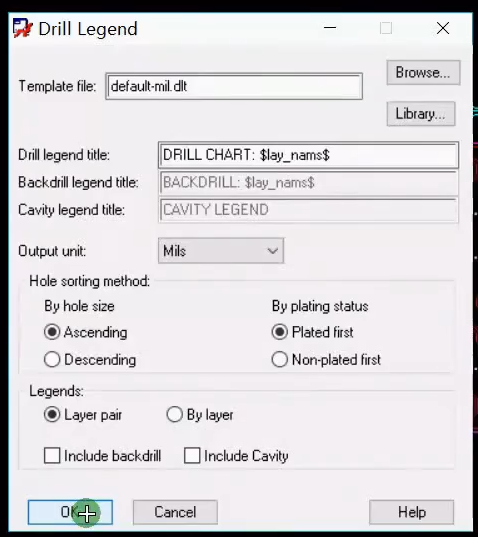
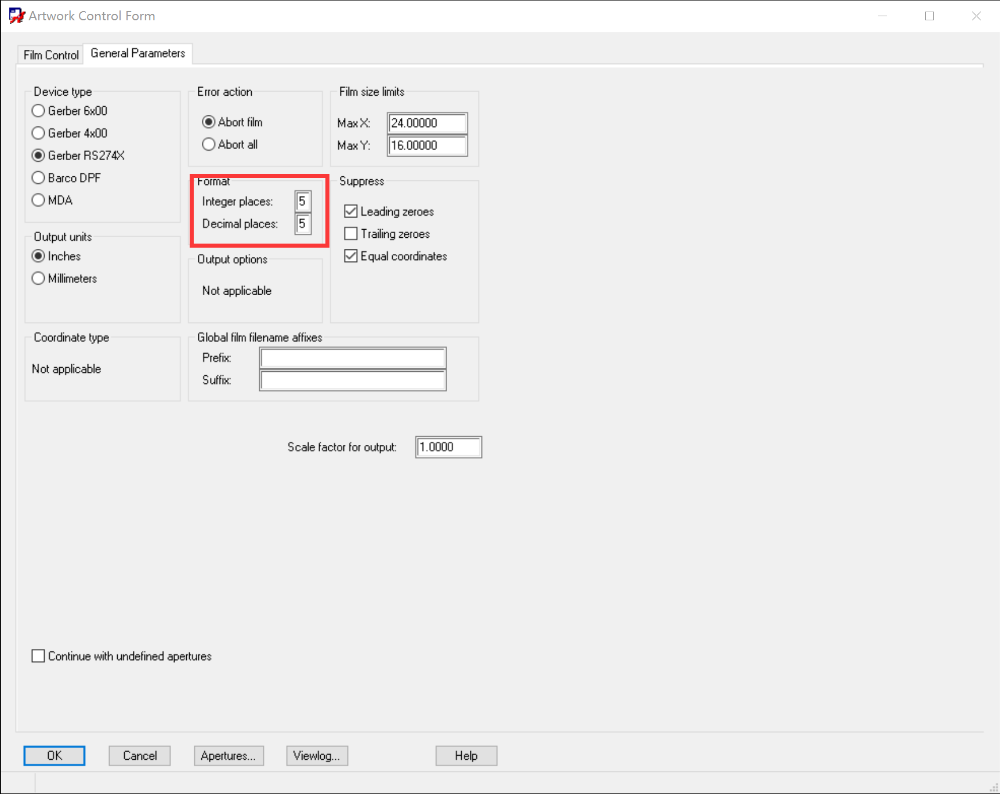
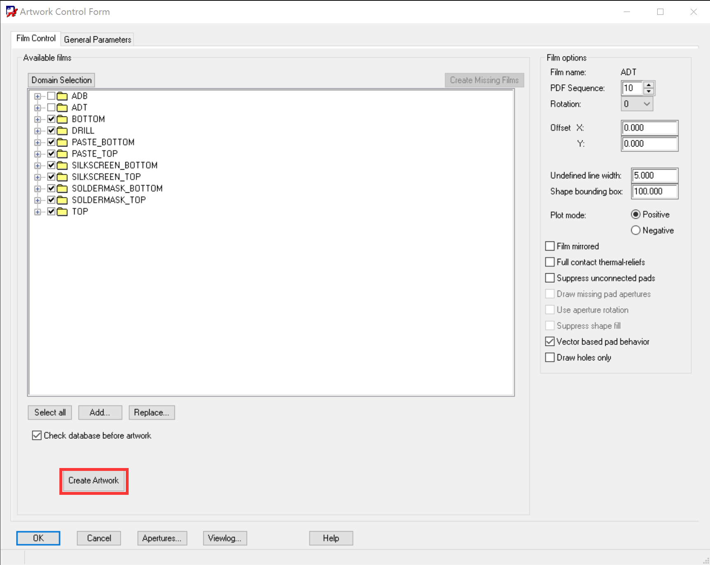
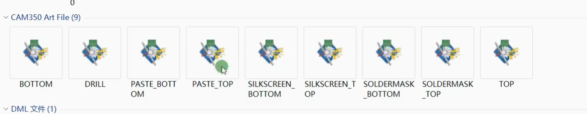
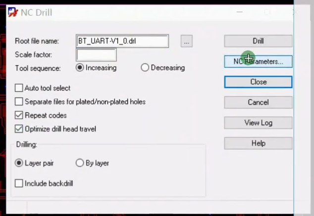
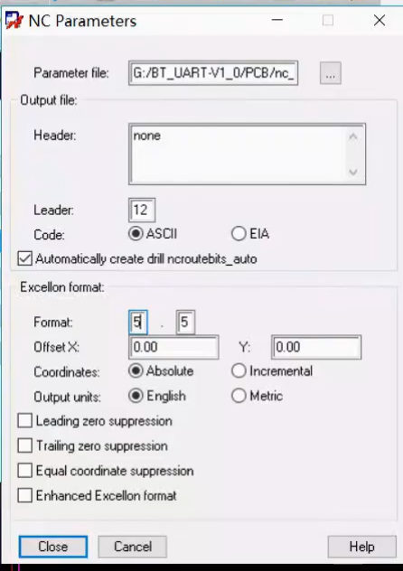
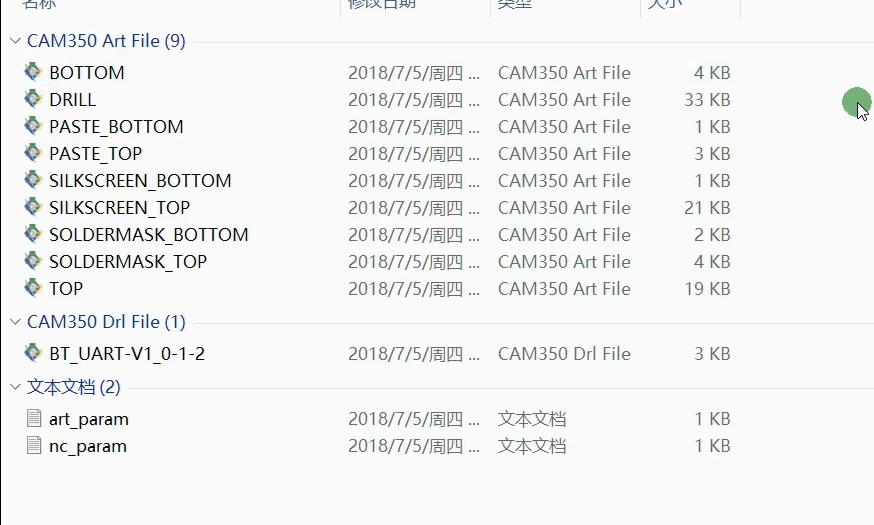

# Allegro：Gerber

## 前提摘要

1. 个人说明：

   - **限于时间紧迫以及作者水平有限，本文错误、疏漏之处恐不在少数，恳请读者批评指正。意见请留言或者发送邮件至：“[Email:noahpanzzz@gmail.com](noahpanzzz@gmail.com)”**。
   - **本博客的工程文件均存放在：[GitHub:https://github.com/panziping](https://github.com/panziping)。**
   - **本博客的地址：[CSDN:https://blog.csdn.net/ZipingPan](https://blog.csdn.net/ZipingPan)**。

2. 参考

   - [小哥Allegro:https://space.bilibili.com/456287853](https://space.bilibili.com/456287853)

---

## 正文

### Available films设置

- ADT

  - Class : BOARD GEOMETRY; Subclass : OUTLINE.	

  - Class: PIN; Subclass : TOP.

  - Class: PACKAGE GEOMETRY; Subclass : SILKSCREEN_TOP.

- ADB
  - Class : BOARD GEOMETRY; Subclass : OUTLINE.
  - Class: PIN; Subclass : BOTTOM.
  - Class: PACKAGE GEOMETRY; Subclass : SILKSCREEN_BOTTOM.

- TOP

  - Class : BOARD GEOMETRY; Subclass : OUTLINE.	

  - Class: ETCH; Subclass : TOP.

  - Class: PIN; Subclass : TOP.

  - Class: VIA CLASS; Subclass : TOP.

- BOTTOM
  - Class : BOARD GEOMETRY; Subclass : OUTLINE.
  - Class: ETCH; Subclass : BOTTOM.
  - Class: PIN; Subclass : BOTTOM.
  - Class: VIA CLASS; Subclass : BOTTOM.

- SOLDERMASK_TOP
  - Class : BOARD GEOMETRY; Subclass : OUTLINE.
  - Class: BOARD GEOMETRY; Subclass:  SOLDERMASK_TOP.
  - Class: PIN; Subclass : SOLDERMASK_TOP.
  - Class: PACKAGE GEOMETRY; Subclass:  SOLDERMASK_TOP.
  - **Class: VIA CLASS; Subclass:  SOLDERMASK_TOP.**(如果过孔需要开窗,添加此项)
- SOLDERMASK_BOTTOM
  - Class : BOARD GEOMETRY; Subclass : OUTLINE.
  - Class: BOARD GEOMETRY; Subclass:  SOLDERMASK_BOTTOM.
  - Class: PIN; Subclass : SOLDERMASK_BOTTOM.
  - Class: PACKAGE GEOMETRY; Subclass:  SOLDERMASK_BOTTOM.
  - **Class: VIA CLASS; Subclass:  SOLDERMASK_BOTTOM.**(如果过孔需要开窗,添加此项)
- SILKSCREEN_TOP
  - Class : BOARD GEOMETRY; Subclass : OUTLINE.
  - Class: BOARD GEOMETRY; Subclass:  SILKSCREEN_TOP.
  - Class: PACKAGE GEOMETRY; Subclass:  SILKSCREEN_TOP.
  - Class: REF DES; Subclass: SILKSCREEN_TOP.
- SILKSCREEN_BOTTOM
  - Class : BOARD GEOMETRY; Subclass : OUTLINE.
  - Class: BOARD GEOMETRY; Subclass:  SILKSCREEN_BOTTOM.
  - Class: PACKAGE GEOMETRY; Subclass:  SILKSCREEN_BOTTOM.
  - Class: REF DES; Subclass: SILKSCREEN_BOTTOM.

- PASTE_TOP

  - Class : BOARD GEOMETRY; Subclass : OUTLINE.

  - Class: PACKAGE GEOMETRY; Subclass:  PASTEMASK_TOP.

  - Class: PIN; Subclass: PASTEMASK_TOP.

- PASTE_BOTTOM

  - Class : BOARD GEOMETRY; Subclass : OUTLINE.

  - Class: PACKAGE GEOMETRY; Subclass:  PASTEMASK_BOTTOM.

  - Class: PIN; Subclass: PASTEMASK_BOTTOM.

- DRILL
  - Class : BOARD GEOMETRY; Subclass : OUTLINE.
  - Class : BOARD GEOMETRY; Subclass : DIMENSION.
  - Class : MANUFACTURING; Subclass : NCDRILL_FIGURE.
  - Class : MANUFACTURING; Subclass : NCDRILL_LEGEND.
  - Class : MANUFACTURING; Subclass : NCLEGEND-1-2.

### 尺寸标注

1. 菜单栏Manufacture->Dimension Environment

   鼠标右键选择Linear dimension。

   然后单击边框一边放置。

   具体显示在Class:Board Geomentry Subclass:Dimension

2. 菜单栏Manufacture->Dimension Environment

   鼠标右键选择Parameters修改单位。

   在Test栏Primary dimension修改单位。

3. 菜单栏Manufacture->Dimension Environment

   移动需要右键选择 Move Text。

### 生成钻孔表

菜单栏 Manufacture->NC->Drill Legend

点击OK。

将表格放置在PCB中即可。

可能区域不够，将操作区域变大。

此时生成一个新的Class：Manufacturing；SubClass：NCLEGEND-1-2。

将这个SubClass添加到Gerber中的Drill底片中。

钻孔表移动，Objects选择Groups。

### 输出ART文件

菜单栏 Manufacture->Artwork

在General Parameters选项卡中将Format中Integer places，Decimal places精度都设置为5。

勾选所有的底片，其中取消ADT和ADB这两个底片。

Create ARTWORK。需要查看是否有error，和warning的提醒都是什么。

### 输出钻孔文件

钻孔文件分为规则钻孔和不规则钻孔。

圆形的为规则钻孔。

菜单栏 Manufacture->NC->NC Drill输出钻孔文件。

勾选Repeat Codes和Optimize drill head travel

单击 NC Parameters，Format输入 5，5

单位是英制不需要更改。勾选最后一项Enhanced excellon format。关闭CLose

然后点击Drill输出钻孔。

这个操作是输出规则钻孔文件（.drl文件 ）。

---

输出不规则钻孔，可以不管规则和不规则直接输出不规则钻孔。

菜单栏 Manufacture->NC->NC Route输出钻孔文件。

点击Route输出不规则钻孔文件（.rou文件）。

---

在生成这些ARTWORK和DRILL文件过程中，同时生成了TXT文本文档。

### 打包制板文件

新建一个文件夹叫做Gerber。

选中ART文件和DRL文件，ROU文件（光绘文件，规则钻孔和不规则钻孔）。

选中art_param和nc_param这两个说明文档。（格式类型，精度，尺寸的一些信息）。

还需要制作一个文档，这个文档包括以下信息：

板厚，制版工艺，联系人， 联系方式，制版交期，制版数量以及其他特殊说明。

## 总结

---

**本文均为原创，欢迎转载，请注明文章出处：[CSDN:https://blog.csdn.net/ZipingPan/Orcad Allegro](https://blog.csdn.net/zipingpan/category_12634775.html)。百度和各类采集站皆不可信，搜索请谨慎鉴别。技术类文章一般都有时效性，本人习惯不定期对自己的博文进行修正和更新，因此请访问出处以查看本文的最新版本。**

