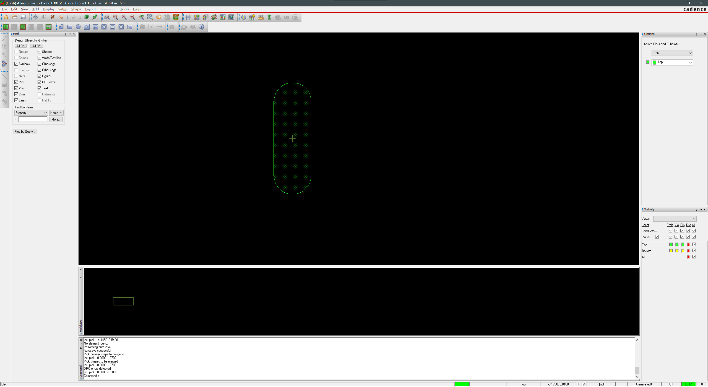
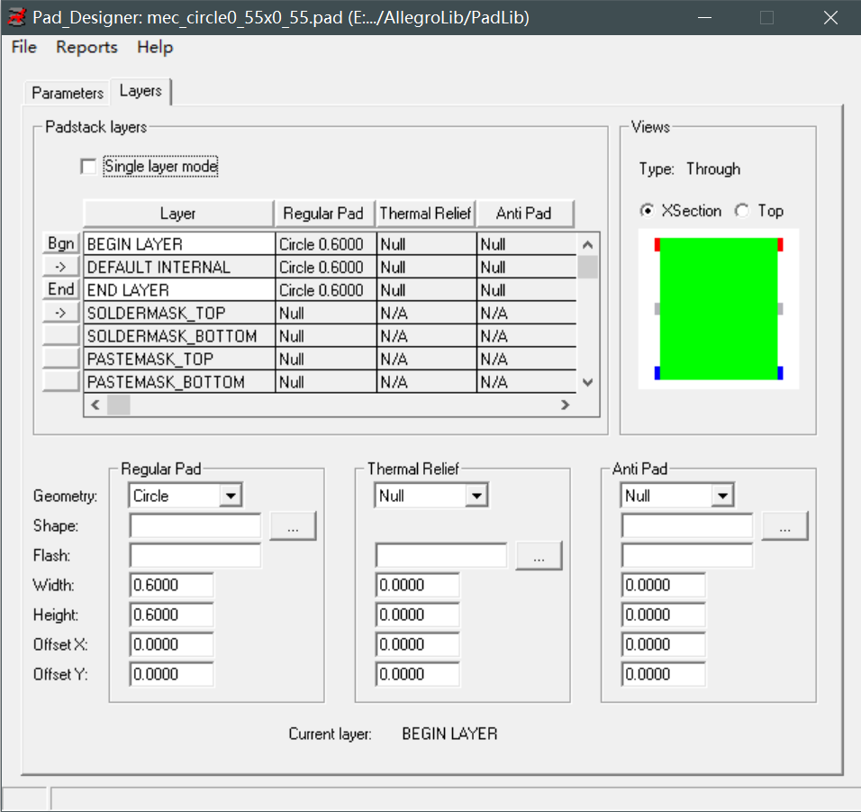
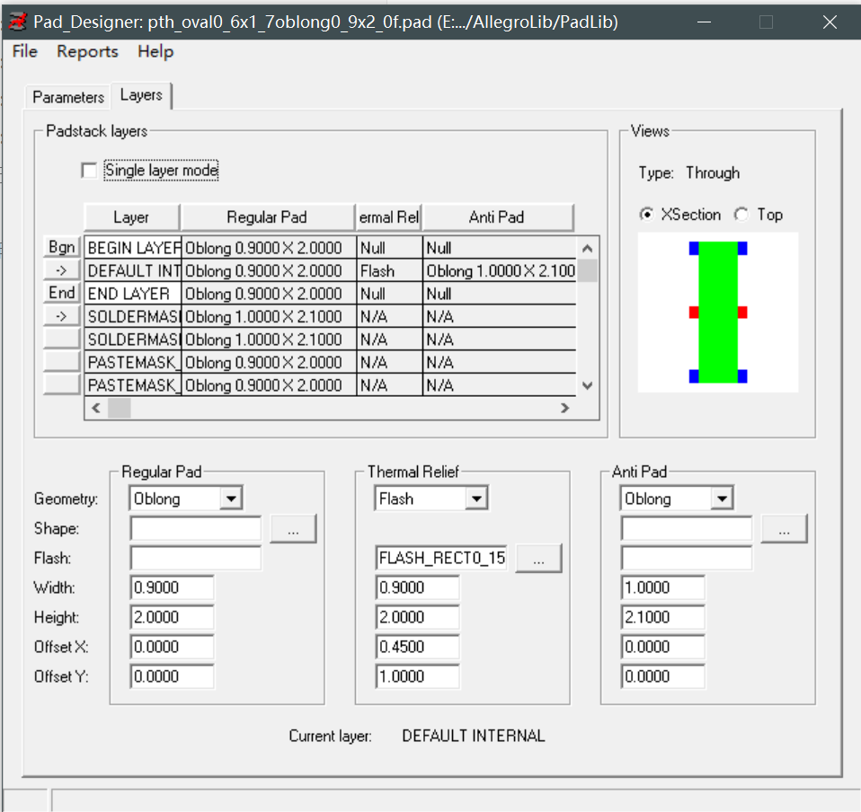

# Allegro：PCB封装制作

## 前提摘要

1. 个人说明：

   - **限于时间紧迫以及作者水平有限，本文错误、疏漏之处恐不在少数，恳请读者批评指正。意见请留言或者发送邮件至：“[Email:noahpanzzz@gmail.com](noahpanzzz@gmail.com)”**。
   - **本博客的工程文件均存放在：[GitHub:https://github.com/panziping](https://github.com/panziping)。**
   - **本博客的地址：[CSDN:https://blog.csdn.net/ZipingPan](https://blog.csdn.net/ZipingPan)**。
2. 参考：

   - 

## 正文

### Flash焊盘制作1（以1X5P排针为例）

#### 通孔焊盘规则

| 单位                            | mil                                                          | mm                                          |
| ------------------------------- | ------------------------------------------------------------ | ------------------------------------------- |
| Drill Diameter（钻孔直径）      | 实物尺寸+8-12mil                                             | 实物尺寸 + 0.2~0.3mm                        |
| Regular Pad（规则焊盘）         | Drill Diameter+10-20mil                                      | Drill Diameter+0.254~0.5 ≈ 2*Drill Diameter |
| Flash焊盘Inner Diameter（内径） | Drill Diameter+16-20 mil                                     | Drill Diameter+0.4-0.5 mm                   |
| Flash焊盘Outer Diameter（外径） | Drill Diameter+30-40 mil                                     | Drill Diameter+0.762-1 mm                   |
|                                 | 钻孔大小在0.5mm以下的，通常外径比内径大0.3mm                 | 超过0.5mm的孔，外径比内径大0.5~0.8mm        |
| Anti Pad（隔离焊盘）            | Drill Diameter+30 mil                                        | Drill Diameter+0.762 mm                     |
|                                 | 通常隔离焊盘比正规焊盘大0.2mm，0.1mm也可以                   |                                             |
| Spoke Width（开口宽度）         | Drill Diameter*Sin30°﹙正弦函数30度﹚ = Drill Diameter/2 = 半径 |                                             |

例如：0.2mm的过孔。

- Drill Diameter ：0.2mm
- Regular Pad ：Drill Diameter *2 = 0.4mm
- Anti Pad ：0.4mm + 0.2mm = 0.6mm
- Flash Inner Diameter：0.2mm + 0.4 mm = 0.6 mm
- Flash Outer Diameter：0.6mm + 0.3mm = 0.9mm
- Spoke Width：Drill Diameter * sin30° = 0.1mm。

倘若此时开口按照Drill diameter *Sin30° = 0.2 /2 = 0.1mm，也就是说在内层的铜皮与该孔连接的地方仅有0.1mm，放置完后，会看到DRC错误，那是因为shape to shape 默认间距是0.127mm，所以报错，就可以适当的把开口做大一点，比如0.2mm。公式不是绝对，可以适当的变动。

#### 小试牛刀

实物尺寸为0.64mm。

- Drill Diameter = 0.64mm +0.3mm = 0.94mm
- Regular Pad =  0.94mm + 0.8mm = 1.74mm（参考文章作者写规则焊盘好像并没有按照规则，而是为了规则焊盘等于外径）
- Flash Inner Diameter  = 0.94 + 0.5mm = 1.44mm
- Flash Outer Diameter = 0.94 + 0.8mm = 1.74mm
- Spoke Width：0.94 / 2 +0.1mm ≈ 0.60mm

#### Allegro制作Flash焊盘

1. (File->New,Flash Symbol,Flash_ic1_44sp0_60）

2. Add->Flash

   

3. Create Symbol.

4. Pad Designer 设计焊盘

5. Allegro制作1x5排针

   

### Flash焊盘制作2（以椭圆槽为例）

关于圆形Flash可以参考“Cadence Allegro（1）：Flash焊盘制作1（以1X5P排针为例）”一文。

由上图可知，钻孔的大小是Oblong，Width：1mm，Height：2.5mm。

Flash焊盘内径就是Oblong，Width：2mm，Height：4mm。

Flash焊盘外径就是Oblong，Width：3mm，Height：5mm。（外扩1mm）。

开口：1mm。

#### Allegro新建Flash Symbol（File->New）

#### Allegro 创建Flash图形

1. 2mmx4mm矩形，1mm的两个圆（Shape->Rectangular,Shape->Circular）

   矩形坐标： x -1 -2 ,x 1 2;

   圆坐标：x 0 -2，ix 1；x 0 2,ix 1

   

2. merge shape（Shape->Merge Shapes）

   

3. shape 外扩1mm

   参考的文章使用的z-copy，不知道为什么z-copy不能使用，这里直接鼠标点击边框，使用expand/contract。

   expand/contract使用时，需要点击+号，才生效。复制一份外径shape留作备用。

   参考中文章将内径shape保留下来，在挖槽的时候，会出现Cannot break shape into fragments错误。总结就是没必要保留内径shape。

   

4. 挖槽（Shape->Manual Void->Rectangular,Shape->Manual Void->Circular）

   需要先点击一下shape，再输入坐标。

   矩形坐标：x -1 -2,x 1 2;

   圆坐标：x 0 -2,ix 1;x 0 2，ix 1；

   

5. 挖开口（Shape->Manual Void->Rectangular）

   其中一个开口比较好弄，另外一个有点难弄。

   矩形坐标 x -1 0.5 x -2 -0.5

   

   可以使用Shape->Edit Boundary先修改成接近图形。

   

   然后在使用Shape->Manual Void->Rectangular删除多余的。

   先设置矩形的一个点x -0.5 -2.5，再用鼠标点下一个点（本来想使用坐标x 0.5 -4，但提示Cannot break shape into fragments，就直接用鼠标点一个大概区域）

   

6. 拼接

   先将外径移到坐标原点，作为参考。

   将这个图形通过copy rotation 和mirror geometry 等来拼成4个。

   

---

可以看出上述的椭圆Flash焊盘制作比较复杂。

在某论坛看到另外一篇关于制作椭圆Flash焊盘。

直接画圆形Flash焊盘，开口选择0°或者90°，然后手动移动。

以上参数为例：

- 钻孔的大小是Oblong，Width：1mm，Height：2.5mm。

- Flash焊盘内径就是Oblong，Width：2mm，Height：4mm。

- Flash焊盘外径就是Oblong，Width：3mm，Height：5mm。（外扩1mm）。

- 开口：1mm。

  

选择上面两个半圆使用move命令，iy 2；

选择下面两个半圆使用move命令，iy -2；

这里给出两个的区别，仅供参考。

### 手动PCB封装制作（以TYPE-C 16Pin为例）

一个器件的封装需要包含一下几个要素：

1. 焊盘
2. Place Bound
3. 丝印层丝印（Silkscreen）
4. 装配层外框（Assembly）
5. 1脚标识
6. 丝印层位号（Silkscreen）
7. 装配层位号（Assembly）

#### TYPE-C 16PIN规格书

[TYPE-C器件链接源自立创商城]: https://item.szlcsc.com/177331.html

由上图可以看到需要制作3种pad

1. 表贴焊盘smd
2. 通孔焊盘pth
3. 机械焊盘mec

#### 新建工程(File ->New)

#### 表贴焊盘

1. Pad Designer制作表贴焊盘

   规格：矩形表贴焊盘，宽0.3mm，高1.14mm（文件名：smd_rect0_3x1_14.pad）。

   

   

   规格：矩形表贴焊盘，宽0.6mm，高1.14mm（文件名：smd_rect0_6x1_14.pad）。

   

   

2. Allegro放置表贴焊盘

   需要放置8个0.3x1.14规格矩形表贴焊盘，放置4个0.6x1.14规格矩形表贴焊盘（需要先对工程设置操作区域和栅格大小）。

   1. 放置8个0.3x1.14规格矩形表贴焊盘，间距0.5mm。

      坐标x 0 0

      

   2. 移动中心点，Setup->Change Drawing Origin。

      想将坐标原点放置在8pin的中心坐标x 1.75 0（3x0.5 +0.25）

   3. 放置4个0.6x1.14规格表贴焊盘。

      矩形焊盘1坐标x 2.4 0 (0.15 + 4 * 0.5 +0.25)

      矩形焊盘2坐标x -2.4 0 

      矩形焊盘3坐标x 3.2 0(0.3 + 0.2 +0.3 +2.4)

      矩形焊盘4坐标x -3.2 0

      

   4. 修改pin脚位号

      由于软件默认的字体太大了，这里将默认字体改为width：0.10，height：0.13（setup->design parameters->text）。

      

#### 机械钻孔

1. Pad Designer制作机械钻孔

   规格：圆形机械钻孔，直径0.55mm（文件名：mec_circle0_55x0_55.pad）。

   

   

   2. Allegro放置机械钻孔

      圆形机械钻孔1坐标x 2.89 -1.07（5.78/2=2.89,1.64-1.14/2 = 1.07）

      圆形机械钻孔2坐标x -2.89 -1.07

      

#### 通孔焊盘（这部分有错误，建议看上面关于FLASH焊盘制作）

**由于电源层和地层使用的负片设计，所以需要使用flash焊盘。**

规格：通孔焊盘，椭圆钻孔:width 0.6mm，height 1.7mm；椭圆焊盘 0.9mm，height 2.0mm（文件名：pth_oval0_6x1_7oblong0_9x2_0f.pad）。

1. Allegro制作flash焊盘(Add ->Frectangle)

   

   flash需要挖空的小矩形尺寸是0.15x0.3,但是感觉这个尺寸好像设计的过小了（如果有懂的高手，还望提点）。

   四个矩形的坐标

   矩形1：x 0 0；x 0.15 0.3

   矩形2：x 0 1.7; x 0.15 2

   矩形3：x 0.75 0;x 0.9 0.3;

   矩形4：x 0.75 1.7;x 0.9 2.0

2. Pad Designer制作热焊盘

   

   

3. Allegro放置热焊盘

   图纸上没有标注该焊盘中心位置，这里暂定坐标为（4.325,-0.57）,(-4.325,-0.57)

   

规格：通孔焊盘，椭圆钻孔:width 0.6mm，height 1.4mm；椭圆焊盘 0.9mm，height 1.7mm（（文件名：pth_oval0_6x1_4oblong0_9x1_7f.pad）。

1. Allegro制作flash焊盘(Add ->Frectangle)

   

2. Pad Designer制作热焊盘

   

   

3. Allegro放置热焊盘

   图纸上没有标注该焊盘中心位置，这里暂定坐标为（4.325,-0.57-4.18 = -4.75）,(-4.325,-0.57-4.18)

   

#### Place Bound（shape->rectangular）

将class改为Package Geometry，将subclass改为Place Bound Top

Place Bound没有经过具体计算。

#### 丝印层丝印（Add->line）

将class改为Package Geometry，将subclass改为Silkscreen Top,线宽0.15mm。

丝印线尺寸没有经过具体计算。

#### 装配层外框（Add->line）

装配层外框尺寸没有经过具体计算。

将class改为Package Geometry，将subclass改为Assembly Top，线宽0mm

#### 1脚标识

不是芯片不需要1脚标识

#### 丝印层位号（Layout->Labels->RefDes）

将class改为RefDes，将subclass改为Silkscreen Top

#### 装配层位号（Layout->Labels->RefDes）

将class改为RefDes，将subclass改为Assembly Top

## 总结

---

**本文均为原创，欢迎转载，请注明文章出处：[CSDN:https://blog.csdn.net/ZipingPan/Orcad Allegro](https://blog.csdn.net/zipingpan/category_12634775.html)。百度和各类采集站皆不可信，搜索请谨慎鉴别。技术类文章一般都有时效性，本人习惯不定期对自己的博文进行修正和更新，因此请访问出处以查看本文的最新版本。**

