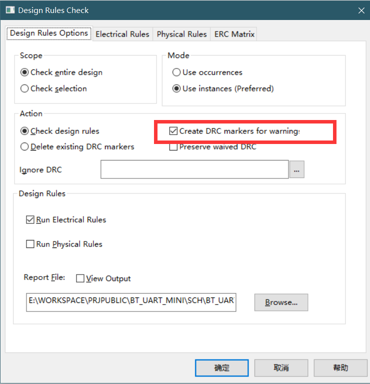
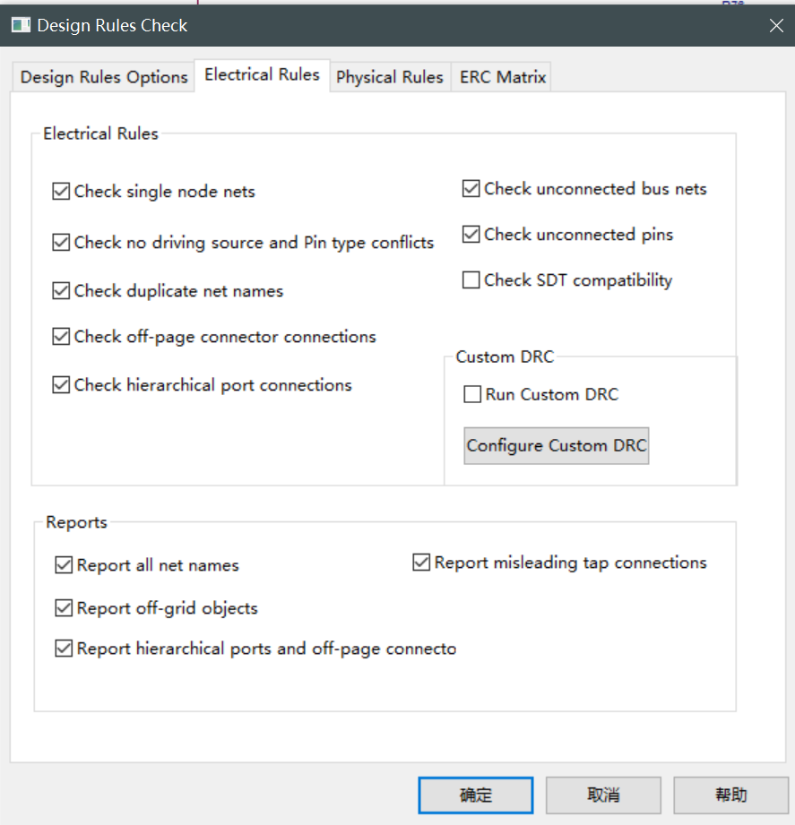

# OrCAD：原理图DRC检查

## 前提摘要

1. 个人说明：

   - **限于时间紧迫以及作者水平有限，本文错误、疏漏之处恐不在少数，恳请读者批评指正。意见请留言或者发送邮件至：“[Email:noahpanzzz@gmail.com](noahpanzzz@gmail.com)”**。
   - **本博客的工程文件均存放在：[GitHub:https://github.com/panziping](https://github.com/panziping)。**
   - **本博客的地址：[CSDN:https://blog.csdn.net/ZipingPan](https://blog.csdn.net/ZipingPan)**。
2. 参考：

   - [小哥Allegro:https://space.bilibili.com/456287853](https://space.bilibili.com/456287853)

---

## 正文

对整个工程进行进行DRC检查。

1. 选中工程文件(project.dsn)。

2. Tools->Design Rules Check。

   - 原理图标注DRC warning

     

   - DRC Electrical Rules

   

   1. Check single node nets:检查单端线
   2.  Check no driving source and Pin type conflicts检查驱动源和pin属性（比如inout的port和单端线连接就会报warning，忽略即可），另外看到部分论坛说这个高速仿真时可以用到，暂时没用到过
   3. check duplicate net names检查重复net名称
   4. check off-page connector connections检查off-page跨页连接
   5. check hierarchical port connections检查hier层次图连接
   6. check unconnected bus nets检查未连接总线网络
   7. check unconnected pins检查未连接pin
   8. check SDT compatibility 检查OrCAD设计工具兼容性,这是早期DOS版本中的OrCAD软件包中对应Capture的软件，用于将Capture电路对应转换成SDT格式，**完全不需要勾选**
      1. SDT:Schematic Design Tools
      2. SDT工具可以检查哪个Capture属性映射到哪个OrCAD原理图工具

   

没有弹出对话框，就说明DRC通过了。

**需要注意的是：如果电源标错了，DRC是不会报错的。**

如果有错误，在下方Session log中查看（Window -> Session log）

## 总结

---

**本文均为原创，欢迎转载，请注明文章出处：[CSDN:https://blog.csdn.net/ZipingPan/Orcad Allegro](https://blog.csdn.net/zipingpan/category_12634775.html)。百度和各类采集站皆不可信，搜索请谨慎鉴别。技术类文章一般都有时效性，本人习惯不定期对自己的博文进行修正和更新，因此请访问出处以查看本文的最新版本。**

