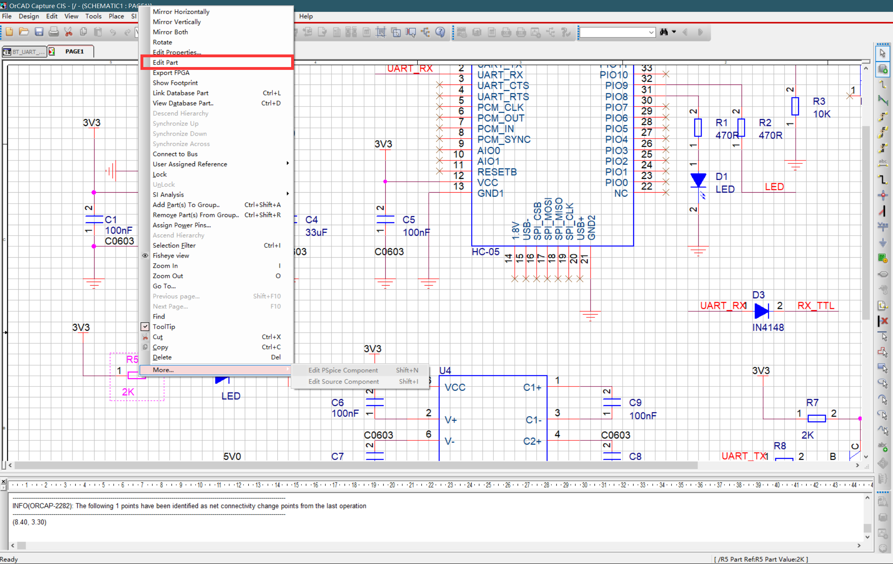
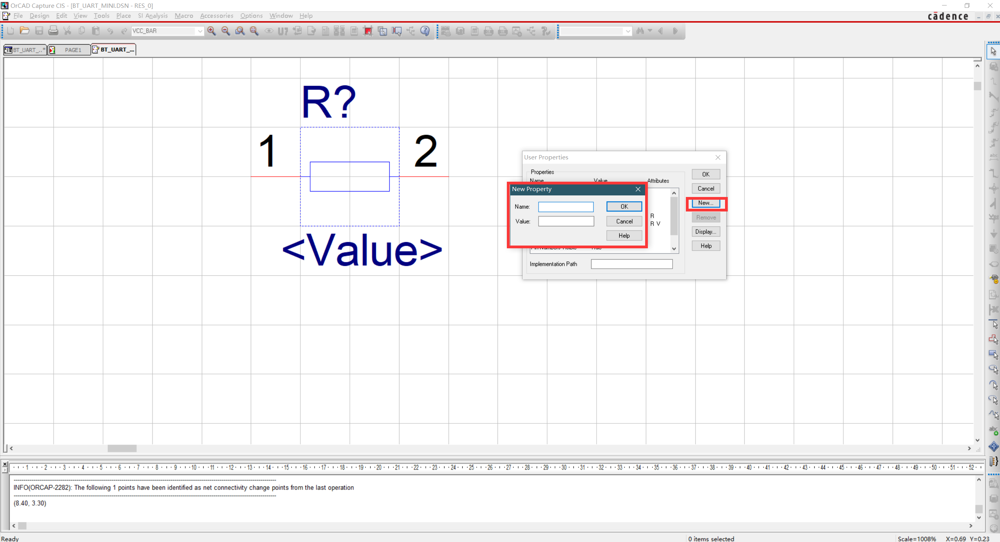
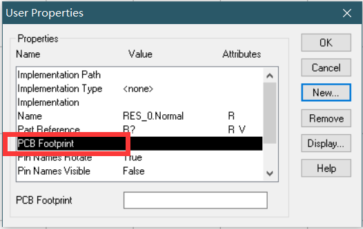
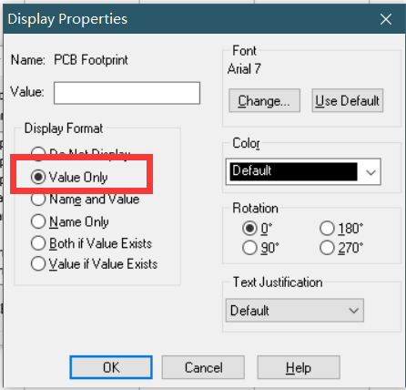
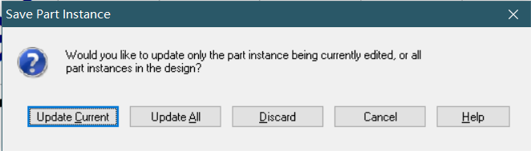

# OrCAD：原理图中显示元器件封装

## 前提摘要

1. 个人说明：

   - **限于时间紧迫以及作者水平有限，本文错误、疏漏之处恐不在少数，恳请读者批评指正。意见请留言或者发送邮件至：“[Email:noahpanzzz@gmail.com](noahpanzzz@gmail.com)”**。
   - **本博客的工程文件均存放在：[GitHub:https://github.com/panziping](https://github.com/panziping)。**
   - **本博客的地址：[CSDN:https://blog.csdn.net/ZipingPan](https://blog.csdn.net/ZipingPan)**。
2. 参考：

   - [小哥Allegro:https://space.bilibili.com/456287853](https://space.bilibili.com/456287853)

---

## 正文

选中元器件，右键选择Edit Part。

双击空白处编辑元器件User Properties属性，点击New，打开New Properties，Name输入**PCB Footprit**（注意一定不要输错），OK保存。

双击选择PCB Footprint，Display Fotmat选择Value Only，OK保存。

关闭元器件编辑界面，提示如下，选择Update All

## 总结

---

**本文均为原创，欢迎转载，请注明文章出处：[CSDN:https://blog.csdn.net/ZipingPan/Orcad Allegro](https://blog.csdn.net/zipingpan/category_12634775.html)。百度和各类采集站皆不可信，搜索请谨慎鉴别。技术类文章一般都有时效性，本人习惯不定期对自己的博文进行修正和更新，因此请访问出处以查看本文的最新版本。**

