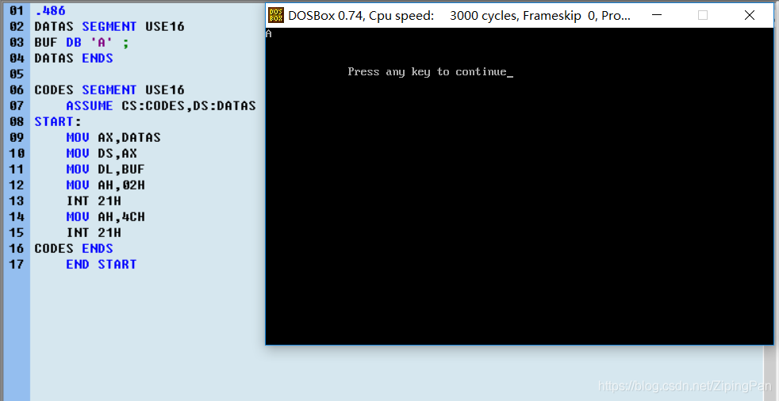
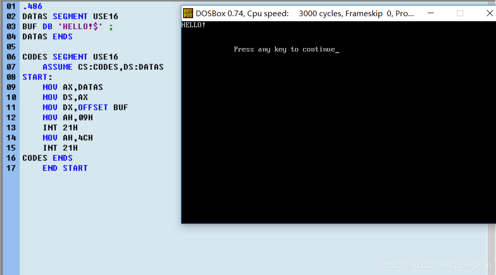
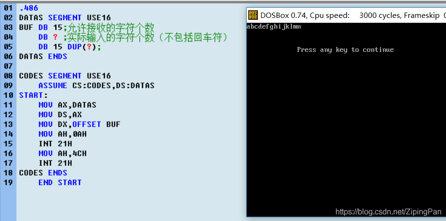

>只有真正的使用语言，才知道自己有没有真正的掌握这门语言。
>学习微机原理与接口技术这门学科的时候，结合网上的部分资料，对DOS和BIOS功能调用作出以下理解。

# DOS功能调用和BIOS功能调用

# DOS 功能调用

~~~assembly
    MOV AH,功能号
    设置入口参数
    INT 21H
    分析出口参数
~~~

###### 功能号00H：结束一个程序
 - 入口参数  CS:程序段前缀段基址
 - 在COM格式的源程序中，运用此项功能，可以结束一个程序，返回DOS.

###### 功能号01H：等待输入一个字符，有回显，响应Ctrl+C键
 - 入口参数：无。
 - 出口参数:AL=按键的ASCII码。
 - 若AL=0，表示按键是功能键，光标键，需再次调用本功能，才能返回按键的扩码。
~~~ assembly
MOV AH,01H
INT 21H
~~~

###### 功能号02H:显示一个字符，响应Ctrl+C键
 - 入口参数：DL=待显字符的ASCLL码。
 - 出口参数：无。
 - 本功能在屏幕的当前位置显示一个字符，光标右移一格，如果是在一行末尾显示字符，则光标返回下一行的开始格。如果是在屏幕的右下角显示字符，光标返回时屏幕要上滚一行。实验表明，该项功能要破坏AL寄存器的内容。
~~~ assembly
.486
DATAS SEGMENT USE16
BUF DB 'A' ;
DATAS ENDS
CODES SEGMENT USE16
    ASSUME CS:CODES,DS:DATAS
START:
    MOV AX,DATAS
    MOV DS,AX     
      MOV DL,BUF
      MOV AH,02H
      INT 21H
    MOV AH,4CH
    INT 21H
CODES ENDS
    END START
~~~

###### 功能号03H：从主串口读一个字符。
 - 入口参数：无。
 - 出口参数：AL=从主串口读到的字符编码。

###### 功能号04H：从主串口写一个字符。
 - 入口参数：DL=欲输出的字符编码。

###### 功能号05H：向打印机发送一个字符。
 - 入口参数：DL=待打印字符的ASCII码。
 - 出口参数：无。
 - 该项功能.DOS将自动检测打印机，如果打印机未准备好、缺纸、打印缓冲区满,DOS将在屏幕上显示错误信息。

###### 功能号06H：字符显示/字符输入。
 - 该项功能根据DL寄存器的内容执行字符显示/字符输人功能。若DL=FFH,该项功能为字符输人，若DL不等于FFH该项功能为字符显示。
 - 人口参数: DL=0~FEH。
 - 出口参数:无，显示与DL内容对应的字符。
 - 入口参数: DL= FFH。
 -  出口参数:该项功能执行时,若键盘缓冲区无字符可取,则置Z标志为1.若有字符可取,则置Z标志为0,AL寄存器即为输人字符的ASCII码。如果AL=0,需再次调用该项功能，方能在AL中得到按键的扩展码。作为字符输入功能时,不回显，不响应Ctrl+C键。

###### 功能号07H：等待输入一个字符，无回显，不响应Ctrl+C键。
 - 入口参数:无。
 - 出口参数: AL=按键的ASCII码,若AL=0,需再次调用该项功能才能在AL中得到按键的扩展码。

###### 功能号08H：等待输入一个字符，无回显，响应Ctrl+C键。
 - 入口参数:无。
 - 出口参数: AL=按键的ASCII码，若AL=0,需再次调用该项功能才能在AL中得到按键的扩展码。

###### 功能号09H：显示字符串，响应Ctrl+C键。
 - 入口参数: DS: DX=字符串首地址，字符串必须以‘$’ (即ASCII码24H)为结束标志。
 - 出口参数:无。
 - 该项功能从屏幕当前位置开始,显示字符申遇到结束标志' $ '时停止' $ '字符并不显示。
 - 实验证明9号功能也破坏AL寄存器的内容。
~~~ assembly
.486
DATAS SEGMENT USE16
BUF DB 'HELLO!$' ;
DATAS ENDS
CODES SEGMENT USE16
    ASSUME CS:CODES,DS:DATAS
START:
    MOV AX,DATAS
    MOV DS,AX     
      MOV DX,OFFSET BUF
      MOV AH,09H
      INT 21H
    MOV AH,4CH
    INT 21H
CODES ENDS
    END START
~~~

###### 功能号0AH：等待输入一串字符送入用户程序数据缓冲区。
 - 入口参数：DS:DX=输入数据缓冲区首地址。
该功能调用要求输入的字符串以“回车”作为结束标志，即按下回车键后，本次功能调用结束，光标返回当前行行始格。“回车符”ODH保存在缓冲区中。在接收字符的过程中，输入字符显示在屏幕上，响应Ctrl+C，按下退格键可删除屏幕以及缓冲区的当前字符。缓冲区不接收超长字符，否则发出声响以示警告。
注：

 - 缓冲区首单元应预置“允许接收的字符个数”（包括回车键）。用户输入回车之后，由0AH功能把实际输入的字符个数（不包括回车符）写入BUF+1单元。 
 - 输入的字符串从BUF+2单元开始一次存放。因此缓冲区的容量要大于（或等于）输入串的长度（包括回车符）+2
~~~ assembly
.486
DATAS SEGMENT USE16
BUF DB 15;允许接收的字符个数
      DB ? ;实际输入的字符个数（不包括回车符）
      DB 15 DUP(?);
DATAS ENDS
CODES SEGMENT USE16
    ASSUME CS:CODES,DS:DATAS
START:
    MOV AX,DATAS
    MOV DS,AX     
      MOV DX,OFFSET BUF
      MOV AH,0AH
      INT 21H
    MOV AH,4CH
    INT 21H
CODES ENDS
    END START
;只能输入15个字符，但输入15个字符时不能按下回车，所以只能输入14个字符
~~~

###### 功能号0BH：查询有无键盘输入，响应Ctrl+C。
 - 入口参数：无
 - 出口参数：AL=0;无输入
                AL=FFH;有输入

###### 功能号0CH:清除键盘缓冲区，然后调用由AL指定的功能。

###### 功能号4CH:结束正在运行的程序，并返回DOS操作系统。

