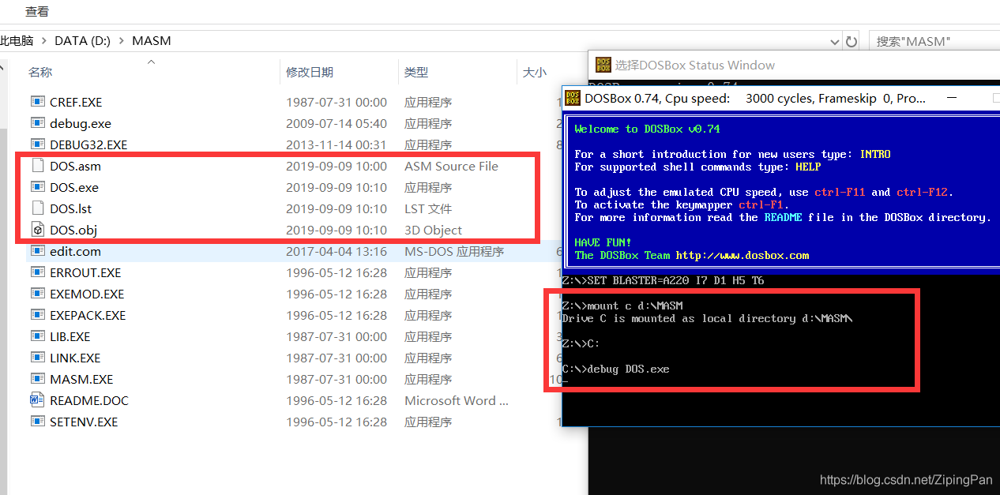
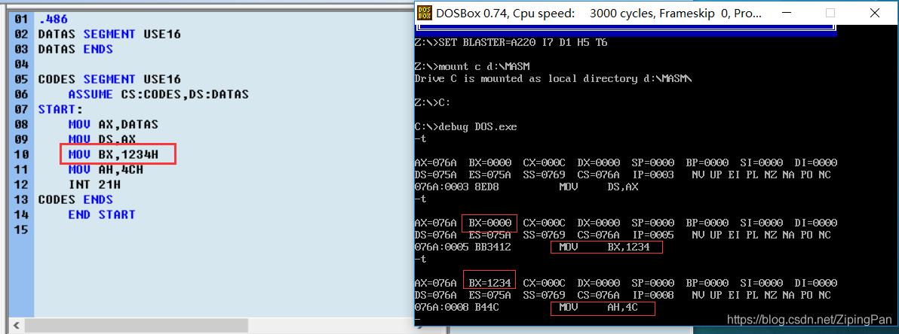
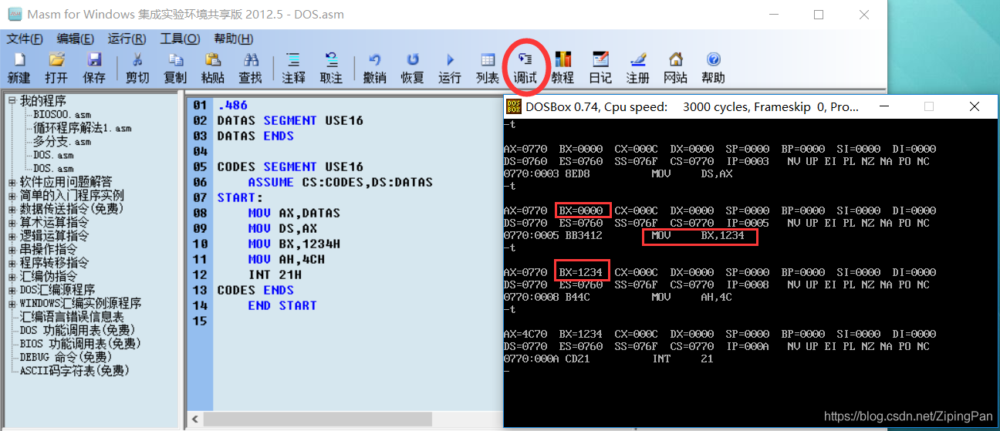

# 汇编程序debug的使用完整使用

### 前言

在网上搜索了10min，大多数关于汇编程序debug功能的使用的文章，发现大多数都是一样的，只是简单的介绍了debug的一些命令符之类的，均没有谈及你自己编写的汇编程序应该如何使用debug。这对新人学习汇编很不友好！

## debug的命令符

debug命令符    | Explain
-------- | -----
-a  | 逐行汇编
-u  | 反汇编
-t   | 逐行执行命令
-d  | 显示一定内存单元内容，再次输入将在原显示内容上继续显示下面内存的内容；
-q  | 退出debug回到dos状态；
-r   |改变或显示一个或多个寄存器的内容；
-n  | 命名文件；
-w | 将已命名文件写入磁盘；
-l  | 将程序装载进内存。


## 具体使用流程
话不多说直接开始，我们以一段最简单例子为例来说明如何使用debug。


```assembly language
.486
DATAS SEGMENT USE16
DATAS ENDS

CODES SEGMENT USE16
    ASSUME CS:CODES,DS:DATAS
START:
    MOV AX,DATAS
    MOV DS,AX	
	MOV BX,1234H
    MOV AH,4CH
    INT 21H
CODES ENDS
    END START 

```

我们将1234H这个数送给BX寄存器看，进行debug可否查看到BX寄存器的变化。

首先我们需要将自己编写的程序放在MASM这个文件夹（ [如何在win10_64位下搭载汇编环境](https://blog.csdn.net/xyisv/article/details/69062382)）下,然后启动DOS。


我们使用debug-t命令逐行执行指令。


后来发现MASM软件其实内置了调试按钮，比使用DOS更加轻松方便（白弄DOS了？不不不知识还是有用的。）


<p align="right">2019年9月9日于扬州</p>

