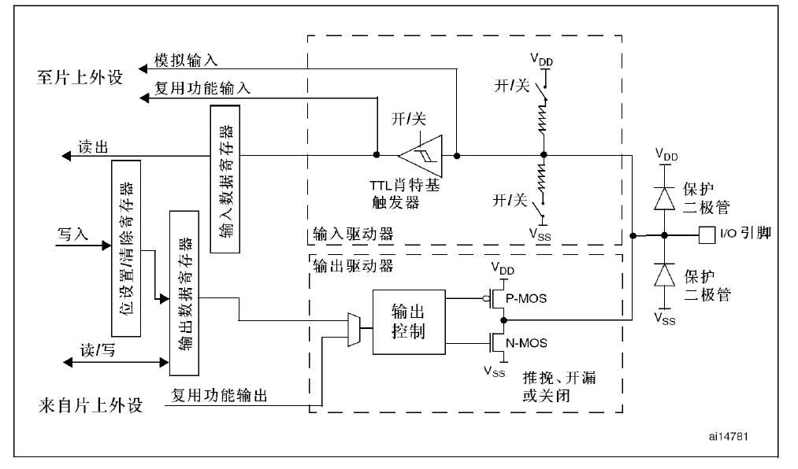

# STM32：GPIO

## 前提摘要

1. 个人说明：

   - **限于时间紧迫以及作者水平有限，本文错误、疏漏之处恐不在少数，恳请读者批评指正。意见请留言或者发送邮件至：“[Email:noahpanzzz@gmail.com](noahpanzzz@gmail.com)”**。
   - **本博客的工程文件均存放在：[GitHub:https://github.com/panziping](https://github.com/panziping)。**
   - **本博客的地址：[CSDN:https://blog.csdn.net/ZipingPan](https://blog.csdn.net/ZipingPan)**。
2. 参考：

   - 正点原子
   - 野火
   - ST数据手册

---

## 正文

## GPIO基本框架



## GPIO初始化结构体

```c
typedef struct
{
  __IO uint32_t CRL;
  __IO uint32_t CRH;
  __IO uint32_t IDR;
  __IO uint32_t ODR;
  __IO uint32_t BSRR;
  __IO uint32_t BRR;
  __IO uint32_t LCKR;
} GPIO_TypeDef;
```

## GPIO输出

GPIO输出模式：

1. 推挽输出

   一般应用于电平0V和3.3V且需要高速切换开关状态的场合。

2. 开漏输出

   应用于“线与”功能的总线电路（I2C）或者是电平不匹配的场合（低电平为0V，高电平为高阻状态，需要外接上拉电阻）。

3. 推挽复用输出

4. 开漏复用输出

```c
void GPIO_SetBits(GPIO_TypeDef* GPIOx, uint16_t GPIO_Pin);		//输出高电平
void GPIO_ResetBits(GPIO_TypeDef* GPIOx, uint16_t GPIO_Pin);	//输出低电平
```

## GPIO输入

GPIO输入模式：

1. 模拟输入
2. 浮空输入
3. 上拉输入
4. 下拉输入

```c
uint8_t GPIO_ReadInputDataBit(GPIO_TypeDef* GPIOx, uint16_t GPIO_Pin)	//读取对应Pin电平
```

## 外设GPIO配置

> 具体参考STM32F1参考手册中8.1.11章节	 外设的GPIO配置.

## GPIO复用和重映射

>具体参考STM32F1参考手册中8.3章节 	复用功能I/O和调试配置(AFIO)

复用功能I/O和调试配置(AFIO) 为了优化64脚或100脚封装的外设数目，可以把一些复用功能重新映射到其他引脚上。设置复用重映射和调试I/O配置寄存器(AFIO_MAPR)实现引脚的重新映射。这时，复用功能不再映射到它们的原始分配上。

```c
void GPIO_PinRemapConfig(uint32_t GPIO_Remap, FunctionalState NewState);
```

**需要注意的是，只有使用了AFIO的事件控制寄存器（AFIO_EVCR）、AFIO的重映射功能(AFIO_MAPR)以及外部中断(AFIO_EXTICRx)控制寄存器才需要开启AFIO的时钟。**


## 寄存器操作

1. 控制GPIO输出高电平 

```c
    //@param  p: GPIOx
    //@param  i: GPIO_Pin_x
    #define	digitalHi(p,i)		 	{p->BSRR=i;}	 	//输出为高电平		
```

2. 控制GPIO输出低电平

```c
    //@param  p: GPIOx
    //@param  i: GPIO_Pin_x
    #define digitalLo(p,i)		 	{p->BRR=i;}	 		//输出低电平
```

3. 控制GPIO输出翻转

```c
    //@param  p: GPIOx
    //@param  i: GPIO_Pin_x
    #define digitalToggle(p,i)		 {p->ODR ^=i;} 		//输出反转状态
```

### 编程指南

#### 按键控制LED，轮询检测

1. 配置GPIO
2. 轮询检测

#### **配置GPIO**

**GPIO硬件相关宏定义，bsp_gpio.h**

```c
#ifndef __BSP_GPIO_H
#define __BSP_GPIO_H

#include "stm32f10x.h"

#define BSP_GPIO_LED_Clk            RCC_APB2Periph_GPIOB      
#define BSP_GPIO_LED_CLK_Cmd        RCC_APB2PeriphClockCmd 
#define BSP_GPIO_LED_R_Port         GPIOB
#define BSP_GPIO_LED_R_Pin          GPIO_Pin_5
#define BSP_GPIO_LED_G_PORT         GPIOB
#define BSP_GPIO_LED_G_PIN          GPIO_Pin_0
#define BSP_GPIO_LED_B_PORT         GPIOB
#define BSP_GPIO_LED_B_PIN          GPIO_Pin_1


#define BSP_GPIO_KEY_CLK            RCC_APB2Periph_GPIOA|RCC_APB2Periph_GPIOC
#define BSP_GPIO_KEY_CLK_Cmd        RCC_APB2PeriphClockCmd
#define BSP_GPIO_KEY1_Port         	GPIOA
#define BSP_GPIO_KEY1_Pin          	GPIO_Pin_0
#define BSP_GPIO_KEY2_Port         	GPIOC
#define BSP_GPIO_KEY2_Pin          	GPIO_Pin_13
          
#define KEY_PRESS				   	1
#define KEY_UP                     	0

#endif /* __BSP_GPIO_H */
```

**注：LED低电平亮，高电平灭。按键按下为高电平，释放为低电平。**

**GPIO模块配置，bsp_gpio.c**

```c
static void BSP_GPIO_KEY_Config(void)
{
    GPIO_InitTypeDef GPIO_InitStructure;
    BSP_GPIO_KEY_CLK_Cmd(BSP_GPIO_KEY_CLK,ENABLE);
    
    GPIO_InitStructure.GPIO_Pin = BSP_GPIO_KEY1_Pin;
    GPIO_InitStructure.GPIO_Mode = GPIO_Mode_IN_FLOATING;
    GPIO_Init(BSP_GPIO_KEY1_Port,&GPIO_InitStructure);
    
    GPIO_InitStructure.GPIO_Pin = BSP_GPIO_KEY2_Pin;
    GPIO_InitStructure.GPIO_Mode = GPIO_Mode_IN_FLOATING;    
    GPIO_Init(BSP_GPIO_KEY2_Port,&GPIO_InitStructure);
}

static void BSP_GPIO_LED_Config(void)
{
    GPIO_InitTypeDef GPIO_InitStructure;
    
    BSP_GPIO_LED_CLK_Cmd(BSP_GPIO_LED_Clk,ENABLE);
    GPIO_InitStructure.GPIO_Pin = BSP_GPIO_LED_R_Pin;
    GPIO_InitStructure.GPIO_Mode = GPIO_Mode_Out_PP;
    GPIO_InitStructure.GPIO_Speed = GPIO_Speed_50MHz;
    GPIO_Init(BSP_GPIO_LED_R_Port,&GPIO_InitStructure);
}
```

#### 轮询检测

**主函数，main.c**

```c
uint8_t KEY_Scan(GPIO_TypeDef* GPIOx, uint16_t GPIO_Pin)
{
    uint8_t key_val = 0;
  
    if(GPIO_ReadInputDataBit(GPIOx, GPIO_Pin) == KEY_PRESS)
    {
        while(GPIO_ReadInputDataBit(GPIOx, GPIO_Pin) == KEY_PRESS);
        key_val = KEY_PRESS;
    }
    else
        key_val = KEY_UP;
    return key_val;
}

int main(void)
{
    BSP_GPIO_Init();
	while(1)
	{
		if(GPIO_KEY_Scan(GPIO_KEY2_PORT,GPIO_KEY2_PIN) == KEY_PRESS)
			BSP_GPIO_LED_R_Port->ODR ^=BSP_GPIO_LED_R_Pin;
	}
}
```

**按键采用硬件消抖，所以不需要在软件中进行延时处理。**


## 总结


---

**本文均为原创，欢迎转载，请注明文章出处：[CSDN:https://blog.csdn.net/ZipingPan/ARM](https://blog.csdn.net/zipingpan/category_12627684.html)。百度和各类采集站皆不可信，搜索请谨慎鉴别。技术类文章一般都有时效性，本人习惯不定期对自己的博文进行修正和更新，因此请访问出处以查看本文的最新版本。**

**非原创博客会在文末标注出处，由于时效原因，可能并不是原创作者地址（已经无法溯源）。**
