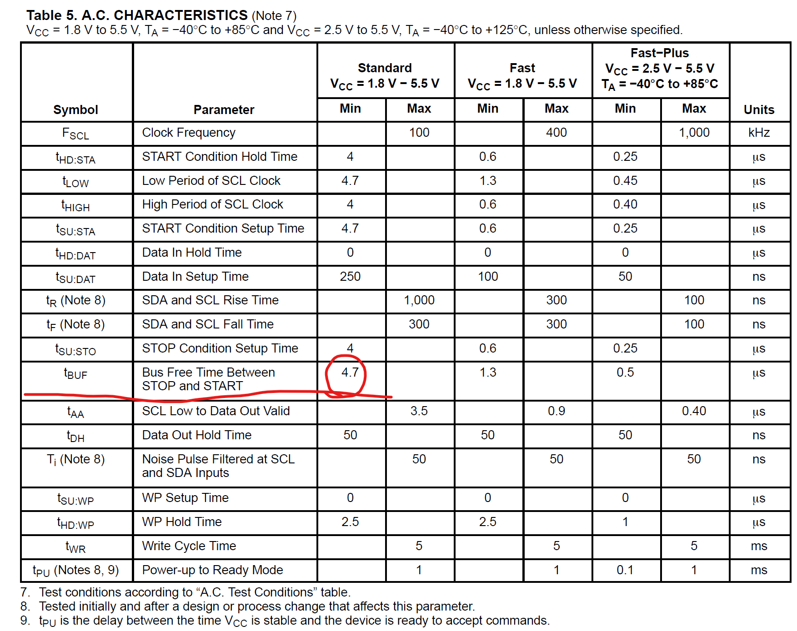
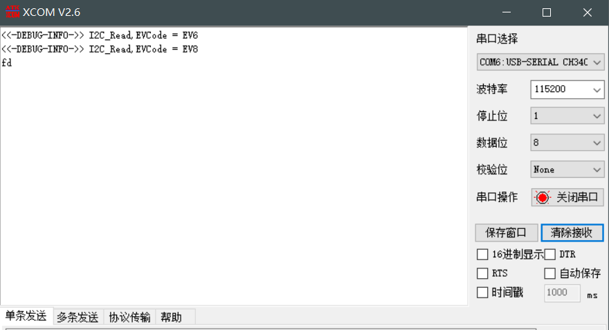
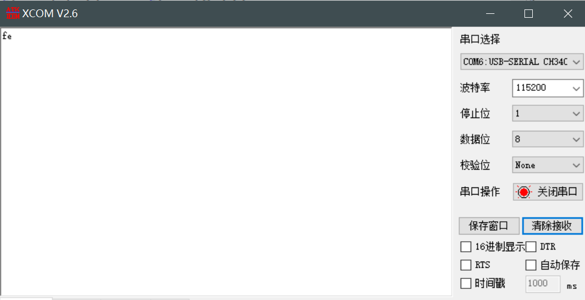
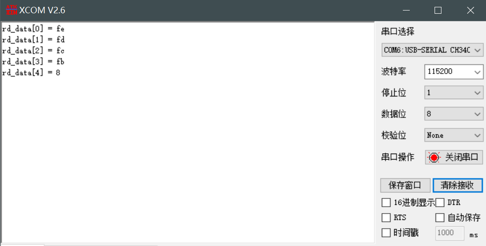

# STM32：I2C-EEPROM

## 前提摘要

1. 个人说明：

   - **限于时间紧迫以及作者水平有限，本文错误、疏漏之处恐不在少数，恳请读者批评指正。意见请留言或者发送邮件至：“[Email:noahpanzzz@gmail.com](noahpanzzz@gmail.com)”**。
   - **本博客的工程文件均存放在：[GitHub:https://github.com/panziping](https://github.com/panziping)。**
   - **本博客的地址：[CSDN:https://blog.csdn.net/ZipingPan](https://blog.csdn.net/ZipingPan)**。
2. 参考：

   - 正点原子
   - 野火
   - ST数据手册

---

## 正文

EEPROM读写需要注意

1. EEPROM读写操作之间，距离下一次操作需要留一定时间，给EEPROM芯片处理数据的时间，不能立即去读写的数据。

   

2. EEPROM多字节读写，需要注意页对齐的问题，不然会出现数据没有成功写入。

### 情况一：单字节连续读写

**具体I2C配置和应用层程序请参考前文**

**主函数，main.c**

```c
    uint8_t wr_data = 0xfe;
    uint8_t rd_data = 0;
    
    BSP_UART_Init();
    BSP_I2C_Init();
    BSP_I2C_WR_Byte(wr_data,EEPROM_ADDRESS7,0x00); 
    BSP_I2C_ReadBuffer(&rd_data,EEPROM_ADDRESS7,0x00,1);
    printf("%x",rd_data);
```



会发现此时会报错I2C读，EV6和EV8事件，查询STM32F1参考手册，会发现从设备对ADDR无应答。

#### 改进：此时加入等待从设备程序

**主函数，main.c**

```c
    uint8_t wr_data = 0xfe;
    uint8_t rd_data = 0;
    
    BSP_UART_Init();
    BSP_NVIC_Config();
    BSP_I2C_Init();
    BSP_I2C_WR_Byte(wr_data,EEPROM_ADDRESS7,0x00); 
    BSP_I2C_WaitStandByState(EEPROM_ADDRESS7);
    BSP_I2C_ReadBuffer(&rd_data,EEPROM_ADDRESS7,0x00,1);
    printf("%x",rd_data);
```



即可正常读出程序。

### 情况二：多字节地址对齐

**具体I2C配置和应用层程序请参考前文**

**主函数，main.c**

```c
    uint8_t wr_data[5] = {0xfe,0xfd,0xfc,0xfb,0xfa};
    uint8_t rd_data[5] = {0};
    
    BSP_UART_Init();
    BSP_NVIC_Config();
    BSP_I2C_Init();
    BSP_I2C_WriteBuffer(wr_data,EEPROM_ADDRESS7,0x04,sizeof(wr_data)/sizeof(uint8_t)); 
    BSP_I2C_WaitStandByState(EEPROM_ADDRESS7);
    BSP_I2C_ReadBuffer(rd_data,EEPROM_ADDRESS7,0x04,sizeof(rd_data)/sizeof(uint8_t));
    for(int i = 0;i<5;i++)
    {
        printf("rd_data[%d] = %x\r\n",i,rd_data[i]);
    }
```

此时EEPROM理想存储情况

|     地址     | 0x04 | 0x05 | 0x06 | 0x07 | 0x08 |
| :----------: | :--: | :--: | :--: | :--: | :--: |
|   写入数据   | 0xfe | 0xfd | 0xfc | 0xfb | 0xfa |
| 实际读出数据 | 0xfe | 0xfd | 0xfc | 0xfb |  8   |



这是由于EEPROM多字节写入必须要考虑页对齐的情况，同时一次写入不能超过EEPROM页大小。

- **1Kbit/2Kbit大小的EEPROM最多写入8Byte；**
- **4Kbit/8Kbit/16Kbit大小的EEPROM最多写入16Byte；**

```c
void BSP_I2C_EE_Page_BufferWrite(uint8_t *pBuffer,uint8_t WriteAddr,uint8_t NumBytetoWrite)
{
    if(NumBytetoWrite > EE_PAGE_SIZE)
        NumBytetoWrite = EE_PAGE_SIZE;
    BSP_I2C_KeepWrite(pBuffer,EEPROM_ADDRESS7,WriteAddr,NumBytetoWrite);
}
```


**不定长字节写入，没有页写入的最大字节8Byte限制**

```c
void BSP_I2C_EE_BufferWrite(uint8_t *pBuffer,uint8_t WriteAddr,uint8_t NumBytetoWrite)
{
    uint8_t NumofPage = 0,NumofSingle = 0,Addr = 0,Addr_Cnt = 0,Addr_Temp = 0;
    
    Addr = WriteAddr % EE_PAGE_SIZE;
    Addr_Cnt = EE_PAGE_SIZE - Addr;
    NumofPage = NumBytetoWrite  / EE_PAGE_SIZE;
    NumofSingle = NumBytetoWrite % EE_PAGE_SIZE;
    
    if(Addr == 0){
        if(NumofPage == 0){
            BSP_I2C_KeepWrite(pBuffer,EEPROM_ADDRESS7,WriteAddr,NumBytetoWrite);
            BSP_I2C_WaitStandByState(EEPROM_ADDRESS7);
        }
        else{
            while(NumofPage--){
                BSP_I2C_KeepWrite(pBuffer,EEPROM_ADDRESS7,WriteAddr,EE_PAGE_SIZE);
                BSP_I2C_WaitStandByState(EEPROM_ADDRESS7);
                WriteAddr += EE_PAGE_SIZE;
                pBuffer += EE_PAGE_SIZE;
            }
            if(NumofSingle != 0){
                BSP_I2C_KeepWrite(pBuffer,EEPROM_ADDRESS7,WriteAddr,NumofSingle);
                BSP_I2C_WaitStandByState(EEPROM_ADDRESS7);
            }
        }    
    }
    else{
        if(NumofPage == 0){
            if(NumofSingle > Addr_Cnt){
                Addr_Temp = NumofSingle - Addr_Cnt;
                BSP_I2C_KeepWrite(pBuffer,EEPROM_ADDRESS7,WriteAddr,Addr_Cnt);
                BSP_I2C_WaitStandByState(EEPROM_ADDRESS7);
                WriteAddr += Addr_Cnt;
                pBuffer += Addr_Cnt;
                
                BSP_I2C_KeepWrite(pBuffer,EEPROM_ADDRESS7,WriteAddr,Addr_Temp);
                BSP_I2C_WaitStandByState(EEPROM_ADDRESS7); 
            }
            else{
                BSP_I2C_KeepWrite(pBuffer,EEPROM_ADDRESS7,WriteAddr,NumBytetoWrite);
                BSP_I2C_WaitStandByState(EEPROM_ADDRESS7); 
            }
        }
        else{
            NumBytetoWrite -= Addr_Cnt;
            NumofPage = NumBytetoWrite  / EE_PAGE_SIZE;
            NumofSingle = NumBytetoWrite % EE_PAGE_SIZE;
            if(Addr_Cnt != 0){
                BSP_I2C_KeepWrite(pBuffer,EEPROM_ADDRESS7,WriteAddr,Addr_Cnt);
                BSP_I2C_WaitStandByState(EEPROM_ADDRESS7); 
                WriteAddr += Addr_Cnt;;
                pBuffer += Addr_Cnt;
            }
            while(NumofPage--){
                BSP_I2C_KeepWrite(pBuffer,EEPROM_ADDRESS7,WriteAddr,EE_PAGE_SIZE);
                BSP_I2C_WaitStandByState(EEPROM_ADDRESS7);
                WriteAddr += EE_PAGE_SIZE;
                pBuffer += EE_PAGE_SIZE;
            
            }
            if(NumofSingle != 0){
                BSP_I2C_KeepWrite(pBuffer,EEPROM_ADDRESS7,WriteAddr,NumofSingle);
                BSP_I2C_WaitStandByState(EEPROM_ADDRESS7); 
            }
        }
    } 
}
```

上述代码主要分为以下几种情况。

1. 写入的数据的首地址页对齐。
   1. 数据长度没有超过一页的大小（8Byte），则直接写入。
   2. 数据长度超过一页的大小（8Byte），先按页写入，再将多余的写入新的一页。
2. 写入的数据的首地址并不是页对齐。
   1. 数据长度没有超过一页的大小（8Byte）
      - 数据首地址距离页尾的空间不足以放下整个数据，则先补全该页，再将剩余的数据写到下一页。
      - 数据首地址距离页尾的空间足以放下整个数据，则直接写入。
   2. 数据长度超过一页的大小（8Byte）
      - 先补全该页，再按页写入，再将剩余的数据写到下一页。


## 总结


---

**本文均为原创，欢迎转载，请注明文章出处：[CSDN:https://blog.csdn.net/ZipingPan/ARM](https://blog.csdn.net/zipingpan/category_12627684.html)。百度和各类采集站皆不可信，搜索请谨慎鉴别。技术类文章一般都有时效性，本人习惯不定期对自己的博文进行修正和更新，因此请访问出处以查看本文的最新版本。**

**非原创博客会在文末标注出处，由于时效原因，可能并不是原创作者地址（已经无法溯源）。**
