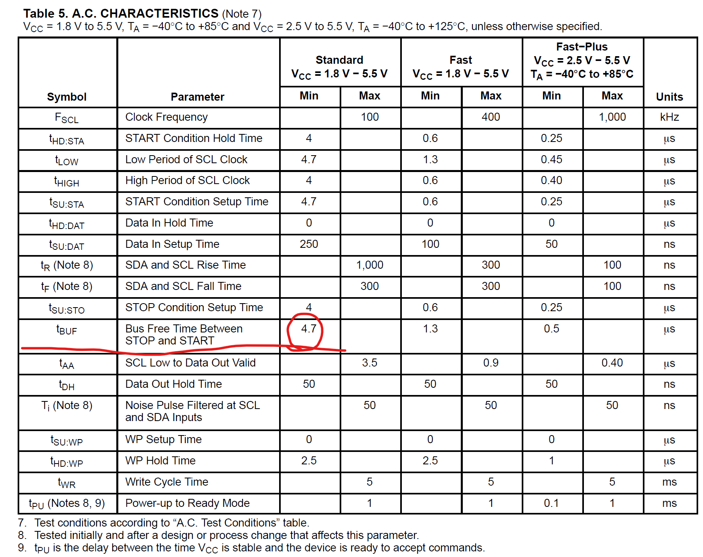

# STM32：I2C-应用层程序

## 前提摘要

1. 个人说明：

   - **限于时间紧迫以及作者水平有限，本文错误、疏漏之处恐不在少数，恳请读者批评指正。意见请留言或者发送邮件至：“[Email:noahpanzzz@gmail.com](noahpanzzz@gmail.com)”**。
   - **本博客的工程文件均存放在：[GitHub:https://github.com/panziping](https://github.com/panziping)。**
   - **本博客的地址：[CSDN:https://blog.csdn.net/ZipingPan](https://blog.csdn.net/ZipingPan)**。
2. 参考：

   - 正点原子
   - 野火
   - ST数据手册

---

## 正文

### I2C字节写入

```c
void BSP_I2C_WRByte(uint8_t data, uint8_t SlaveAddr, uint8_t WriteAddr) {
    ErrorStatus status = ERROR;
    I2C_GenerateSTART(BSP_I2Cx, ENABLE);
    I2C_TimeCounter = 0;
    do {
        status = I2C_CheckEvent(BSP_I2Cx, I2C_EVENT_MASTER_MODE_SELECT);
        I2C_TimeCounter++;
    } while ((I2C_TimeCounter != BSP_I2Cx_FLAG_TIMEOUT) && (status == ERROR));
    if (status == ERROR)
        DEBUG_INFO("I2C_Write,EVCode = EV5");


    I2C_Send7bitAddress(BSP_I2Cx, SlaveAddr, I2C_Direction_Transmitter);
    I2C_TimeCounter = 0;
    do {
        status = I2C_CheckEvent(BSP_I2Cx, I2C_EVENT_MASTER_TRANSMITTER_MODE_SELECTED);
        I2C_TimeCounter++;
    } while ((I2C_TimeCounter != BSP_I2Cx_LONG_TIMEOUT) && (status == ERROR));
    if (status == ERROR)
        DEBUG_INFO("I2C_Write,EVCode = EV6");


    I2C_SendData(BSP_I2Cx, WriteAddr);
    I2C_TimeCounter = 0;
    do {
        status = I2C_CheckEvent(BSP_I2Cx, I2C_EVENT_MASTER_BYTE_TRANSMITTING);
        I2C_TimeCounter++;
    } while ((I2C_TimeCounter != BSP_I2Cx_FLAG_TIMEOUT) && (status == ERROR));
    if (status == ERROR)
        DEBUG_INFO("I2C_Write,EVCode = EV8");

    I2C_SendData(BSP_I2Cx, data);
    I2C_TimeCounter = 0;
    do {
        status = I2C_CheckEvent(BSP_I2Cx, I2C_EVENT_MASTER_BYTE_TRANSMITTED);
        I2C_TimeCounter++;
    } while ((I2C_TimeCounter != BSP_I2Cx_FLAG_TIMEOUT) && (status == ERROR));
    if (status == ERROR)
        DEBUG_INFO("I2C_Write,EVCode = EV8_2");
    
    I2C_GenerateSTOP(BSP_I2Cx, ENABLE);
}
```


### I2C连续写入

```c
void BSP_I2C_KeepWrite(uint8_t *pBuffer, uint8_t SlaveAddr, uint8_t WriteAddr, uint8_t NumBytetoWrite) {
    ErrorStatus status = ERROR;
    I2C_TimeCounter = 0;
    do {
        status = (ErrorStatus) I2C_GetFlagStatus(BSP_I2Cx, I2C_FLAG_BUSY);
        I2C_TimeCounter++;
    } while ((I2C_TimeCounter != BSP_I2Cx_LONG_TIMEOUT) && (status != RESET));
    if (status != RESET) {
        DEBUG_INFO("I2C Write,I2C BUS Busy!");
    }

    I2C_GenerateSTART(BSP_I2Cx, ENABLE);
    I2C_TimeCounter = 0;
    do {
        status = I2C_CheckEvent(BSP_I2Cx, I2C_EVENT_MASTER_MODE_SELECT);
        I2C_TimeCounter++;
    } while ((I2C_TimeCounter != BSP_I2Cx_FLAG_TIMEOUT) && (status == ERROR));
    if (status == ERROR)
        DEBUG_INFO("I2C_Write,EVCode = EV5");

    I2C_Send7bitAddress(BSP_I2Cx, SlaveAddr, I2C_Direction_Transmitter);
    I2C_TimeCounter = 0;
    do {
        status = I2C_CheckEvent(BSP_I2Cx, I2C_EVENT_MASTER_TRANSMITTER_MODE_SELECTED);
        I2C_TimeCounter++;
    } while ((I2C_TimeCounter != BSP_I2Cx_FLAG_TIMEOUT) && (status == ERROR));
    if (status == ERROR)
        DEBUG_INFO("I2C_Write,EVCode = EV6");


    I2C_SendData(BSP_I2Cx, WriteAddr);
    I2C_TimeCounter = 0;
    do {
        status = I2C_CheckEvent(BSP_I2Cx, I2C_EVENT_MASTER_BYTE_TRANSMITTING);
        I2C_TimeCounter++;
    } while ((I2C_TimeCounter != BSP_I2Cx_FLAG_TIMEOUT) && (status == ERROR));
    if (status == ERROR)
        DEBUG_INFO("I2C_Write,EVCode = EV8");

    while (NumBytetoWrite) {
        I2C_SendData(BSP_I2Cx, *pBuffer);
        I2C_TimeCounter = 0;
        do {
            status = I2C_CheckEvent(BSP_I2Cx, I2C_EVENT_MASTER_BYTE_TRANSMITTED);
            I2C_TimeCounter++;
        } while ((I2C_TimeCounter != BSP_I2Cx_FLAG_TIMEOUT) && (status == ERROR));
        if (status == ERROR)
            DEBUG_INFO("I2C_Write,EVCode = EV8");
        pBuffer++;
        NumBytetoWrite--;
    }
    I2C_GenerateSTOP(BSP_I2Cx, ENABLE);
}
```

### I2C连续读出

```c
void BSP_I2C_KeepRead(uint8_t *pBuffer, uint8_t SlaveAddr, uint8_t WriteAddr, uint8_t NumByteToRead) {
    ErrorStatus status = ERROR;
    I2C_TimeCounter = 0;
    do {
        status = (ErrorStatus) I2C_GetFlagStatus(BSP_I2Cx, I2C_FLAG_BUSY);
        I2C_TimeCounter++;
    } while ((I2C_TimeCounter != BSP_I2Cx_LONG_TIMEOUT) && (status != RESET));
    if (status != RESET) {
        DEBUG_INFO("I2C_Read,I2C BUS Busy!");
    }

    I2C_GenerateSTART(BSP_I2Cx, ENABLE);
    I2C_TimeCounter = 0;
    do {
        status = I2C_CheckEvent(BSP_I2Cx, I2C_EVENT_MASTER_MODE_SELECT);
        I2C_TimeCounter++;
    } while ((I2C_TimeCounter != BSP_I2Cx_FLAG_TIMEOUT) && (status == ERROR));
    if (status == ERROR)
        DEBUG_INFO("I2C_Read,EVCode = EV5");


    I2C_Send7bitAddress(BSP_I2Cx, SlaveAddr, I2C_Direction_Transmitter);
    I2C_TimeCounter = 0;

    do {
        status = I2C_CheckEvent(BSP_I2Cx, I2C_EVENT_MASTER_TRANSMITTER_MODE_SELECTED);
        I2C_TimeCounter++;

    } while ((I2C_TimeCounter != BSP_I2Cx_FLAG_TIMEOUT) && (status == ERROR));
    if (status == ERROR) {
        DEBUG_INFO("I2C_Read,EVCode = EV6");
    }

    I2C_Cmd(BSP_I2Cx, ENABLE);

    I2C_SendData(BSP_I2Cx, WriteAddr);
    I2C_TimeCounter = 0;
    do {
        status = I2C_CheckEvent(BSP_I2Cx, I2C_EVENT_MASTER_BYTE_TRANSMITTED);
        I2C_TimeCounter++;
    } while ((I2C_TimeCounter != BSP_I2Cx_FLAG_TIMEOUT) && (status == ERROR));
    if (status == ERROR)
        DEBUG_INFO("I2C_Read,EVCode = EV8");


    I2C_GenerateSTART(BSP_I2Cx, ENABLE);
    I2C_TimeCounter = 0;
    do {
        status = I2C_CheckEvent(BSP_I2Cx, I2C_EVENT_MASTER_MODE_SELECT);
        I2C_TimeCounter++;
    } while ((I2C_TimeCounter != BSP_I2Cx_FLAG_TIMEOUT) && (status == ERROR));
    if (status == ERROR)
        DEBUG_INFO("I2C_Read,EVCode = EV5");


    I2C_Send7bitAddress(BSP_I2Cx, SlaveAddr, I2C_Direction_Receiver);
    I2C_TimeCounter = 0;
    do {
        status = I2C_CheckEvent(BSP_I2Cx, I2C_EVENT_MASTER_RECEIVER_MODE_SELECTED);
        I2C_TimeCounter++;
    } while ((I2C_TimeCounter != BSP_I2Cx_FLAG_TIMEOUT) && (status == ERROR));
    if (status == ERROR)
        DEBUG_INFO("I2C_Read,EVCode = EV6");

    while (NumByteToRead) {
        if (NumByteToRead == 1) {
            I2C_AcknowledgeConfig(BSP_I2Cx, DISABLE);
            I2C_GenerateSTOP(BSP_I2Cx, ENABLE);
        }

        I2C_TimeCounter = 0;
        do {
            status = I2C_CheckEvent(BSP_I2Cx, I2C_EVENT_MASTER_BYTE_RECEIVED);
            I2C_TimeCounter++;
        } while ((I2C_TimeCounter != BSP_I2Cx_FLAG_TIMEOUT) && (status == ERROR));
        if (status == ERROR)
            DEBUG_INFO("I2C_Read,EVCode = EV7");
        *pBuffer = I2C_ReceiveData(BSP_I2Cx);
        pBuffer++;
        NumByteToRead--;
    }

    I2C_AcknowledgeConfig(BSP_I2Cx, ENABLE);
}
```

### 等待I2C总线空闲

```c
ErrorStatus BSP_I2C_WaitStandByState(uint8_t slave_addr) {
    __IO
    uint32_t EE_Trials = 0;

    __IO
    uint16_t TempSR1 = 0;
    ErrorStatus status = ERROR;

    I2C_TimeCounter = 0;
    do {
        status = (ErrorStatus) I2C_GetFlagStatus(BSP_I2Cx, I2C_FLAG_BUSY);
        I2C_TimeCounter++;
    } while ((I2C_TimeCounter != BSP_I2Cx_LONG_TIMEOUT) && (status != RESET));
    if (status != RESET) {
        DEBUG_INFO("I2C Wait,I2C BUS Busy!");
        return ERROR;
    }

    while (1) {
        I2C_GenerateSTART(BSP_I2Cx, ENABLE);
        I2C_TimeCounter = 0;
        do {
            status = I2C_CheckEvent(BSP_I2Cx, I2C_EVENT_MASTER_MODE_SELECT);
            I2C_TimeCounter++;
        } while ((I2C_TimeCounter != BSP_I2Cx_FLAG_TIMEOUT) && (status == ERROR));
        if (status == ERROR) {
            DEBUG_INFO("EVCode = EV5");
            return ERROR;
        }

        I2C_Send7bitAddress(BSP_I2Cx, slave_addr, I2C_Direction_Transmitter);

        I2C_TimeCounter = 0;
        do {
            TempSR1 = I2C_ReadRegister(BSP_I2Cx, I2C_Register_SR1);
            I2C_TimeCounter++;
        } while ((I2C_TimeCounter != BSP_I2Cx_LONG_TIMEOUT) && ((TempSR1 & (I2C_SR1_ADDR | I2C_SR1_AF)) == 0));
        if (I2C_TimeCounter == BSP_I2Cx_LONG_TIMEOUT) {
            DEBUG_INFO("Slave ADDR Timeout");
            return ERROR;
        }

        if (TempSR1 & I2C_SR1_ADDR) {
            (void) BSP_I2Cx->SR2;
            I2C_GenerateSTOP(BSP_I2Cx, ENABLE);
            return SUCCESS;
        } else {
            I2C_ClearFlag(BSP_I2Cx, I2C_FLAG_AF);
        }

        if (EE_Trials++ == BSP_I2Cx_MAX_TRIALS_NUM) {
            DEBUG_INFO("The maximum num of trials has been reached!");
            return ERROR;
        }
    }
}
```

有时候I2C设备在写入数据之后，需要有一个处理的过程。这时候你直接读取数据，可能会发生失败，所以需要有一个等待的时间。比如EEPROM。




## 总结


---

**本文均为原创，欢迎转载，请注明文章出处：[CSDN:https://blog.csdn.net/ZipingPan/ARM](https://blog.csdn.net/zipingpan/category_12627684.html)。百度和各类采集站皆不可信，搜索请谨慎鉴别。技术类文章一般都有时效性，本人习惯不定期对自己的博文进行修正和更新，因此请访问出处以查看本文的最新版本。**

**非原创博客会在文末标注出处，由于时效原因，可能并不是原创作者地址（已经无法溯源）。**
