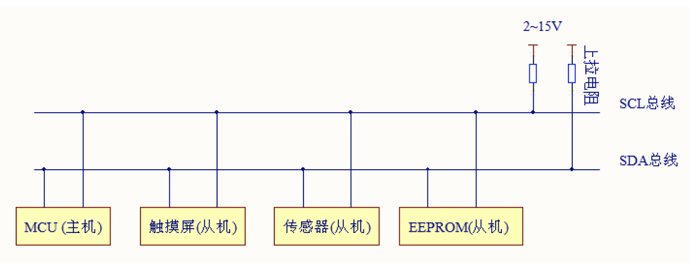
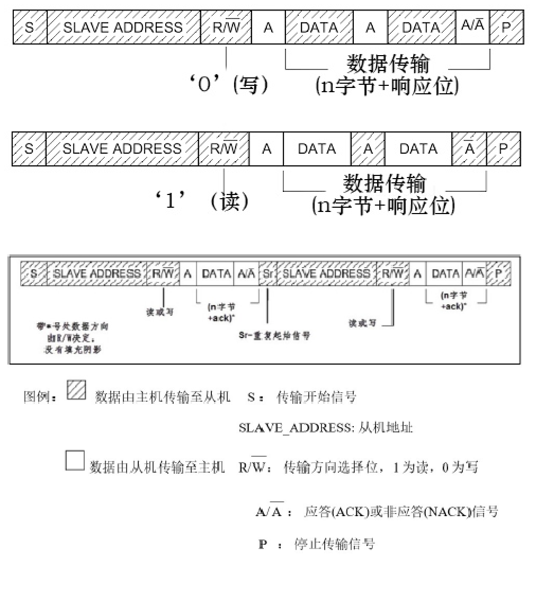
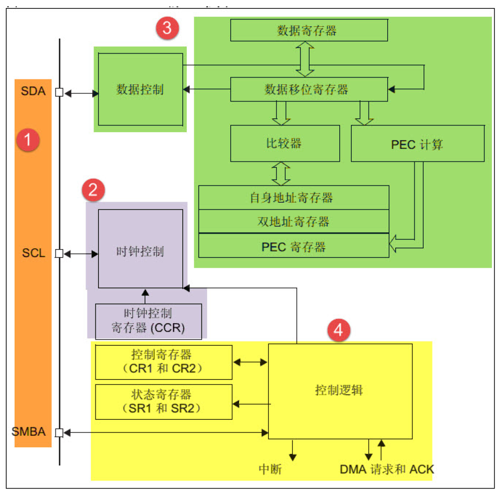
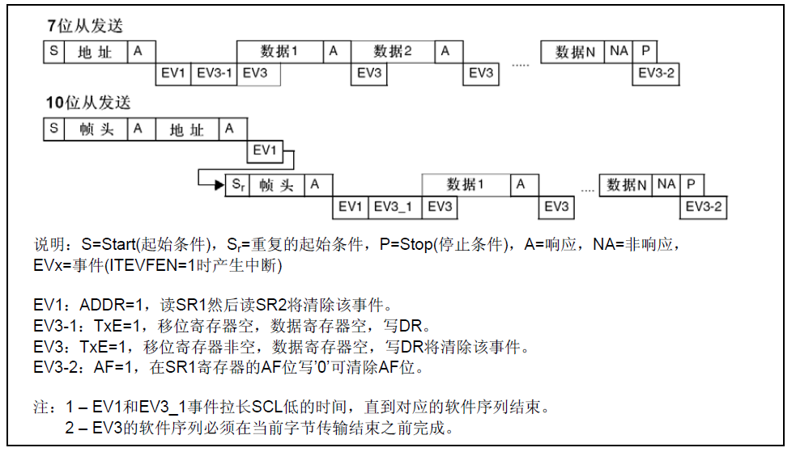
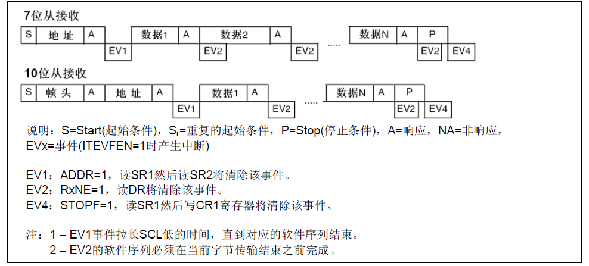
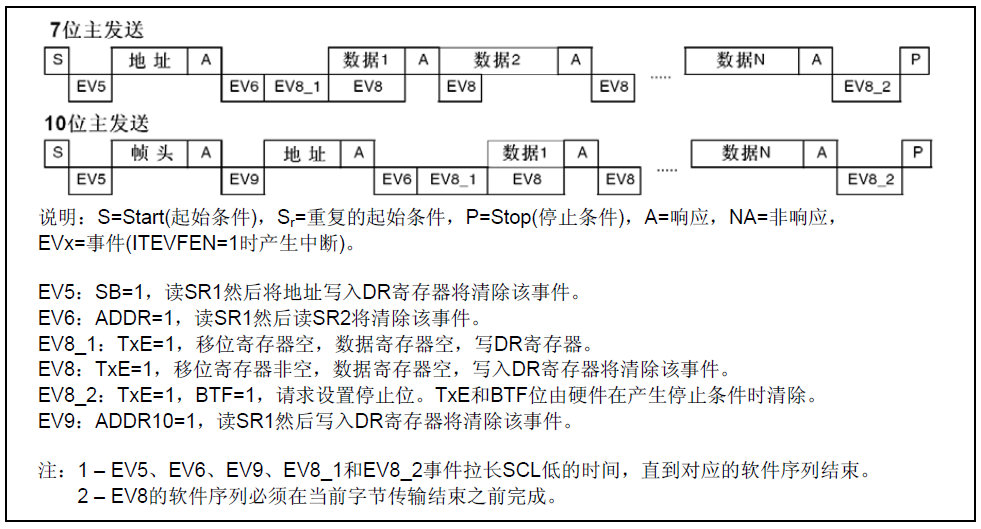
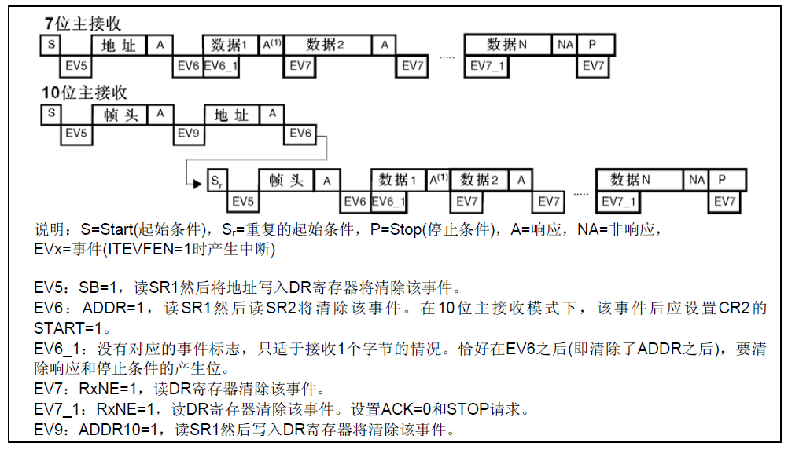

# STM32：I2C-结构体配置

## 前提摘要

1. 个人说明：

   - **限于时间紧迫以及作者水平有限，本文错误、疏漏之处恐不在少数，恳请读者批评指正。意见请留言或者发送邮件至：“[Email:noahpanzzz@gmail.com](noahpanzzz@gmail.com)”**。
   - **本博客的工程文件均存放在：[GitHub:https://github.com/panziping](https://github.com/panziping)。**
   - **本博客的地址：[CSDN:https://blog.csdn.net/ZipingPan](https://blog.csdn.net/ZipingPan)**。
2. 参考：

   - 正点原子
   - 野火
   - ST数据手册

---

## 正文

## 物理层



- 它是一个支持设备的总线。“总线”指多个设备共用的信号线。在一个I2C 通讯总线中，可连接多个I2C 通讯设备，支持多个通讯主机及多个通讯从机。
- 一个I2C 总线只使用两条总线线路，一条双向串行数据线(SDA) ，一条串行时钟线(SCL)。数据线即用来表示数据，时钟线用于数据收发同步。
- 每个连接到总线的设备都有一个独立的地址，主机可以利用这个地址进行不同设备之间的访问。
- 总线通过上拉电阻接到电源。当I2C 设备空闲时，会输出高阻态，而当所有设备都空闲，都输出高阻态时，由上拉电阻把总线拉成高电平。
- 多个主机同时使用总线时，为了防止数据冲突，会利用仲裁方式决定由哪个设备占用总线。
- 具有三种传输模式：标准模式传输速率为100kbit/s ，快速模式为400kbit/s ，高速模式下可达3.4Mbit/s，但目前大多I2C 设备尚不支持高速模式。
- 连接到相同总线的IC 数量受到总线的最大电容400pF 限制。

## 协议层(一主多从)



- 起始信号和停止信号

  起始信号：当SCL 线是高电平时SDA 线从高电平向低电平切换，这个情况表示通讯的起始。

  停止信号：当SCL 是高电平时SDA 线由低电平向高电平切换，表示通讯的停止。

- 数据有效性

  传输时，SCL 为高电平的时候SDA 表示的数据有效，即此时的SDA 为高电平时表示数据“1”，为低电平时表示数据“0”。当SCL 为低电平时，SDA的数据无效，一般在这个时候SDA 进行电平切换，为下一次表示数据做好准备。


## STM32-I2C

### 基本框架



- 通讯引脚
- 时钟控制逻辑
- 数据控制逻辑
- 整体控制逻辑

### STM32F1-I2C通信过程

#### I2C从机

I2C从发送器的传送序列图



I2C从接收器的传送序列图



#### I2C主机

I2C主发送器传送序列图



I2C主接收器传送序列图



#### I2C初始化结构体

```c
typedef struct
{
  uint32_t I2C_ClockSpeed;          /*!< Specifies the clock frequency.
                                         This parameter must be set to a value lower than 400kHz */

  uint16_t I2C_Mode;                /*!< Specifies the I2C mode.
                                         This parameter can be a value of @ref I2C_mode */

  uint16_t I2C_DutyCycle;           /*!< Specifies the I2C fast mode duty cycle.
                                         This parameter can be a value of @ref I2C_duty_cycle_in_fast_mode */

  uint16_t I2C_OwnAddress1;         /*!< Specifies the first device own address.
                                         This parameter can be a 7-bit or 10-bit address. */

  uint16_t I2C_Ack;                 /*!< Enables or disables the acknowledgement.
                                         This parameter can be a value of @ref I2C_acknowledgement */

  uint16_t I2C_AcknowledgedAddress; /*!< Specifies if 7-bit or 10-bit address is acknowledged.
                                         This parameter can be a value of @ref I2C_acknowledged_address */
}I2C_InitTypeDef;
```

### 编程要点

#### I2C主机通信

**I2C硬件相关宏定义，bsp_i2c.h**

```c
#ifndef __BSP_I2C_H
#define __BSP_I2C_H


#include "stm32f10x.h"

#define BSP_I2Cx_GPIO_Clk                       RCC_APB2Periph_GPIOB
#define BSP_I2Cx_GPIO_Clk_Cmd                   RCC_APB2PeriphClockCmd

#define BSP_I2Cx_GPIO_SCL_Port                  GPIOB
#define BSP_I2Cx_GPIO_SCL_Pin                   GPIO_Pin_6

#define BSP_I2Cx_GPIO_SDA_Port                  GPIOB
#define BSP_I2Cx_GPIO_SDA_Pin                   GPIO_Pin_7

#define BSP_I2Cx_Clk                            RCC_APB1Periph_I2C1    
#define BSP_I2Cx_Clk_Cmd                        RCC_APB1PeriphClockCmd

#define BSP_I2Cx                                I2C1
#define BSP_I2Cx_Speed                          400000

#define BSP_I2Cx_Owner_Address7                 0xA0

#define BSP_I2Cx_FLAG_TIMEOUT                   ((uint32_t)0x1000)
#define BSP_I2Cx_LONG_TIMEOUT                   ((uint32_t)(10 * BSP_I2Cx_FLAG_TIMEOUT))
#define BSP_I2Cx_MAX_TRIALS_NUM                 150

#define __DEBUG_INFO   

#ifdef __DEBUG_INFO
    #define DEBUG_INFO(fmt,arg...)      printf("<<-DEBUG-INFO->> "fmt"\r\n",##arg)
#else
    #define DEBUG_INFO(fmt,arg...)
#endif


#endif /* __BSP_I2C_H */
```

**I2C模块配置，bsp_i2c.c**

```c
static void BSP_I2C_GPIO_Config(void)
{
    GPIO_InitTypeDef GPIO_InitStructure;
    BSP_I2Cx_GPIO_Clk_Cmd(BSP_I2Cx_GPIO_Clk,ENABLE);
    
    GPIO_InitStructure.GPIO_Pin = BSP_I2Cx_GPIO_SCL_Pin;
    GPIO_InitStructure.GPIO_Mode = GPIO_Mode_AF_OD;
    GPIO_InitStructure.GPIO_Speed = GPIO_Speed_50MHz;
    GPIO_Init(BSP_I2Cx_GPIO_SCL_Port,&GPIO_InitStructure);
    
    GPIO_InitStructure.GPIO_Pin = BSP_I2Cx_GPIO_SDA_Pin;
    GPIO_InitStructure.GPIO_Mode = GPIO_Mode_AF_OD;
    GPIO_InitStructure.GPIO_Speed = GPIO_Speed_50MHz;
    GPIO_Init(BSP_I2Cx_GPIO_SDA_Port,&GPIO_InitStructure);   
}

static void BSP_I2C_Config(void)
{
    I2C_InitTypeDef I2C_InitStructure;
    BSP_I2Cx_Clk_Cmd(BSP_I2Cx_Clk,ENABLE);
    
    I2C_InitStructure.I2C_Mode = I2C_Mode_I2C;
    I2C_InitStructure.I2C_OwnAddress1 = BSP_I2Cx_Owner_Address7;
    I2C_InitStructure.I2C_DutyCycle = I2C_DutyCycle_2;
    I2C_InitStructure.I2C_ClockSpeed = BSP_I2Cx_Speed;
    I2C_InitStructure.I2C_Ack = I2C_Ack_Enable;
    I2C_InitStructure.I2C_AcknowledgedAddress = I2C_AcknowledgedAddress_7bit;
    I2C_Init(BSP_I2Cx,&I2C_InitStructure); 
    I2C_Cmd(BSP_I2Cx,ENABLE);
}

void BSP_I2C_Init(void){
    BSP_I2C_GPIO_Config();
    BSP_I2C_Config(); 
}

```


## 总结


---

**本文均为原创，欢迎转载，请注明文章出处：[CSDN:https://blog.csdn.net/ZipingPan/ARM](https://blog.csdn.net/zipingpan/category_12627684.html)。百度和各类采集站皆不可信，搜索请谨慎鉴别。技术类文章一般都有时效性，本人习惯不定期对自己的博文进行修正和更新，因此请访问出处以查看本文的最新版本。**

**非原创博客会在文末标注出处，由于时效原因，可能并不是原创作者地址（已经无法溯源）。**
