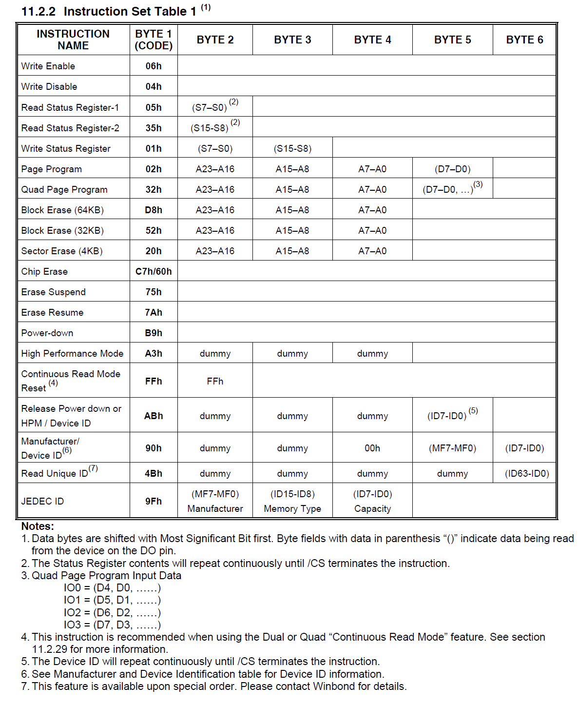
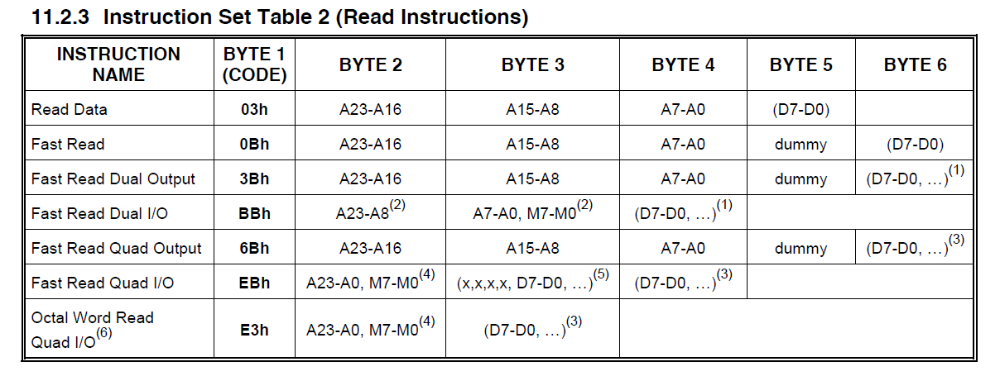

# STM32：SPI-FLASH

## 前提摘要

1. 个人说明：

   - **限于时间紧迫以及作者水平有限，本文错误、疏漏之处恐不在少数，恳请读者批评指正。意见请留言或者发送邮件至：“[Email:noahpanzzz@gmail.com](noahpanzzz@gmail.com)”**。
   - **本博客的工程文件均存放在：[GitHub:https://github.com/panziping](https://github.com/panziping)。**
   - **本博客的地址：[CSDN:https://blog.csdn.net/ZipingPan](https://blog.csdn.net/ZipingPan)**。
2. 参考：

   - 正点原子
   - 野火
   - ST数据手册

---

## 正文

### W25Q64指令集






**SPI硬件相关宏定义，bsp_spi.h**

```c
#define Dummy_Byte                              0xFF

#define W25X_WriteEnable		                0x06 
#define W25X_WriteDisable		                0x04 
#define W25X_ReadStatusReg1		                0x05 
#define W25X_WriteStatusReg		                0x01 
#define W25X_ReadData			                0x03 
#define W25X_FastReadData		                0x0B 
#define W25X_FastReadDual		                0x3B 
#define W25X_PageProgram		                0x02 
#define W25X_BlockErase			                0xD8 
#define W25X_SectorErase		                0x20 
#define W25X_ChipErase                          0xC7 
#define W25X_PowerDown			                0xB9 
#define W25X_ReleasePowerDown	                0xAB 
#define W25X_DeviceID			                0xAB 
#define W25X_ManufactDeviceID   	            0x90 
#define W25X_JedecDeviceID		                0x9F

#define FLASH_PAGE_SIZE                         256
```

**读取Flash ID**

```c
uint32_t BSP_Flash_ID(void)
{
    uint32_t flash_id;
    BSP_SPIx_NSS_Enable;
    
    BSP_SPI_SendByte(W25X_JedecDeviceID);
    flash_id = BSP_SPI_ReceiveByte();
    flash_id <<= 8;
    flash_id |= BSP_SPI_ReceiveByte();
    flash_id <<= 8;
    flash_id |= BSP_SPI_ReceiveByte();

    BSP_SPIx_NSS_Disable;
    return flash_id;
}

```

**读使能**

```c
void BSP_Flash_Write_Enable(void)
{
    BSP_SPIx_NSS_Enable;
    BSP_SPI_SendByte(W25X_WriteEnable);
    BSP_SPIx_NSS_Disable;
}
```


**等待FLASH空闲状态**

```c
void BSP_Flash_WaitStandByState(void)
{
    uint8_t Flash_Status = 0;
    BSP_SPIx_NSS_Enable;
    BSP_SPI_SendByte(W25X_ReadStatusReg1);
    do{
        Flash_Status = BSP_SPI_ReceiveByte();
    }while((Flash_Status & 0x01) == SET);
    BSP_SPIx_NSS_Disable;
}
```


**擦除扇区，需要注意Seator擦除操作需要输入地址对齐4KB**

```c
void BSP_Flash_EraseSector(uint32_t SectorAddr)
{
    BSP_Flash_Write_Enable();
    BSP_Flash_WaitStandByState();
    
    BSP_SPIx_NSS_Enable;
    BSP_SPI_SendByte(W25X_SectorErase);
    BSP_SPI_SendByte((SectorAddr & 0xff0000)>>16);
    BSP_SPI_SendByte((SectorAddr & 0xff00)>>8);
    BSP_SPI_SendByte(SectorAddr & 0xff);
    BSP_SPIx_NSS_Disable;
    
    BSP_Flash_WaitStandByState();
}
```


**擦除块，需要注意Block擦除操作需要输入地址对齐64KB**

```c
void BSP_Flash_EraseBlock(uint32_t BlockAddr)
{
    BSP_Flash_Write_Enable();
    BSP_Flash_WaitStandByState();
    
    BSP_SPIx_NSS_Enable;
    BSP_SPI_SendByte(W25X_BlockErase);
    BSP_SPI_SendByte((BlockAddr & 0xff0000)>>16);
    BSP_SPI_SendByte((BlockAddr & 0xff00)>>8);
    BSP_SPI_SendByte(BlockAddr & 0xff);
    BSP_SPIx_NSS_Disable;
    
    BSP_Flash_WaitStandByState();
}

```

**擦除芯片**

```c
void BSP_Flash_EraseChip(void)
{
    BSP_Flash_Write_Enable();
    BSP_Flash_WaitStandByState();
    
    BSP_SPIx_NSS_Enable;
    BSP_SPI_SendByte(W25X_ChipErase);
    BSP_SPIx_NSS_Disable;
    
    BSP_Flash_WaitStandByState();
}
```


**页写入，Page写入支持的最大字节为256Byte，需要考虑**

```c
void BSP_Flash_PageWrite(uint8_t *pBuffer,uint32_t WriteAddr,uint16_t NumBytetoWrite)
{
    BSP_Flash_Write_Enable();
    BSP_Flash_WaitStandByState();
    
    BSP_SPIx_NSS_Enable;
    
   BSP_SPI_SendByte(W25X_PageProgram);
    
    BSP_SPI_SendByte((WriteAddr & 0xff0000)>>16);
    BSP_SPI_SendByte((WriteAddr & 0xff00)>>8);
    BSP_SPI_SendByte(WriteAddr & 0xff); 
    
    if(NumBytetoWrite > FLASH_PAGE_SIZE)
    {
        NumBytetoWrite = FLASH_PAGE_SIZE;
        DEBUG_INFO("FLASH Page Program OverSize\r\n");
    }
    
    while(NumBytetoWrite--)
    {
        BSP_SPI_SendByte(*pBuffer);
        pBuffer++;
    }
    BSP_SPIx_NSS_Disable;
    BSP_Flash_WaitStandByState();
}
```


**不定长字节写入，没有页写入的最大字节256Byte限制**

```c
void BSP_Flash_BufferWrite(uint8_t *pBuffer,uint32_t WriteAddr,uint16_t NumBytetoWrite)
{
    uint8_t NumofPage = 0,NumofSingle = 0,Addr = 0,Addr_Cnt = 0,Addr_Temp = 0;
    
    Addr = WriteAddr % FLASH_PAGE_SIZE;
    Addr_Cnt = FLASH_PAGE_SIZE - Addr;
    NumofSingle = NumBytetoWrite % FLASH_PAGE_SIZE;
    NumofPage = NumBytetoWrite / FLASH_PAGE_SIZE;
    
    if(Addr == 0){
        if(NumofPage == 0)
            BSP_Flash_PageWrite(pBuffer,WriteAddr,NumofSingle);
        else{
            while(NumofPage--){
                BSP_Flash_PageWrite(pBuffer,WriteAddr,FLASH_PAGE_SIZE);
                WriteAddr += FLASH_PAGE_SIZE;
                pBuffer += FLASH_PAGE_SIZE;
            }
            if(NumofSingle != 0)
                BSP_Flash_PageWrite(pBuffer,WriteAddr,NumofSingle);
        }    
    }
    else{
        if(NumofPage == 0){
            if(NumofSingle > Addr_Cnt){
                Addr_Temp = NumofSingle - Addr_Cnt;
                BSP_Flash_PageWrite(pBuffer,WriteAddr,Addr_Cnt);
                WriteAddr += Addr_Cnt;
                pBuffer += Addr_Cnt;

                BSP_Flash_PageWrite(pBuffer,WriteAddr,Addr_Temp);
            }
            else
                BSP_Flash_PageWrite(pBuffer,WriteAddr,NumBytetoWrite);
        }
        else{
            NumBytetoWrite -= Addr_Cnt;
            NumofPage = NumBytetoWrite  / EE_PAGE_SIZE;
            NumofSingle = NumBytetoWrite % EE_PAGE_SIZE;
            if(Addr_Cnt != 0){
                BSP_Flash_PageWrite(pBuffer,WriteAddr,Addr_Cnt);
                WriteAddr += Addr_Cnt;;
                pBuffer += Addr_Cnt;
            }
            while(NumofPage--){
                BSP_Flash_PageWrite(pBuffer,WriteAddr,Addr_Cnt);
                WriteAddr += FLASH_PAGE_SIZE;
                pBuffer += FLASH_PAGE_SIZE;
            
            }
            if(NumofSingle != 0)
                BSP_Flash_PageWrite(pBuffer,WriteAddr,NumofSingle); 
        }
    }
}
```

上述代码主要分为以下几种情况。

1. 写入的数据的首地址页对齐。
   1. 数据长度没有超过一页的大小（256Byte），则直接写入。
   2. 数据长度超过一页的大小（256Byte），先按页写入，再将多余的写入新的一页。
2. 写入的数据的首地址并不是页对齐。
   1. 数据长度没有超过一页的大小（256Byte）
      - 数据首地址距离页尾的空间不足以放下整个数据，则先补全该页，再将剩余的数据写到下一页。
      - 数据首地址距离页尾的空间足以放下整个数据，则直接写入。
   2. 数据长度超过一页的大小（256Byte）
      - 先补全该页，再按页写入，再将剩余的数据写到下一页。

```c
void BSP_Flash_BufferRead(uint8_t *pBuffer,uint32_t ReadAddr,uint16_t NumBytetoRead)
{
    BSP_SPIx_NSS_Enable;
    
    BSP_SPI_SendByte(W25X_ReadData);
    
    BSP_SPI_SendByte((ReadAddr & 0xff0000)>>16);
    BSP_SPI_SendByte((ReadAddr & 0xff00)>>8);
    BSP_SPI_SendByte(ReadAddr & 0xff);
    
    
    while(NumBytetoRead--)
    {
        *pBuffer = BSP_SPI_ReceiveByte(); 
        pBuffer++;
    }
    
    BSP_SPIx_NSS_Disable;
}
```


## 总结


---

**本文均为原创，欢迎转载，请注明文章出处：[CSDN:https://blog.csdn.net/ZipingPan/ARM](https://blog.csdn.net/zipingpan/category_12627684.html)。百度和各类采集站皆不可信，搜索请谨慎鉴别。技术类文章一般都有时效性，本人习惯不定期对自己的博文进行修正和更新，因此请访问出处以查看本文的最新版本。**

**非原创博客会在文末标注出处，由于时效原因，可能并不是原创作者地址（已经无法溯源）。**
