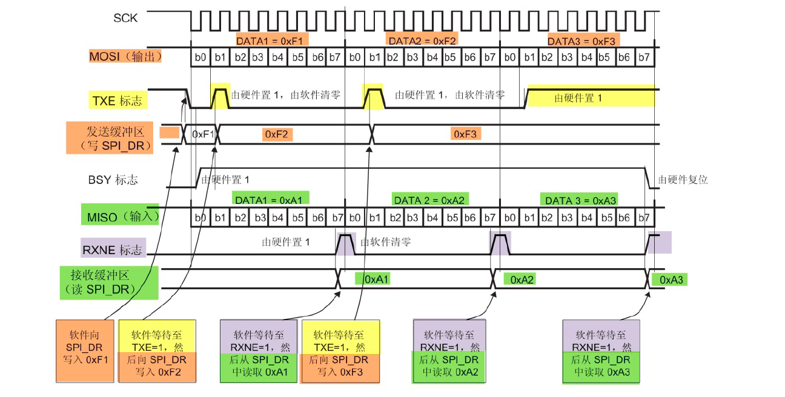

# STM32：SPI-应用层程序

## 前提摘要

1. 个人说明：

   - **限于时间紧迫以及作者水平有限，本文错误、疏漏之处恐不在少数，恳请读者批评指正。意见请留言或者发送邮件至：“[Email:noahpanzzz@gmail.com](noahpanzzz@gmail.com)”**。
   - **本博客的工程文件均存放在：[GitHub:https://github.com/panziping](https://github.com/panziping)。**
   - **本博客的地址：[CSDN:https://blog.csdn.net/ZipingPan](https://blog.csdn.net/ZipingPan)**。
2. 参考：

   - 正点原子
   - 野火
   - ST数据手册

---

## 正文



### 发送和接收一个字节数据

**SPI硬件相关宏定义，bsp_spi.h**

```c
#define Dummy_Byte                              0xFF

#define SPIT_FLAG_TIMEOUT                       ((uint32_t)0x1000)
#define SPIT_LONG_TIMEOUT                       ((uint32_t)(10 * SPIT_FLAG_TIMEOUT))

```

**SPI应用层函数，bsp_spi.c**

```c
uint8_t BSP_SPI_SendByte(uint8_t data)
{
    __IO uint32_t SPI_TimeCounter = 0;
    FlagStatus status = RESET;
    
    do {
        status = SPI_I2S_GetFlagStatus(BSP_SPIx,SPI_I2S_FLAG_TXE);
        SPI_TimeCounter++;
    } while ((SPI_TimeCounter != SPIT_FLAG_TIMEOUT) && (status == RESET));
    if(status == RESET)
        DEBUG_INFO("SPI_I2S_FLAG_TXNE\r\n");
    
    SPI_I2S_SendData(BSP_SPIx,data);
    
    SPI_TimeCounter = 0;
    
    do {
        status = SPI_I2S_GetFlagStatus(BSP_SPIx,SPI_I2S_FLAG_RXNE);
        SPI_TimeCounter++;
    } while ((SPI_TimeCounter != SPIT_FLAG_TIMEOUT) && (status == RESET));
    if(status == RESET)
        DEBUG_INFO("SPI_I2S_FLAG_RXE\r\n");
    return SPI_I2S_ReceiveData(BSP_SPIx);
    
}


uint8_t BSP_SPI_ReceiveByte(void)
{
    return BSP_SPI_SendByte(Dummy_Byte);
}
```

 SPI发送

1. 首先判断TXE标志，确定DR寄存器中是否为空，才能发送数据
2. TXE=0，并不能代表数据已经发送完成。因为此时数据可以还在移位寄存器中。
3. 由于采用的是全双工通信，数据发送与接收是同步的
4. 然后判断RXNE标志，确定DR寄存器中是否有数据。有数据则代表发送已经完成。

SPI接收

1. 并不能直接接收数据，需要发送数据驱动SCK时钟信号
2. 主机发送Dummy（无效数据），用于接收从机的数据


## 总结


---

**本文均为原创，欢迎转载，请注明文章出处：[CSDN:https://blog.csdn.net/ZipingPan/ARM](https://blog.csdn.net/zipingpan/category_12627684.html)。百度和各类采集站皆不可信，搜索请谨慎鉴别。技术类文章一般都有时效性，本人习惯不定期对自己的博文进行修正和更新，因此请访问出处以查看本文的最新版本。**

**非原创博客会在文末标注出处，由于时效原因，可能并不是原创作者地址（已经无法溯源）。**
