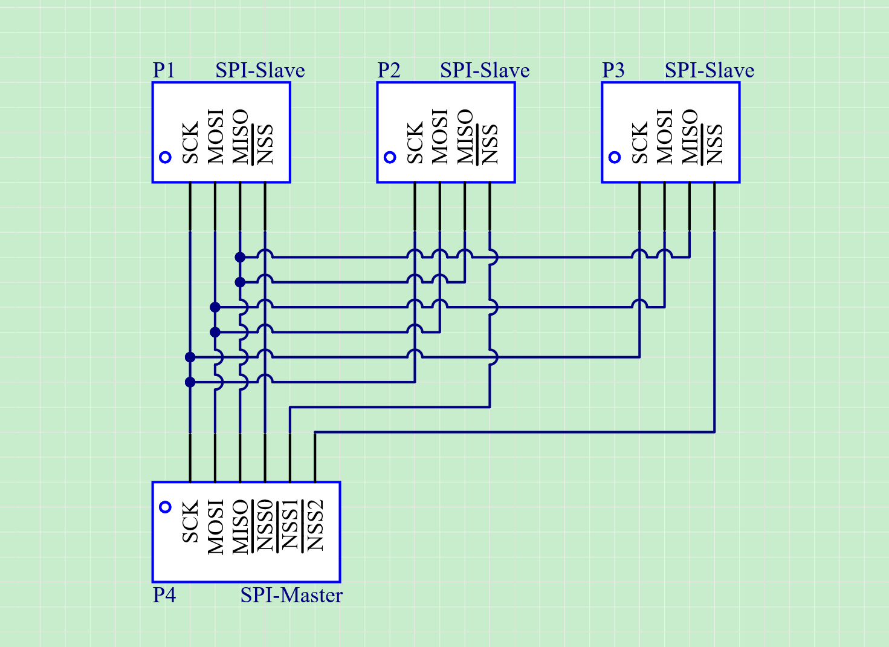

# STM32：SPI-结构体配置

## 前提摘要

1. 个人说明：

   - **限于时间紧迫以及作者水平有限，本文错误、疏漏之处恐不在少数，恳请读者批评指正。意见请留言或者发送邮件至：“[Email:noahpanzzz@gmail.com](noahpanzzz@gmail.com)”**。
   - **本博客的工程文件均存放在：[GitHub:https://github.com/panziping](https://github.com/panziping)。**
   - **本博客的地址：[CSDN:https://blog.csdn.net/ZipingPan](https://blog.csdn.net/ZipingPan)**。
2. 参考：

   - 正点原子
   - 野火
   - ST数据手册

---

## 正文

- STM-SPI作为主机，从机

- SPI的时钟，最高为Pclk/2，SPI1最高为36Mhz，SPI2最高为18Mhz。

- SPI的四种模式 CPOL CPHA，数据帧8~16位，LSB,MSB

- 全双工，双向单线，单线

### 物理层



### 接口标准

| 序号 | 名称 |          说明          |
| :--: | :--: | :--------------------: |
|  1   | NSS  |   片选线，低电平有效   |
|  2   | SCK  |       时钟信号线       |
|  3   | MOSI | 主设备输出，从设备输入 |
|  4   | MISO | 主设备输入，从设备输出 |

### 协议层

#### 起始信号和停止信号

NSS 信号线由高变低，是SPI 通讯的起始信号。NSS 是每个从机各自独占的信号线，当从机在自己的NSS 线检测到起始信号后，就知道自己被主机选中了，开始准备与主机通讯。在图中的标号处，NSS 信号由低变高，是SPI 通讯的停止信号，表示本次通讯结束，从机的选中状态被取消。

#### CPOL/CPOH

时钟极性CPOL：SPI 通讯设备处于空闲状态时，SCK 信号线的电平信号(即SPI 通讯开始前，NSS 线为高电平时SCK 的状态)。CPOL=0 时，SCK 在空闲状态时为低电平，CPOL=1 时，SCK 在空闲状态时为高电平。

时钟相位CPHA：数据的采样的时刻。当CPHA=0 时，MOSI 或MISO 数据线上的信号将会在SCK 时钟线的“奇数边沿”被采样。当CPHA=1 时，数据线在SCK 的“偶数边沿”采样。

| SPI模式 | CPOL | CPHA | 空闲时SCK时钟 | 采样时刻 |
| :-----: | :--: | :--: | :-----------: | :------: |
|    0    |  0   |  0   |    低电平     | 奇数边沿 |
|    1    |  0   |  1   |    低电平     | 偶数边沿 |
|    2    |  1   |  0   |    高电平     | 奇数边沿 |
|    3    |  1   |  1   |    高电平     | 偶数边沿 |


### SPI基本结构


SPI框架主要分为通讯引脚、时钟控制逻辑、数据控制逻辑、整体控制逻辑。

- 通讯引脚

  NSS可以使用软件控制，其他引脚使用硬件SPI控制	

- 时钟控制逻辑

  时钟控制：波特率发生器：BR[2:0],控制SPI的时钟。CR1寄存器

- 数据控制逻辑

  SPI的MOSI及MISO都连接到数据移位寄存器上，数据移位寄存器的数据来源于接收缓冲区及发送缓冲区。

- 整体控制逻辑

  通过写SPI的数据寄存器DR把数据填充到发送缓冲区中。

  通过读SPI的数据寄存器DR，可以获取到接收缓冲区中的内容。

  其中数据帧长度通过DFF为配置成8位及16位。

  模式：配置LSBFIRST位，可选择MSB先行还是LSB先行。

### SPI初始化结构体

```C
typedef struct
{
  uint16_t SPI_Direction;           
  uint16_t SPI_Mode;                
  uint16_t SPI_DataSize;           
  uint16_t SPI_CPOL;                
  uint16_t SPI_CPHA;               
  uint16_t SPI_NSS;                                
  uint16_t SPI_BaudRatePrescaler;  
  uint16_t SPI_FirstBit;          
  uint16_t SPI_CRCPolynomial;       
}SPI_InitTypeDef;
```

### 编程要点


**SPI硬件相关宏定义，bsp_spi.h**

```c
#ifndef __bsp_spi_h
#define __bsp_spi_h

#include "stm32f10x.h"

#define BSP_SPIx_GPIO_Clk                       RCC_APB2Periph_GPIOA
#define BSP_SPIx_GPIO_Clk_Cmd                   RCC_APB2PeriphClockCmd

#define BSP_SPIx_GPIO_NSS_Port                  GPIOA
#define BSP_SPIx_GPIO_NSS_Pin                   GPIO_Pin_4

#define BSP_SPIx_GPIO_SCK_Port                  GPIOA
#define BSP_SPIx_GPIO_SCK_Pin                   GPIO_Pin_5

#define BSP_SPIx_GPIO_MOSI_Port                 GPIOA
#define BSP_SPIx_GPIO_MOSI_Pin                  GPIO_Pin_7

#define BSP_SPIx_GPIO_MISO_Port                 GPIOA
#define BSP_SPIx_GPIO_MISO_Pin                  GPIO_Pin_6

#define BSP_SPIx_Clk                            RCC_APB2Periph_SPI1
#define BSP_SPIx_Clk_Cmd                        RCC_APB2PeriphClockCmd

#define BSP_SPIx                                SPI1
#define BSP_SPIx_NSS_Enable                     BSP_SPIx_GPIO_NSS_Port->BRR |= BSP_SPIx_GPIO_NSS_Pin
#define BSP_SPIx_NSS_Disable                    BSP_SPIx_GPIO_NSS_Port->BSRR  |= BSP_SPIx_GPIO_NSS_Pin


void BSP_SPI_Init(void);


#endif /* __bsp_spi_h */


```

**SPI模块配置，bsp_spi.c**

```c
static void BSP_SPI_GPIO_Config(void)
{
    GPIO_InitTypeDef GPIO_InitStructure;
    BSP_SPIx_GPIO_Clk_Cmd(BSP_SPIx_GPIO_Clk,ENABLE);
    
    GPIO_InitStructure.GPIO_Mode = GPIO_Mode_Out_PP;
    GPIO_InitStructure.GPIO_Pin = BSP_SPIx_GPIO_NSS_Pin;
    GPIO_InitStructure.GPIO_Speed = GPIO_Speed_50MHz;
    GPIO_Init(BSP_SPIx_GPIO_NSS_Port,&GPIO_InitStructure);
    
    GPIO_InitStructure.GPIO_Mode = GPIO_Mode_AF_PP;
    GPIO_InitStructure.GPIO_Pin = BSP_SPIx_GPIO_SCK_Pin;
    GPIO_InitStructure.GPIO_Speed = GPIO_Speed_50MHz;
    GPIO_Init(BSP_SPIx_GPIO_SCK_Port,&GPIO_InitStructure);
    
    GPIO_InitStructure.GPIO_Mode = GPIO_Mode_AF_PP;
    GPIO_InitStructure.GPIO_Pin = BSP_SPIx_GPIO_MOSI_Pin;
    GPIO_InitStructure.GPIO_Speed = GPIO_Speed_50MHz;
    GPIO_Init(BSP_SPIx_GPIO_MOSI_Port,&GPIO_InitStructure);
    
    GPIO_InitStructure.GPIO_Mode = GPIO_Mode_IN_FLOATING;
    GPIO_InitStructure.GPIO_Pin = BSP_SPIx_GPIO_MISO_Pin;
    GPIO_Init(BSP_SPIx_GPIO_MISO_Port,&GPIO_InitStructure);
    BSP_SPIx_NSS_Disable;// pull up NSS
}

static void BSP_SPI_Config(void)
{
    SPI_InitTypeDef SPI_InitStructure;
    BSP_SPIx_Clk_Cmd(BSP_SPIx_Clk,ENABLE);
    SPI_InitStructure.SPI_BaudRatePrescaler = SPI_BaudRatePrescaler_2;
    SPI_InitStructure.SPI_CPHA = SPI_CPHA_2Edge;
    SPI_InitStructure.SPI_CPOL = SPI_CPOL_High;
    SPI_InitStructure.SPI_CRCPolynomial = 0;
    SPI_InitStructure.SPI_DataSize = SPI_DataSize_8b;
    SPI_InitStructure.SPI_Direction = SPI_Direction_2Lines_FullDuplex;
    SPI_InitStructure.SPI_FirstBit = SPI_FirstBit_MSB;
    SPI_InitStructure.SPI_Mode = SPI_Mode_Master;
    SPI_InitStructure.SPI_NSS = SPI_NSS_Soft;
    SPI_Init(BSP_SPIx,&SPI_InitStructure);
    SPI_Cmd(BSP_SPIx,ENABLE);
}


void BSP_SPI_Init(void)
{
    BSP_SPI_GPIO_Config();
    BSP_SPI_Config();
}

```


## 总结


---

**本文均为原创，欢迎转载，请注明文章出处：[CSDN:https://blog.csdn.net/ZipingPan/ARM](https://blog.csdn.net/zipingpan/category_12627684.html)。百度和各类采集站皆不可信，搜索请谨慎鉴别。技术类文章一般都有时效性，本人习惯不定期对自己的博文进行修正和更新，因此请访问出处以查看本文的最新版本。**

**非原创博客会在文末标注出处，由于时效原因，可能并不是原创作者地址（已经无法溯源）。**
