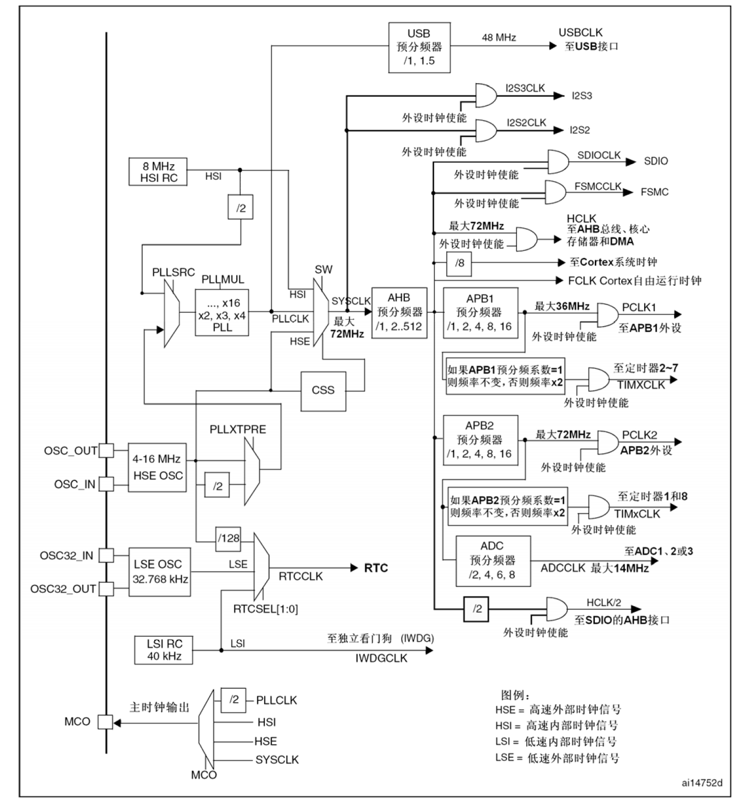

# STM32：STM32F1-RCC,Reset&ClockControl

## 前提摘要

1. 个人说明：

   - **限于时间紧迫以及作者水平有限，本文错误、疏漏之处恐不在少数，恳请读者批评指正。意见请留言或者发送邮件至：“[Email:noahpanzzz@gmail.com](noahpanzzz@gmail.com)”**。
   - **本博客的工程文件均存放在：[GitHub:https://github.com/panziping](https://github.com/panziping)。**
   - **本博客的地址：[CSDN:https://blog.csdn.net/ZipingPan](https://blog.csdn.net/ZipingPan)**。
2. 参考：

   - 正点原子
   - 野火
   - ST数据手册

---

## 正文

### Reset

1. 系统复位
2. 电源复位
3. 备份域复位

### Clock Control

三种不同的时钟驱动系统时钟

- HSI

- HSE

- PLL


### RCC时钟树




STM32F1推荐SYSYCLK时钟为72MHz，所以各个时钟设置如下：

- HSE = 8MHz，AHB = 72MHZ,APB1 = 36MHz,APB2 = 72MHz;
  - USB = 48Mhz;
  - HCLK = 72MHz;
  - Cortex系统时钟（SysTick Clock） = 9Mhz;
  - PCLK1 = 36MHz
  - PCLK2 = 72MHz
  - TIMxCLK = 72MHz
  - ADCCLK = 12MHz
- LSE = 32.768kHz
- HSI = 8Mhz
- LSI = 40kHz

**RCC寄存器**

```c
typedef struct
{
  __IO uint32_t CR;
  __IO uint32_t CFGR;
  __IO uint32_t CIR;
  __IO uint32_t APB2RSTR;
  __IO uint32_t APB1RSTR;
  __IO uint32_t AHBENR;
  __IO uint32_t APB2ENR;
  __IO uint32_t APB1ENR;
  __IO uint32_t BDCR;
  __IO uint32_t CSR;
} RCC_TypeDef;
```

**HSE作为时钟来源，经过PLL倍频作为系统时钟**

```c
void HSE_SetSysClock(void)
{
	__IO uint32_t HSEStatus = 0;
	/* Resets the RCC clock configuration to the default reset state.*/
	RCC_DeInit();

	/* Enable HSE */  
	RCC_HSEConfig(RCC_HSE_ON);

	/* Wait till HSE is ready*/
	HSEStatus = RCC_WaitForHSEStartUp();
	
	if (HSEStatus == SUCCESS)
	{
		/* Enable Prefetch Buffer */
		FLASH_PrefetchBufferCmd(FLASH_PrefetchBuffer_Enable);

		/* Flash 2 wait state */
		// 0：0 < SYSCLK <= 24M
		// 1：24< SYSCLK <= 48M
		// 2：48< SYSCLK <= 72M
		FLASH_SetLatency(FLASH_Latency_2);
	 
		/* HCLK = SYSCLK */
		RCC_HCLKConfig(RCC_SYSCLK_Div1); 
	  
		/* PCLK2 = HCLK */
		RCC_PCLK2Config(RCC_HCLK_Div1); 

		/* PCLK1 = HCLK/2 */
		RCC_PCLK1Config(RCC_HCLK_Div2);
			
		/*  PLL configuration: PLLCLK = HSE * 9 = 72 MHz */
		RCC_PLLConfig(RCC_PLLSource_HSE_Div1, RCC_PLLMul_9);

		/* Enable PLL */
		RCC_PLLCmd(ENABLE);

		/* Wait till PLL is ready */
		while (RCC_GetFlagStatus(RCC_FLAG_PLLRDY) == RESET)
		{
		}

		/* Select PLL as system clock source */
		RCC_SYSCLKConfig(RCC_SYSCLKSource_PLLCLK);

		/* Wait till PLL is used as system clock source */
		while (RCC_GetSYSCLKSource() != 0x08)
		{
		}
  }
	else
	{ 
		/* If HSE fails to start-up, the application will have wrong clock 
		 configuration. User can add here some code to deal with this error */
		while (1)
		{
		}
	}
}
```

**HSI/2作为时钟来源，经过PLL倍频作为系统时钟**

```c
#define HSI_STARTUP_TIMEOUT		((uint16_t)0x0500) /*!< Time out for HSI start up */
void HSI_SetSysClock(void)
{
	__IO uint32_t StartUpCounter = 0,HSIStatus = 0;

	/* Resets the RCC clock configuration to the default reset state.*/
	RCC_DeInit();

	/* Enable HSI */ 
	RCC_HSICmd(ENABLE);
	
	/* Wait till HSI is ready and if Time out is reached exit */
	do{
		HSIStatus = RCC->CR & RCC_CR_HSIRDY;
		StartUpCounter++;
	}while((HSIStatus == 0) && (StartUpCounter != HSI_STARTUP_TIMEOUT));
	
	if ((HSIStatus & RCC_CR_HSIRDY) != RESET)
	{
		/* Enable Prefetch Buffer */
		FLASH_PrefetchBufferCmd(FLASH_PrefetchBuffer_Enable);

		/* Flash 2 wait state */
		// 0：0 < SYSCLK <= 24M
		// 1：24< SYSCLK <= 48M
		// 2：48< SYSCLK <= 72M
		FLASH_SetLatency(FLASH_Latency_2);

		 /* HCLK = SYSCLK */
		RCC_HCLKConfig(RCC_SYSCLK_Div1); 

		/* PCLK2 = HCLK */
		RCC_PCLK2Config(RCC_HCLK_Div1); 

		/* PCLK1 = HCLK/2 */
		RCC_PCLK1Config(RCC_HCLK_Div2);
			
		/*  PLL configuration: PLLCLK = HSI * 16 = 64 MHz */
		RCC_PLLConfig(RCC_PLLSource_HSI_Div2, RCC_PLLMul_16);
		//------------------------------------------------------------------//

		 /* Enable PLL */
		RCC_PLLCmd(ENABLE);

		/* Wait till PLL is ready */
		while (RCC_GetFlagStatus(RCC_FLAG_PLLRDY) == RESET)
		{
		}

		/* Select PLL as system clock source */
		RCC_SYSCLKConfig(RCC_SYSCLKSource_PLLCLK);

		/* Wait till PLL is used as system clock source */
		while (RCC_GetSYSCLKSource() != 0x08)
		{
		}
	}
	else
	{ 
		/* If HSE fails to start-up, the application will have wrong clock 
		configuration. User can add here some code to deal with this error */
		while (1)
		{
		}
	}
}
```

**MCO时钟输出**

RCC MCO硬件相关宏定义，bsp_mco.h

```c
#ifndef __BSP_RCCMCO_H
#define __BSP_RCCMCO_H

#include "stm32f10x.h"

#define BSP_RCC_MCO_Clk             RCC_APB2Periph_GPIOA      
#define BSP_RCC_MCO_Clk_Cmd         RCC_APB2PeriphClockCmd 
#define BSP_RCC_MCO_Port            GPIOA
#define BSP_RCC_MCO_Pin             GPIO_Pin_8


#endif /* __BSP_RCCMCO_H */
```

**配置MCO GPIO**

```c
static void BSP_MCO_GPIO_Config(void)
{
	GPIO_InitTypeDef GPIO_InitStructure;
	BSP_RCC_MCO_Clk_Cmd(BSP_RCC_MCO_Clk, ENABLE);

    GPIO_InitStructure.GPIO_Pin = BSP_RCC_MCO_Pin;
    GPIO_InitStructure.GPIO_Mode = GPIO_Mode_AF_PP;
    GPIO_InitStructure.GPIO_Speed = GPIO_Speed_50MHz;
    GPIO_Init(BSP_RCC_MCO_Port, &GPIO_InitStructure);
}

void BSP_MCO_Init(void)
{
	BSP_MCO_GPIO_Config();
    //RCC_MCOConfig(RCC_MCO_HSE);	             	        
	//RCC_MCOConfig(RCC_MCO_HSI);	                   
	//RCC_MCOConfig(RCC_MCO_PLLCLK_Div2);
	RCC_MCOConfig(RCC_MCO_SYSCLK);		     
}

```


### 时间安全系统CSS

时钟安全系统可以通过软件被激活。一旦其被激活，时钟监测器将在HSE振荡器启动延迟后被使能，并在HSE时钟关闭后关闭。 

```c
void RCC_ClockSecuritySystemCmd(ENABLE);
```

如果HSE时钟发生故障，HSE振荡器被自动关闭，时钟失效事件将被送到高级定时器(TIM1和TIM8)的刹车输入端，并产生时钟安全中断CSSI，允许软件完成营救操作。此CSSI中断连接到Cortex™-M3的NMI中断(不可屏蔽中断)。 

注意： 一旦CSS被激活，并且HSE时钟出现故障，CSS中断就产生，并且NMI也自动产生。NMI将被不断执行，直到CSS中断挂起位被清除。因此，在NMI的处理程序中必须通过设置时钟中断寄存器(RCC_CIR)里的CSSC位来清除CSS中断。

如果HSE振荡器被直接或间接地作为系统时钟，(间接的意思是：它被作为PLL输入时钟，并且PLL时钟被作为系统时钟)，时钟故障将导致系统时钟自动切换到HSI振荡器，同时外部HSE振荡器被关闭。在时钟失效时，如果HSE振荡器时钟(被分频或未被分频)是用作系统时钟的PLL的输入时钟，PLL也将被关闭。

```c
void NMI_Handler(void)
{
    if (RCC_GetITStatus(RCC_IT_CSS) != RESET)
    {    // HSE、PLL 已被禁止(但是PLL 设置未变)
         /* …… */ // 客户添加相应的系统保护代码处
        // 下面为HSE恢复后的预设置代码
       RCC_HSEConfig(RCC_HSE_ON);  // 使能HSE
       RCC_ ITConfig(RCC_IT_HSERDY,ENABLE); // 使能HSE就绪中断
       RCC_ ITConfig(RCC_IT_PLLRDY,ENABLE); // 使能PLL 就绪中断
       RCC_ClearITPendingBit(RCC_IT_CSS);  // 清除时钟安全系统中断的挂起位
 
       // 至此，一旦HSE时钟恢复，将发生HSERDY中断，
 
       //在RCC中断处理程序里， 系统时钟可以设置到以前的状态 
    }
}
void RCC_IRQHandler(void)
{
    __IO uint32_t StartUpCounter = 0, HSEStatus = 0;
    
	if(RCC_GetITStatus(RCC_IT_HSERDY) != RESET)
    {
        RCC_ClearITPendingBit(RCC_IT_HSERDY);  // 清除时钟安全系统中断的挂起位
        RCC_DeInit();
        /* Enable HSE */  
        RCC_HSEConfig(RCC_HSE_ON);
        /* Wait till HSE is ready and if Time out is reached exit */
        HSEStatus = RCC_WaitForHSEStartUp();
        if(HSEStatus == SUCCESS)
        {
            FLASH_PrefetchBufferCmd(FLASH_PrefetchBuffer_Enable);
            FLASH_SetLatency(FLASH_Latency_2);
            
            RCC_HCLKConfig(RCC_SYSCLK_Div1);
         	RCC_PCLK1Config(RCC_HCLK_Div2);
         	RCC_PCLK2Config(RCC_HCLK_Div1);
            RCC_PLLConfig(RCC_PLLSource_HSE_Div1,9);
            RCC_PLLCmd(ENABLE);
            /* Wait till HSE is ready */
            while (RCC_GetFlagStatus(RCC_FLAG_PLLRDY) == RESET);
            /* SYSCLK is PLLCLK ,nor HSE CLK*/
            RCC_SYSCLKConfig(RCC_SYSCLKSource_PLLCLK);
            /* Wait till PLL is ready */
            while (RCC_GetSYSCLKSource() != 0x08);
        }
    }
}
```

**mark：由于之前在上一家公司工作对于系统稳定性有很高的要求，所以看到CSS决定写尝试写一下这部分的代码。**


**上述代码未经过实际工程验证，只是在看完STM32F10x参考手册中关于CSS部分所写。**


## 总结


---

**本文均为原创，欢迎转载，请注明文章出处：[CSDN:https://blog.csdn.net/ZipingPan/ARM](https://blog.csdn.net/zipingpan/category_12627684.html)。百度和各类采集站皆不可信，搜索请谨慎鉴别。技术类文章一般都有时效性，本人习惯不定期对自己的博文进行修正和更新，因此请访问出处以查看本文的最新版本。**

**非原创博客会在文末标注出处，由于时效原因，可能并不是原创作者地址（已经无法溯源）。**
