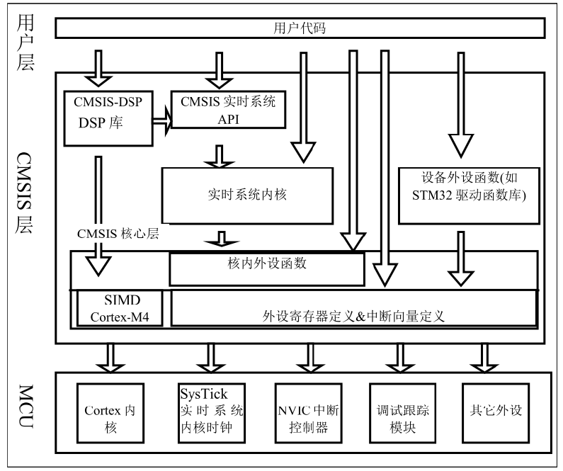
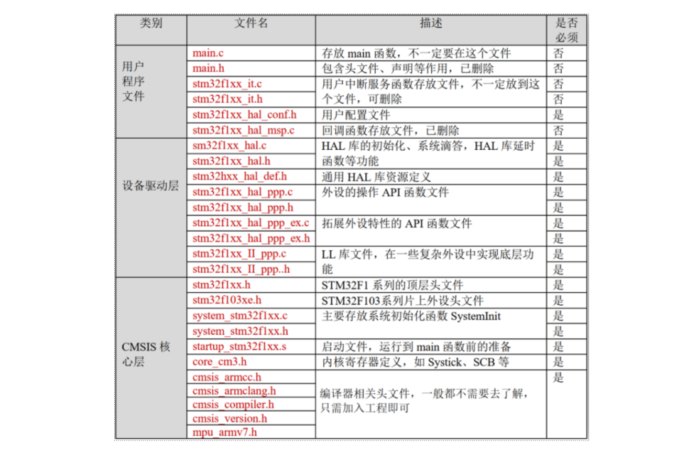

# STM32：STM32F1HAL库（FW V1.8.0）构成

## 前提摘要

1. 个人说明：

   - **限于时间紧迫以及作者水平有限，本文错误、疏漏之处恐不在少数，恳请读者批评指正。意见请留言或者发送邮件至：“[Email:noahpanzzz@gmail.com](noahpanzzz@gmail.com)”**。
   - **本博客的工程文件均存放在：[GitHub:https://github.com/panziping](https://github.com/panziping)。**
   - **本博客的地址：[CSDN:https://blog.csdn.net/ZipingPan](https://blog.csdn.net/ZipingPan)**。
2. 参考：

   - 正点原子
   - 野火
   - ST数据手册

---

## 正文

### CMSIS 标准及库层次关系

因为基于Cortex 系列芯片采用的内核都是相同的，区别主要为核外的片上外设的差异，这些差异却导致软件在同内核，不同外设的芯片上移植困难。为了解决不同的芯片厂商生产的Cortex 微控制器软件的兼容性问题，ARM 与芯片厂商建立了CMSIS 标准(Cortex MicroController SoftwareInterface Standard)。

CMSIS 标准中最主要的为CMSIS 核心层，它包括了：

- 内核函数层：其中包含用于访问内核寄存器的名称、地址定义，主要由ARM 公司提供。
- 设备外设访问层：提供了片上的核外外设的地址和中断定义，主要由芯片生产商提供。

可见CMSIS 层位于硬件层与操作系统或用户层之间，提供了与芯片生产商无关的硬件抽象层，可以为接口外设、实时操作系统提供简单的处理器软件接口，屏蔽了硬件差异，这对软件的移植是有极大的好处的。STM32 的库，就是按照CMSIS 标准建立的。

STM32的开发模式有三种：标准外设库、HAL库、LL库。

- 标准外设库，Standard Peripheral Libraries
- HAL库（硬件抽象层）：Hardware Abstraction Layer
- LL库：Low Layer

目前主流的开发模式主要有标准外设库和HAL库。

- 标注库仅支持F0,F1,F2,F3,F4,L1，但是目前已经停止维护。

- HAL库全系列兼容，是ST目前主推的库，易兼容性、易移植性。

---

### HAL库

#### STM32Cube_FW_F1_V1.8.0组成

|      文件夹名      |       解释        |
| :----------------: | :---------------: |
|      _htmresc      |                   |
|   Documentation    | STM32Cube说明文档 |
|      Drivers       |     驱动源码      |
|    Middlewares     |     中间文件      |
|      Projects      |  ST官方开发例程   |
|     Utilities      |     公共组件      |
|     License.md     |   软件版权信息    |
|    package.xml     |  固件库版本信息   |
|     Readme.md      |       自述        |
| Release_Notes.html |  补充或更新说明   |

**启动文件**

|       启动文件        |   对应FLASH容量    |                说明                |
| :-------------------: | :----------------: | :--------------------------------: |
| startup_stm32f103x6.s |     Flash≤32KB     |  用于小容量F103系列芯片的启动文件  |
| startup_stm32f103xb.s |  64KB≤Flash≤128KB  |  用于中容量F103系列芯片的启动文件  |
| startup_stm32f103xe.s | 256KB≤Flash≤512KB  |  用于大容量F103系列芯片的启动文件  |
| startup_stm32f103xg.s | 768KB≤Flash≤1024KB | 用于超大容量F103系列芯片的启动文件 |

其中主要文件均在Drivers，Middlewares。由于本文使用的开发软件为Keil-MDK，故将几个重要文件整理如下：

Drivers

- BSP：板级支持包，用于适配ST官方的开发板。
- CMSIS：符合CMSIS的组件，包括：DSP库、Cortex-M内核及其设备文件、微控制器专用头文件、启动文件、专用系统文件等。
- STM32F1xx_HAL_Driver：HAL库外设驱动源码，包括F1系列HAL库源文件和头文件。

Middlewares

- ST
  - STemWin：STemWin工具包
  - STM32_USB_Device_Library：USB从机设备支持包
  - STM32_USB_Host_Library：USB主机设备支持包
- Third_Party
  - FatFs：FAT文件系统支持包
  - FreeRTOS：FreeRTOS实时系统支持包
  - LwIP：LwIP网络通信

**用户程序文件**

- main.c

- main.h

- stm32f1xx_it.c

- stm32f1xx_it.h

- stm32f1xx_hal_conf.h

- stm32f1xx_hal_msp.c

**设别驱动层**

- stm32f1xx_hal.c

- stm32f1xx_hal.h

- stm32f1xx_hal_def.h

- stm32f1xx_hal_ppp.c

- stm32f1xx_hal_ppp.h

- stm32f1xx_hal_ppp_ex.c

- stm32f1xx_hal_ppp_ex.h

- stm32f1xx_ll_ppp.c

- stm32f1xx_ll_ppp.h

**CMSIS核心层**

- stm32f1xx.h

- stm32f103xe.h

- system_stm32f1xx.c

- system_stm32f1xx.h

- startup_stm32f1xx.s

- core_cm3.h

- cmsis_armcc.h

- cmsis_armclang.h

- cmsis_compiler.h

- cmsis_version.h

- mpu_armv7.h

---

## 总结

---

**本文均为原创，欢迎转载，请注明文章出处：[CSDN:https://blog.csdn.net/ZipingPan/ARM](https://blog.csdn.net/zipingpan/category_12627684.html)。百度和各类采集站皆不可信，搜索请谨慎鉴别。技术类文章一般都有时效性，本人习惯不定期对自己的博文进行修正和更新，因此请访问出处以查看本文的最新版本。**

**非原创博客会在文末标注出处，由于时效原因，可能并不是原创作者地址（已经无法溯源）。**
