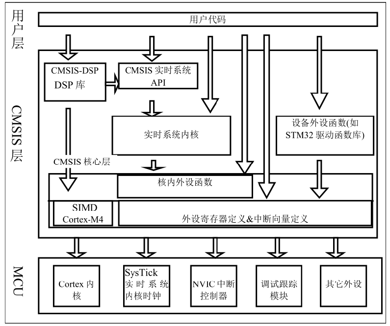

# STM32：STM32F1标准库（Std V3.5.0）构成

## 前提摘要

1. 个人说明：

   - **限于时间紧迫以及作者水平有限，本文错误、疏漏之处恐不在少数，恳请读者批评指正。意见请留言或者发送邮件至：“[Email:noahpanzzz@gmail.com](noahpanzzz@gmail.com)”**。
   - **本博客的工程文件均存放在：[GitHub:https://github.com/panziping](https://github.com/panziping)。**
   - **本博客的地址：[CSDN:https://blog.csdn.net/ZipingPan](https://blog.csdn.net/ZipingPan)**。
2. 参考：

   - 正点原子
   - 野火
   - ST数据手册

---

## 正文

### CMSIS 标准及库层次关系

因为基于Cortex 系列芯片采用的内核都是相同的，区别主要为核外的片上外设的差异，这些差异却导致软件在同内核，不同外设的芯片上移植困难。为了解决不同的芯片厂商生产的Cortex 微控制器软件的兼容性问题，ARM 与芯片厂商建立了CMSIS 标准(Cortex MicroController SoftwareInterface Standard)。

CMSIS 标准中最主要的为CMSIS 核心层，它包括了：

- 内核函数层：其中包含用于访问内核寄存器的名称、地址定义，主要由ARM 公司提供。
- 设备外设访问层：提供了片上的核外外设的地址和中断定义，主要由芯片生产商提供。

可见CMSIS 层位于硬件层与操作系统或用户层之间，提供了与芯片生产商无关的硬件抽象层，可以为接口外设、实时操作系统提供简单的处理器软件接口，屏蔽了硬件差异，这对软件的移植是有极大的好处的。STM32 的库，就是按照CMSIS 标准建立的。

STM32的设备外设函数有三种：标准外设库、HAL库、LL库。

- 标准外设库，Standard Peripheral Libraries
- HAL库（硬件抽象层）：Hardware Abstraction Layer
- LL库：Low Layer

目前主流的开发模式主要有标准外设库和HAL库。

- 标注库仅支持F0,F1,F2,F3,F4,L1，但是目前已经停止维护。

- HAL库全系列兼容，是ST目前主推的库，易兼容性、易移植性。

---

### 汇编编写的启动文件

startup_stm32f10x_hd.s:设置堆栈指针、设置PC指针、初始化中断向量表、配置系统时钟、从_main 跳转到main();

|         启动文件          |                             区别                             |
| :-----------------------: | :----------------------------------------------------------: |
|  startup_stm32f10x_ld.s   |        ld:low density，小容量，FLASH容量在16~32K之间         |
|  startup_stm32f10x_md.s   |      md:medium density，小容量，FLASH容量在64~128K之间       |
|  startup_stm32f10x_hd.s   |       hd:high density，小容量，FLASH容量在256~512K之间       |
|  startup_stm32f10x_xl.s   |     xl: extra large，超大容量，FLASH容量在512~1024K之间      |
|   以上四种都属于基本型    |           STM32F101xx、STM32F102xx、STM32F103x系列           |
|  startup_stm32f10x_cl.s   | cl:connectivity line devices，互联型，特指STM32F105xx和STM32F107xx系列 |
| startup_stm32f10x_ld_vl.s |    vl:value line devices,超值型系列，特指STM32F100xx系列     |
| startup_stm32f10x_md_vl.s |    vl:value line devices,超值型系列，特指STM32F100xx系列     |
| startup_stm32f10x_hd_vl.s |    vl:value line devices,超值型系列，特指STM32F100xx系列     |

### 时钟配置文件

system_stm32f10x.c：把外部时钟HSE=8M，经过PLL倍频为72M。

### 外设相关

stm32f10x.h：实现了内核之外的外设的寄存器映射
xx：GPIO、USART、I2C、SPI、FSMC...
stm32f10x_xx.c：外设的驱动函数库文件
stm32f10x_xx.h：存放外设的初始化结构体，外设初始化结构体成员的参数列表，外设固件库函数的声明

### 内核相关

CMSIS - Cortex 微控制器软件接口标准
core_cm3.h：实现了内核里面外设的寄存器映射
core_cm3.c：内核外设的驱动固件库

NVIC(嵌套向量中断控制器)、SysTick(系统滴答定时器)
misc.h
misc.c

### 头文件的配置文件

stm32f10x_conf.h：头文件包含所有的外设头文件
//stm32f10x_usart.h
//stm32f10x_i2c.h
//stm32f10x_spi.h
//stm32f10x_adc.h
//stm32f10x_fsmc.h
......

### 中断服务函数

stm32f10x_it.c
stm32f10x_it.h

## 总结

---

**本文均为原创，欢迎转载，请注明文章出处：[CSDN:https://blog.csdn.net/ZipingPan/ARM](https://blog.csdn.net/zipingpan/category_12627684.html)。百度和各类采集站皆不可信，搜索请谨慎鉴别。技术类文章一般都有时效性，本人习惯不定期对自己的博文进行修正和更新，因此请访问出处以查看本文的最新版本。**

**非原创博客会在文末标注出处，由于时效原因，可能并不是原创作者地址（已经无法溯源）。**
