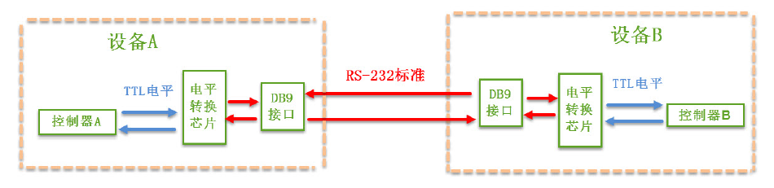
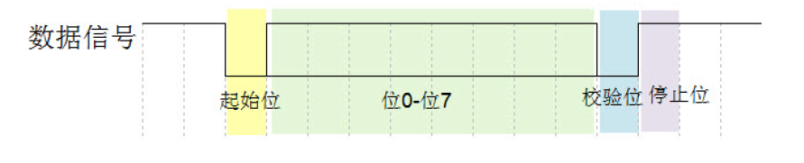
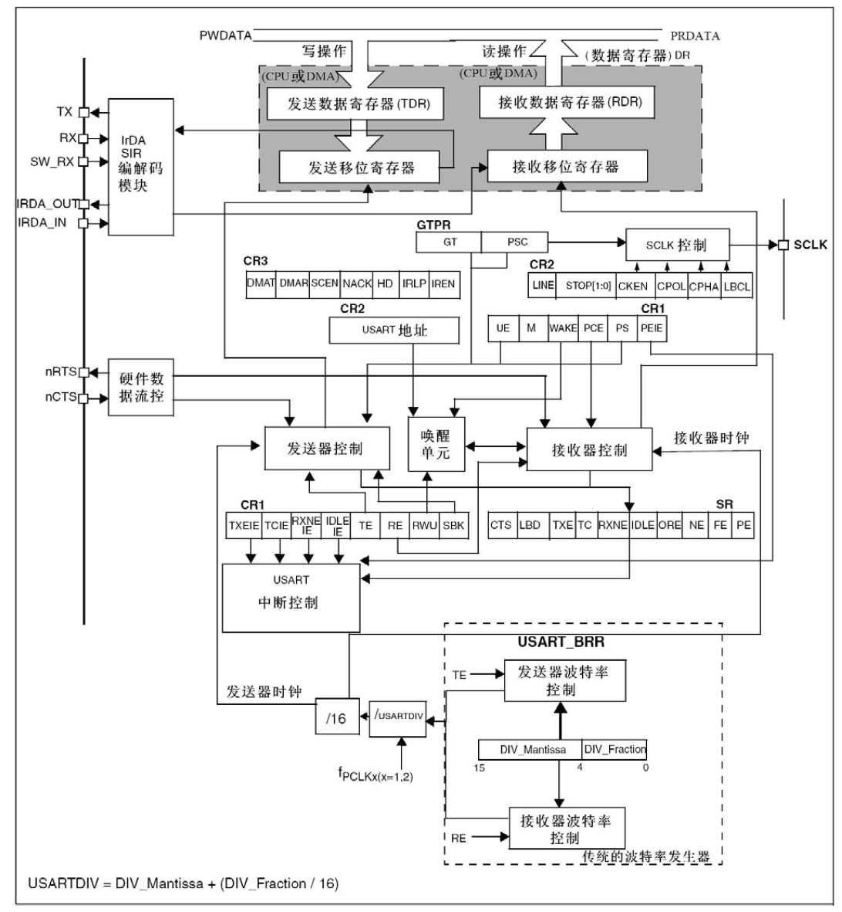
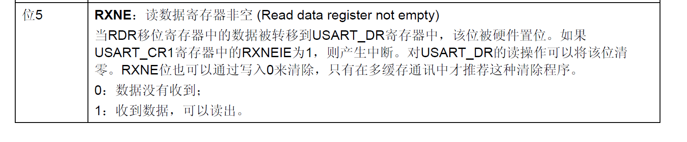

# STM32：UART-回环通信

## 前提摘要

1. 个人说明：

   - **限于时间紧迫以及作者水平有限，本文错误、疏漏之处恐不在少数，恳请读者批评指正。意见请留言或者发送邮件至：“[Email:noahpanzzz@gmail.com](noahpanzzz@gmail.com)”**。
   - **本博客的工程文件均存放在：[GitHub:https://github.com/panziping](https://github.com/panziping)。**
   - **本博客的地址：[CSDN:https://blog.csdn.net/ZipingPan](https://blog.csdn.net/ZipingPan)**。
2. 参考：

   - 正点原子
   - 野火
   - ST数据手册

---

## 正文

### 物理层



> ​	这里使用的是异步串行通信（UART），没有提供主动时钟触发数据。（区别于USART）

### 电平标准

串口通讯分为TTL标准和RS-232标准。

| 通讯标准  |             电平标准             |
| :-------: | :------------------------------: |
| 5V    TTL |  逻辑1：2.4V~5V；逻辑0：0~0.5V   |
|  RS-232   | 逻辑1：-15V~-3V；逻辑0：+3V~+15V |

### 接口标准（DB9）

| 序号 |        名称         | 符号 | 数据方向 |                             说明                             |
| :--: | :-----------------: | :--: | :------: | :----------------------------------------------------------: |
|  1   |      载波检测       | DCD  | DTE→DCE  | Data Carrier Detect，数据载波检测，用于DTE告知对方，本机是否收到对方的载波信号 |
|  2   |      接收数据       | RXD  | DTE←DCE  |                  Receive Data，数据接收信号                  |
|  3   |      发送数据       | TXD  | DTE→DCE  |                 Transmit Data，数据发送信号                  |
|  4   | 数据终端（DTE）就绪 | DTR  | DTE→DCE  | Data Terminal Ready，数据终端就绪，用于DTE向对方告知本机是否已准备好 |
|  5   |       信号地        | GND  |    -     |                            共地线                            |
|  6   | 数据设备（DCE）就绪 | DSR  | DTE←DCE  | Data Set Ready，数据发送就绪，用于DCE告知对方本机是否处于待命状态 |
|  7   |      请求发送       | RTS  | DTE→DCE  |  Request To Send，请求发送，DTE请求DCE本设备向DCE端发送数据  |
|  8   |      允许发送       | CTS  | DTE←DCE  | Clear To Send，允许发送，DCE回应对方的RTS发送请求，告知对方是否可以发送数据 |
|  9   |      响铃指示       |  RI  | DTE←DCE  |       Ring Indicator，响铃指示，表示DCE端与线路已接通        |

> **实际使用中，受限于设备IO较少，成本等因素，只保留了RXD,TXD,GND三条信号线。**

### 串口协议




### USART基本结构




### 编程要点

1. 使能RX 和TX 引脚GPIO 时钟和USART 时钟；
2. 初始化GPIO，并将GPIO 复用到USART 上；
3. 配置USART 参数；
4. 配置中断控制器并使能USART中断；

#### UART初始化结构体

```c
typedef struct
{
  uint32_t USART_BaudRate;
  uint16_t USART_WordLength;
  uint16_t USART_StopBits;
  uint16_t USART_Parity;
  uint16_t USART_Mode;
  uint16_t USART_HardwareFlowControl;
} USART_InitTypeDef;
```

#### 配置串口

**串口硬件相关宏定义，bsp_uart.h**

```c
#ifndef __BSP_UART_H
#define __BSP_UART_H

#include "stm32f10x.h"
#include <stdio.h>


#define RCC_UART_GPIO_Clk_Cmd           RCC_APB2PeriphClockCmd
#define RCC_UART_GPIO_Clk               RCC_APB2Periph_GPIOA

#define UART_GPIO_Tx_Pin                GPIO_Pin_9
#define UART_GPIO_Tx_Port               GPIOA

#define UART_GPIO_Rx_Pin                GPIO_Pin_10
#define UART_GPIO_Rx_Port               GPIOA

#define BSP_USARTx                      USART1 
#define RCC_UART_Clk_Cmd                RCC_APB2PeriphClockCmd
#define RCC_UART_Clk                    RCC_APB2Periph_USART1
#define UART_BaudRate                   115200

#define BSP_USARTx_IRQHandler           USART1_IRQHandler

void BSP_UART_Init(void);

#endif /* __BSP_UART_H */


```


**串口模块配置，bsp_uart.c**

```c
static void BSP_UART_GPIO_Config(void)
{
    GPIO_InitTypeDef GPIO_InitStructure;
    RCC_UART_GPIO_Clk_Cmd(RCC_UART_GPIO_Clk,ENABLE);
    GPIO_InitStructure.GPIO_Pin = UART_GPIO_Tx_Pin;
    GPIO_InitStructure.GPIO_Mode = GPIO_Mode_AF_PP;
    GPIO_InitStructure.GPIO_Speed = GPIO_Speed_50MHz;
    GPIO_Init(UART_GPIO_Tx_Port,&GPIO_InitStructure);

    GPIO_InitStructure.GPIO_Pin = UART_GPIO_Rx_Pin;
    GPIO_InitStructure.GPIO_Mode = GPIO_Mode_IN_FLOATING;
    GPIO_Init(UART_GPIO_Rx_Port,&GPIO_InitStructure);
}


static void BSP_UART_Config(void)
{
    USART_InitTypeDef USART_InitStructure;
    RCC_UART_Clk_Cmd(RCC_UART_Clk,ENABLE);
    USART_InitStructure.USART_BaudRate = UART_BaudRate;
    USART_InitStructure.USART_HardwareFlowControl = USART_HardwareFlowControl_None;
    USART_InitStructure.USART_Mode = USART_Mode_Rx | USART_Mode_Tx;
    USART_InitStructure.USART_Parity = USART_Parity_No;
    USART_InitStructure.USART_StopBits =USART_StopBits_1;
    USART_InitStructure.USART_WordLength =USART_WordLength_8b;
    USART_Init(BSP_USARTx,&USART_InitStructure);
    USART_ITConfig(BSP_USARTx,USART_IT_RXNE,ENABLE);
    USART_Cmd(BSP_USARTx,ENABLE);
}


void BSP_UART_Init(void)
{
    BSP_UART_Config();
    BSP_UART_GPIO_Config();
}
```


#### 串口环路收发

**主函数，main.c**

```c
#include "stm32f10x.h"

void BSP_NVIC_Config(void)
{
    NVIC_InitTypeDef NVIC_InitStructure;
    NVIC_PriorityGroupConfig(NVIC_PriorityGroup_0);
    NVIC_InitStructure.NVIC_IRQChannel = USART1_IRQn;
    NVIC_InitStructure.NVIC_IRQChannelPreemptionPriority = 0;
    NVIC_InitStructure.NVIC_IRQChannelSubPriority = 0;
    NVIC_InitStructure.NVIC_IRQChannelCmd = ENABLE;
    NVIC_Init(&NVIC_InitStructure);
}

int main(void)
{
    BSP_NVIC_Config();
    BSP_UART_Init();
    while(1)
    {
        
    }
}
```

**中断服务，stm32f10x_it.c**

```c
void BSP_USARTx_IRQHandler(void)
{
  uint16_t data_temp;
  if(USART_GetITStatus(BSP_USARTx, USART_IT_RXNE) != RESET)
  {   
    /* Read one byte from the receive data register */
    data_temp = USART_ReceiveData(BSP_USARTx);
    USART_SendData(BSP_USARTx,data_temp);
  }
}
```



这里使用软件清除RXNE标志，对USART_DR读操作可以将该位清零。


## 总结


---

**本文均为原创，欢迎转载，请注明文章出处：[CSDN:https://blog.csdn.net/ZipingPan/ARM](https://blog.csdn.net/zipingpan/category_12627684.html)。百度和各类采集站皆不可信，搜索请谨慎鉴别。技术类文章一般都有时效性，本人习惯不定期对自己的博文进行修正和更新，因此请访问出处以查看本文的最新版本。**

**非原创博客会在文末标注出处，由于时效原因，可能并不是原创作者地址（已经无法溯源）。**
