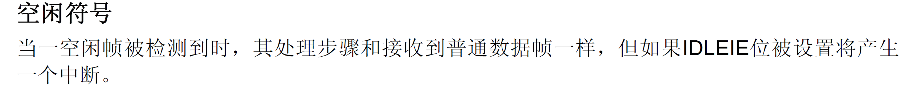
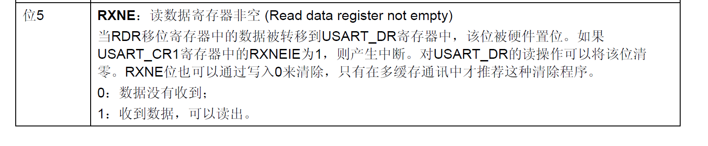
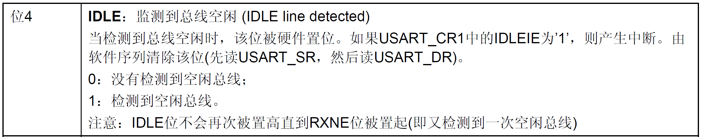

# STM32：UART-接收不定长数据

## 前提摘要

1. 个人说明：

   - **限于时间紧迫以及作者水平有限，本文错误、疏漏之处恐不在少数，恳请读者批评指正。意见请留言或者发送邮件至：“[Email:noahpanzzz@gmail.com](noahpanzzz@gmail.com)”**。
   - **本博客的工程文件均存放在：[GitHub:https://github.com/panziping](https://github.com/panziping)。**
   - **本博客的地址：[CSDN:https://blog.csdn.net/ZipingPan](https://blog.csdn.net/ZipingPan)**。
2. 参考：

   - 正点原子
   - 野火
   - ST数据手册

---

## 正文

### 空闲帧



一空闲帧所需要的时间：1位起始位+8位数据位+1位校验位+1位停止位。

### 编程要点

**串口硬件相关宏定义，bsp_uart.h**

```c
#ifndef __BSP_UART_H
#define __BSP_UART_H

#include "stm32f10x.h"
#include <stdio.h>


#define RCC_UART_GPIO_Clk_Cmd           RCC_APB2PeriphClockCmd
#define RCC_UART_GPIO_Clk               RCC_APB2Periph_GPIOA

#define UART_GPIO_Tx_Pin                GPIO_Pin_9
#define UART_GPIO_Tx_Port               GPIOA

#define UART_GPIO_Rx_Pin                GPIO_Pin_10
#define UART_GPIO_Rx_Port               GPIOA

#define BSP_USARTx                      USART1 
#define RCC_UART_Clk_Cmd                RCC_APB2PeriphClockCmd
#define RCC_UART_Clk                    RCC_APB2Periph_USART1
#define UART_BaudRate                   115200

#define BSP_USARTx_IRQHandler           USART1_IRQHandler

void BSP_UART_Init(void);

#endif /* __BSP_UART_H */


```


**串口模块配置，bsp_uart.c**

```c
#include "bsp_uart.h"

static void BSP_UART_GPIO_Config(void)
{
    GPIO_InitTypeDef GPIO_InitStructure;
    RCC_UART_GPIO_Clk_Cmd(RCC_UART_GPIO_Clk,ENABLE);
    GPIO_InitStructure.GPIO_Pin = UART_GPIO_Tx_Pin;
    GPIO_InitStructure.GPIO_Mode = GPIO_Mode_AF_PP;
    GPIO_InitStructure.GPIO_Speed = GPIO_Speed_50MHz;
    GPIO_Init(UART_GPIO_Tx_Port,&GPIO_InitStructure);

    GPIO_InitStructure.GPIO_Pin = UART_GPIO_Rx_Pin;
    GPIO_InitStructure.GPIO_Mode = GPIO_Mode_IN_FLOATING;
    GPIO_Init(UART_GPIO_Rx_Port,&GPIO_InitStructure);
}


static void BSP_UART_Config(void)
{
    USART_InitTypeDef USART_InitStructure;
    RCC_UART_Clk_Cmd(RCC_UART_Clk,ENABLE);
    USART_InitStructure.USART_BaudRate = UART_BaudRate;
    USART_InitStructure.USART_HardwareFlowControl = USART_HardwareFlowControl_None;
    USART_InitStructure.USART_Mode = USART_Mode_Rx | USART_Mode_Tx;
    USART_InitStructure.USART_Parity = USART_Parity_No;
    USART_InitStructure.USART_StopBits =USART_StopBits_1;
    USART_InitStructure.USART_WordLength =USART_WordLength_8b;
    USART_Init(BSP_USARTx,&USART_InitStructure);
    USART_ITConfig(BSP_USARTx,USART_IT_RXNE,ENABLE);
    USART_ITConfig(BSP_USARTx,USART_IT_IDLE,ENABLE);
    
    USART_Cmd(BSP_USARTx,ENABLE);
}


void BSP_UART_Init(void)
{
    BSP_UART_Config();
    BSP_UART_GPIO_Config();
}
```

### 串口不定长数据接收

**主函数，main.c**

```c
#define data_size   100

typedef struct{
    uint16_t flag;
    uint16_t len;
    char data[data_size];
}Data_TypeDef;


void Data_Process(Data_TypeDef* Data_Struct)
{
    Usart_SendString(BSP_USARTx,Data_Struct->data);
    
    Data_Struct->flag = 0;
    Data_Struct->len = 0;
}


void BSP_NVIC_Config(void)
{
    NVIC_InitTypeDef NVIC_InitStructure;
    NVIC_PriorityGroupConfig(NVIC_PriorityGroup_0);
    NVIC_InitStructure.NVIC_IRQChannel = USART1_IRQn;
    NVIC_InitStructure.NVIC_IRQChannelPreemptionPriority = 0;
    NVIC_InitStructure.NVIC_IRQChannelSubPriority = 0;
    NVIC_InitStructure.NVIC_IRQChannelCmd = ENABLE;
    NVIC_Init(&NVIC_InitStructure);
}


Data_TypeDef Data_Structure;

int main(void) 
{
    BSP_UART_Init();
    BSP_NVIC_Config();
    while(1)
    {
        if(Data_Structure.flag == 1)
        {
            Data_Process(&Data_Structure);
        }
    }
}
```

**中断服务，stm32f10x_it.c**

```c
extern Data_TypeDef Data_Structure;

void BSP_USARTx_IRQHandler(void)
{
  if(USART_GetITStatus(BSP_USARTx, USART_IT_RXNE) != RESET)
  {   
    /* Read one byte from the receive data register */
    Data_Struct.data[Data_Structure.len] = USART_ReceiveData(BSP_USARTx);
    if(++Data_Structure.len > data_size - 2)
    {
        Data_Struct.len = 0;
    }

  }
  if(USART_GetITStatus(BSP_USARTx,USART_IT_IDLE) != RESET)
  {
        BSP_USARTx->SR;
        BSP_USARTx->DR;
        Data_Structure.data[Data_Structure.len] = '\0'; 
        Data_Structure.flag = 1;
  }

}
```



这里使用软件清除RXNE标志，对USART_DR读操作可以将该位清零。



这里使用软件清除IDLE标志，对USART_SR,USART_DR读操作可以将该位清零。


## 总结


---

**本文均为原创，欢迎转载，请注明文章出处：[CSDN:https://blog.csdn.net/ZipingPan/ARM](https://blog.csdn.net/zipingpan/category_12627684.html)。百度和各类采集站皆不可信，搜索请谨慎鉴别。技术类文章一般都有时效性，本人习惯不定期对自己的博文进行修正和更新，因此请访问出处以查看本文的最新版本。**

**非原创博客会在文末标注出处，由于时效原因，可能并不是原创作者地址（已经无法溯源）。**
