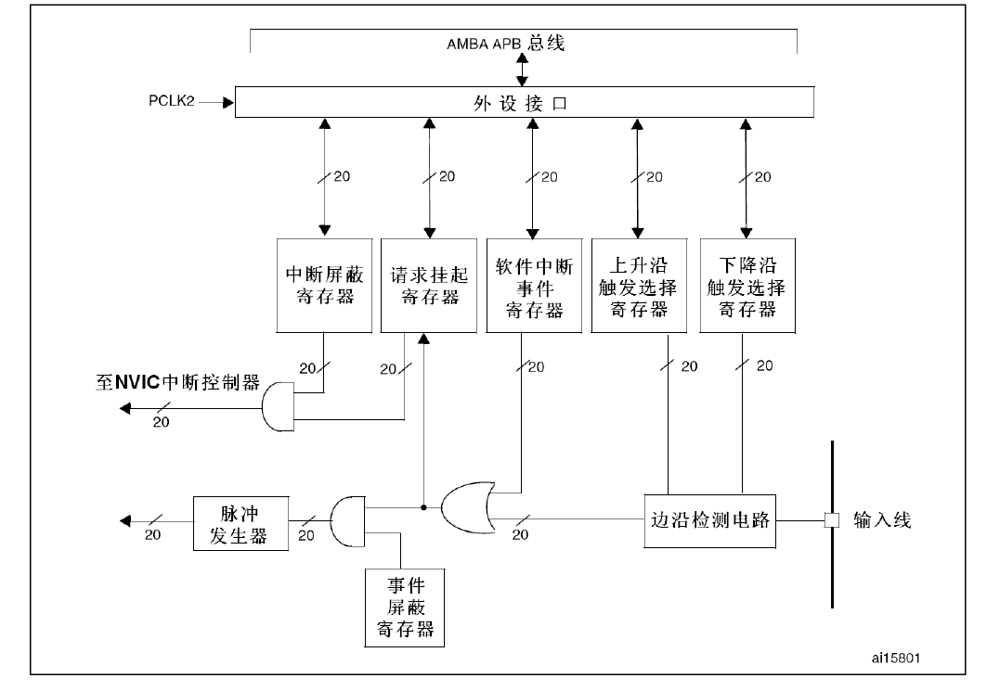

# STM32：中断

## 前提摘要

1. 个人说明：

   - **限于时间紧迫以及作者水平有限，本文错误、疏漏之处恐不在少数，恳请读者批评指正。意见请留言或者发送邮件至：“[Email:noahpanzzz@gmail.com](noahpanzzz@gmail.com)”**。
   - **本博客的工程文件均存放在：[GitHub:https://github.com/panziping](https://github.com/panziping)。**
   - **本博客的地址：[CSDN:https://blog.csdn.net/ZipingPan](https://blog.csdn.net/ZipingPan)**。
2. 参考：

   - 正点原子
   - 野火
   - ST数据手册

---

## 正文

> 前言：使用中断，在检测到中断事件发生之后，需要立即清除中断标志，防止中断嵌套失败。最好不要在中断函数中执行时间消耗太多的操作。
>
> 建议在中断函数（前台）中设置标志信号，在应用程序（后台）中循环检测这个标志信号，并进行相应的操作。

中断：外部设备引起的中断。

异常：处理器内部引起的中断。

区别：中断与现行指令无关，由系统某事件引起的；异常与现行指令有关。系统异常，内核；外部中断，外设。

可以简单认为：**中断就是异常，异常就是中断**。

**STM32F10xxx中断异常向量表中有内核中断 10个，外设中断 60个。**


### 嵌套向量中断控制器(NVIC)

#### NVIC寄存器

NVIC为ARM内核外设，具体查看Cortex-M3编程手册。

在core_cm3.h有关于NVIC结构体定义：

```c
typedef struct {
	__IO uint32_t ISER[8]; 		
	uint32_t RESERVED0[24];
	__IO uint32_t ICER[8]; 		
	uint32_t RSERVED1[24];
	__IO uint32_t ISPR[8]; 		
	uint32_t RESERVED2[24];
	__IO uint32_t ICPR[8]; 		
	uint32_t RESERVED3[24];
	__IO uint32_t IABR[8]; 		
	uint32_t RESERVED4[56];
	__IO uint8_t IP[240]; 		
	uint32_t RESERVED5[644];
	__O uint32_t STIR; 			
} NVIC_Type;
```


#### 优先级定义

外设中断优先级寄存器**（NVIC->IPRx）**，内核中断优先级寄存器**（SCB->SHPRx）**。

寄存器宽度为8Bits，原则上可以配置优先级为0~255，数值越小，优先级越大。但是绝大数CM3芯片都会精简设计，**F103只使用高4bit**。

|  bit7  |  bit6  |  bit5  |  bit4  |      bit3       |      bit2       |      bit1       |      bit0       |
| :----: | :----: | :----: | :----: | :-------------: | :-------------: | :-------------: | :-------------: |
| 优先级 | 优先级 | 优先级 | 优先级 | 未使用，读回为0 | 未使用，读回为0 | 未使用，读回为0 | 未使用，读回为0 |

优先级4Bits，又被分为抢先优先级和子优先级。

**优先级判断：抢占优先级>子优先级>中断向量表中优先级**

先比较抢占优先级，再比较子优先级，如果相同，则比较中断向量表中的硬件标号。


#### 内核中断与外设中断怎么判断优先级呢？

内核中断优先级：内核中断优先级跟外设中断优先级有所区别，并没有抢占优先级和子优先级。

**NVIC的中断优先级分组不仅对片上外设有效，同时对内核外设有效。**

**例子：SysTick**

NVIC的优先级分组为2,SysTick的优先级为15。

则抢占优先级为3，子优先级为3。


### 中断定义

**中断向量表**定义在stm32f10x.h。

**中断服务函数名**定义在startup_stm32f10x_hd.s。

在启动文件中，为所有的中断服务函数分配好存储单元(DCD xxx_IRQHandler)，但是都是弱函数（weak）。当检测到中断事件，则指针跳转到这片存储单元。

建议真正的中断服务函数都在stm32f10x_it.c中定义，方便管理。**需要注意中断函数名不能写错！**


#### EXTI（外部中断事件控制器）

##### EXTI基本结构



#### 编程指南：

1. 使能中断请求
   - 使能外设中断
   - 使能NVIC中断使能

2. 配置中断优先级分组

3. 初始化NVIC结构体，初始化外设

4. 编写中断服务函数

   - 首先确认是否产生中断，

   - 若产生中断，执行相依操作

   - 最后清除中断标志

##### 外部中断 

###### 示例1 ：检测按键上升沿，控制LED翻转。

1. 初始化要连接到EXTI的GPIO。
2. 初始化EXTI。
3. 初始化NVIC。
4. 编写中断服务函数。

**硬件相关宏定义，bsp_gpio.h**

```c
#ifndef __BSP_GPIO_H
#define __BSP_GPIO_H

#include "stm32f10x.h"

#define BSP_GPIO_KEY_Clk            RCC_APB2Periph_GPIOA|RCC_APB2Periph_GPIOC
#define BSP_GPIO_KEY_Clk_Cmd        RCC_APB2PeriphClockCmd
#define BSP_GPIO_KEY1_Port          GPIOA
#define BSP_GPIO_KEY1_Pin           GPIO_Pin_0
#define BSP_GPIO_KEY2_Port          GPIOC
#define BSP_GPIO_KEY2_Pin           GPIO_Pin_13
          
#define BSP_EXTI_KEY_Clk            RCC_APB2Periph_AFIO
#define BSP_EXTI_KEY_Clk_Cmd        RCC_APB2PeriphClockCmd

#define BSP_EXTI_KEY1_Line          EXTI_Line0
#define BSP_EXTI_KEY1_PortSource    GPIO_PortSourceGPIOA
#define BSP_EXTI_KEY1_PinSource     GPIO_PinSource0
#define BSP_EXTI_KEY1_IRQHandler    EXTI0_IRQHandler
#define BSP_EXTI_KEY1_IRQ           EXTI0_IRQn


#define BSP_EXTI_KEY2_Line          EXTI_Line13
#define BSP_EXTI_KEY2_PortSource    GPIO_PortSourceGPIOC
#define BSP_EXTI_KEY2_PinSource     GPIO_PinSource13
#define BSP_EXTI_KEY2_IRQHandler    EXTI15_10_IRQHandler
#define BSP_EXTI_KEY2_IRQ           EXTI15_10_IRQn

#define KEY_PRESS				    1
#define KEY_UP                      0

void BSP_GPIO_Init(void);

#endif /* __BSP_GPIO_H */

```

**exti，gpio模块配置，bsp_gpio.c**

```c
static void BSP_GPIO_KEY_Config(void)
{
    GPIO_InitTypeDef GPIO_InitStructure;
    BSP_GPIO_KEY_Clk_Cmd(BSP_GPIO_KEY_Clk,ENABLE);
    
    GPIO_InitStructure.GPIO_Pin = BSP_GPIO_KEY1_Pin;
    GPIO_InitStructure.GPIO_Mode = GPIO_Mode_IN_FLOATING;
    GPIO_Init(BSP_GPIO_KEY1_Port,&GPIO_InitStructure);
    
    GPIO_InitStructure.GPIO_Pin = BSP_GPIO_KEY2_Pin;
    GPIO_InitStructure.GPIO_Mode = GPIO_Mode_IN_FLOATING;    
    GPIO_Init(BSP_GPIO_KEY2_Port,&GPIO_InitStructure);
}

static void BSP_EXTI_IT_GPIO_Config(void)
{
    EXTI_InitTypeDef EXTI_InitStructure;
    BSP_EXTI_KEY_Clk_Cmd(BSP_EXTI_KEY_Clk,ENABLE);
    EXTI_InitStructure.EXTI_Line = BSP_EXTI_KEY1_Line;
    EXTI_InitStructure.EXTI_Mode = EXTI_Mode_Interrupt;
    EXTI_InitStructure.EXTI_Trigger = EXTI_Trigger_Rising;
    EXTI_InitStructure.EXTI_LineCmd = ENABLE;
    EXTI_Init(&EXTI_InitStructure);
    GPIO_EXTILineConfig(BSP_EXTI_KEY1_PortSource,BSP_EXTI_KEY1_PinSource);
     
    EXTI_InitStructure.EXTI_Line = BSP_EXTI_KEY2_Line;
    EXTI_InitStructure.EXTI_Mode = EXTI_Mode_Interrupt;
    EXTI_InitStructure.EXTI_Trigger = EXTI_Trigger_Rising;
    EXTI_InitStructure.EXTI_LineCmd = ENABLE;
    EXTI_Init(&EXTI_InitStructure);
    GPIO_EXTILineConfig(BSP_EXTI_KEY2_PortSource,BSP_EXTI_KEY2_PinSource);    
}

void BSP_GPIO_Init(void)
{
    BSP_GPIO_KEY_Config();
    BSP_EXTI_IT_GPIO_Config();
}
```

**主函数，main.c**

```c
void BSP_NVIC_Config(void)
{
    NVIC_InitTypeDef NVIC_InitStructure;
    NVIC_PriorityGroupConfig(NVIC_PriorityGroup_0);
    NVIC_InitStructure.NVIC_IRQChannel = BSP_EXTI_KEY1_IRQ;
    NVIC_InitStructure.NVIC_IRQChannelCmd = ENABLE;
    NVIC_InitStructure.NVIC_IRQChannelPreemptionPriority = 0;
    NVIC_InitStructure.NVIC_IRQChannelSubPriority = 1;
    NVIC_Init(&NVIC_InitStructure);
    
    NVIC_InitStructure.NVIC_IRQChannel = BSP_EXTI_KEY2_IRQ;
    NVIC_InitStructure.NVIC_IRQChannelCmd = ENABLE;
    NVIC_InitStructure.NVIC_IRQChannelPreemptionPriority = 0;
    NVIC_InitStructure.NVIC_IRQChannelSubPriority = 2;
    NVIC_Init(&NVIC_InitStructure);
}

int main(void)
{
    BSP_NVIC_Config();
    BSP_EXTI_KEY_Config();
    while(1)
    {
        
    }
}

```

**中断服务，stm32f10x_it.c**

```c
void BSP_EXTI_KEY1_IRQHandler(void)
{
    if(EXTI_GetITStatus(BSP_EXTI_KEY1_Line) !=RESET)
    {
        EXTI_ClearITPendingBit(BSP_EXTI_KEY1_Line);
        /* User Logic Code */
    }
}

void BSP_EXTI_KEY2_IRQHandler(void)
{
    if(EXTI_GetITStatus(BSP_EXTI_KEY2_Line) !=RESET)
    {
        EXTI_ClearITPendingBit(BSP_EXTI_KEY2_Line);
         /* User Logic Code */
    }
}

```


###### 示例2：由于EXTIx同时连接PAx,PBx....，如何判断外部中断事件是发生在哪一个PIN。

EXTI0同时连接PA0和PB0，判断是由PA0产生中断还是PB0产生中断。

```c
void EXTI0_IRQHandler(void)
{
	if(EXTI_GetITStatus(EXTI_Line0) != RESET)
	{
        EXTI_ClearITPendingBit(EXTI_Line0);
		if(->IDR & GPIO_Pin_0 == 1)
			GPIO_LED_G_TOGGLE;
		if(GPIOB->IDR & GPIO_Pin_0 == 1)
			GPIO_LED_B_TOGGLE;
	}
}
```

Mark：该程序我经过实际测试，发现还是有问题。第一次事件无法检测。

目前demo板上按键有一个电容短路了。由于目前手上没有电容，不知道是不是硬件有没有问题。等以后有时间在具体试一下。


## 总结


---

**本文均为原创，欢迎转载，请注明文章出处：[CSDN:https://blog.csdn.net/ZipingPan/ARM](https://blog.csdn.net/zipingpan/category_12627684.html)。百度和各类采集站皆不可信，搜索请谨慎鉴别。技术类文章一般都有时效性，本人习惯不定期对自己的博文进行修正和更新，因此请访问出处以查看本文的最新版本。**

**非原创博客会在文末标注出处，由于时效原因，可能并不是原创作者地址（已经无法溯源）。**
