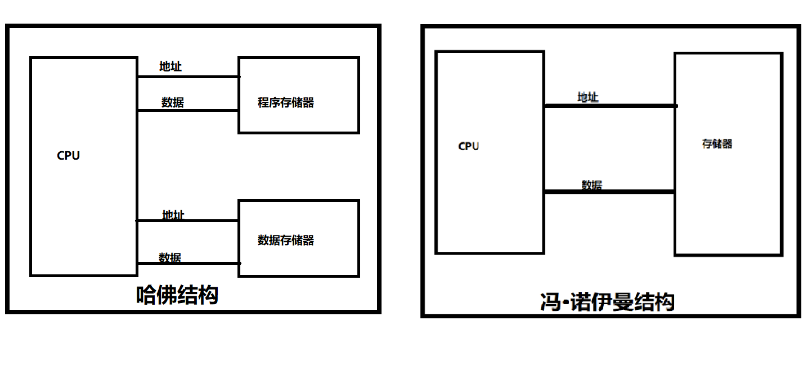
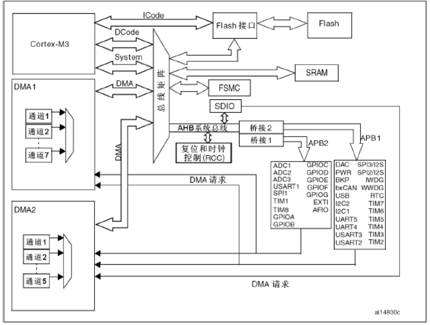
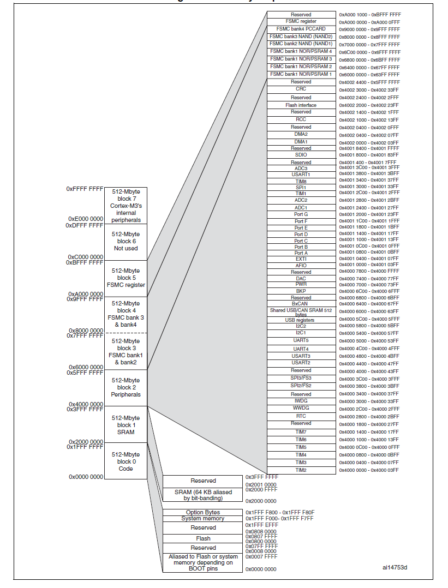

# STM32：系统架构&地址映射

## 前提摘要

1. 个人说明：

   - **限于时间紧迫以及作者水平有限，本文错误、疏漏之处恐不在少数，恳请读者批评指正。意见请留言或者发送邮件至：“[Email:noahpanzzz@gmail.com](noahpanzzz@gmail.com)”**。
   - **本博客的工程文件均存放在：[GitHub:https://github.com/panziping](https://github.com/panziping)。**
   - **本博客的地址：[CSDN:https://blog.csdn.net/ZipingPan](https://blog.csdn.net/ZipingPan)**。
2. 参考：

   - 正点原子
   - 野火
   - ST数据手册

---

## 正文

## 系统架构

CPU的核心主要功能为运算器和控制器，但是CPU并不具备数据存储的功能。CPU与外界存储器建立数据通道分为“哈佛结构”和“冯诺伊曼结构”两种不同思路。



冯诺伊曼结构的优点是总线资源占用少，缺点是执行效率较低，冯诺伊曼结构执行程序的同时不能读取数据。而相反的是哈佛结构的优点是执行效率较高，缺点是总线资源占用多，哈佛结构执行程序的同时能够读取数据。

如今半导体技术发展迅速，对于资源限制已经没有那么严重了。

### ST-ARM

ST公司设计的ARM架构芯片，采用的是“哈佛结构”，ICode总线直接连接到Flash，而不需要经过经过总线矩阵。



上图为STM32F1系列系统架构图。

## 地址映射

#### Cortex-M3

1. ARM Cortex-M3架构，32位CPU，所以就有32位地址线和数据线。
2. 32位地址线决定了CPU的地址空间为4G（2^32 = 4G,按字节寻址）。

### 地址映射规则

1. 芯片外接外部RAM和外部ROM的时候，RAM和ROM器件都是独立器件，并没有地址一说，或者说都只有自己的绝对地址，且从0x00开始。而对于CPU来说，0x00地址只能有1个，所以外接器件挂到CPU上时只能做地址映射，如RAM的地址为0x3000 0000, ROM地址为0x4000 0000, 这样CPU就做了统一编址。
2. 32位地址线决定了CPU的地址空间为4G，这些地址要统一分配使用，所以说内存（RAM）、外设（寄存器）和存储器（RAM）都需要被映射到这个4G空间里面，但是哪些占用低地址，哪些占用高地址？
3. 这些问题已经被ARM的设计者给设计好了的，地址从高到低如何使用，已经被规定好，而我们只需要学习这些规则就好了。掌握规则，并使用规则。
4. 因此可以想象到：ARM体系结构中，系统上电或复位后，处理器将从地址0x00处取第一条指令，因此，上电的时候，地址0x00处必须是非易失性的ROM或FLASH。
5. CPU地址总线的地址，由硬件电路控制其具体含义。物理地址中很大一部分是留给内存条中的内存的，但也常被映射到其他存储器上 （如显存、BIOS等）。就生成了物理地址，这个物理地址被放到CPU的地址线上。
6. 物理地址空间，一部分给物理RAM（内存）用，一部分给总线用，这是由硬件设计来决定的，但物理RAM一般不能上到4G，因为还有一部分要给总线用（总线上还挂着别的许多设备）。一般是把低端物理地址给RAM用，高端物理地址给总线用。

总结：地址映射就是给地址进行命名的过程。


#### 存储器映射

1. 存储器本身不具有地址信息，它的地址是由芯片厂商或用户分配的，给存储器分配地址的过程就称为存储器映射。
2. 在这 4G 的地址空间中，ARM 平均分成了 8 个块，每块 512MB，每个块也都规定了用途。每个块的大小都有 512MB，显然这是非常大的，芯片厂商在每个块的范围内设计各具特色的外设时并不一定都用得完，都是只用了其中的一部分而已。

|  序号   |         用途          |             地址范围             |
| :-----: | :-------------------: | :------------------------------: |
| Block 0 |         Code          | 0x0000 0000 ~ 0x1FFF FFFF(512MB) |
| Block 1 |         SRAM          | 0x2000 0000 ~ 0x3FFF FFFF(512MB) |
| Block 2 |       片上外设        | 0x4000 0000 ~ 0x5FFF FFFF(512MB) |
| Block 3 | FSMC 的 bank1 ~ bank2 | 0x6000 0000 ~ 0x7FFF FFFF(512MB) |
| Block 4 | FSMC 的 bank3 ~ bank4 | 0x8000 0000 ~ 0x9FFF FFFF(512MB) |
| Block 5 |      FSMC 寄存器      | 0xA000 0000 ~ 0xCFFF FFFF(512MB) |
| Block 6 |       没有使用        | 0xD000 0000 ~ 0xDFFF FFFF(512MB) |
| Block 7 |  Cortex-M3 内部外设   | 0xE000 0000 ~ 0xFFFF FFFF(512MB) |



上图为STM32F1系列存储器映射列表。

#### 寄存器映射

1. 寄存器是单片机内部一种特殊的内存，可以实现对单片机各个功能的控制，给寄存器分配地址的过程称为寄存器映射。

|    大类    |      小类      |                             说明                             |
| :--------: | :------------: | :----------------------------------------------------------: |
| 内存寄存器 | 内核相关寄存器 |              包含R0~R15、xPSR、特殊功能寄存器等              |
| 内存寄存器 | 中断控制寄存器 | 包含NVIC和SCB相关寄存器，NVIC有：ISER、ICER、ISPR、IP等；SCB有：VTOR、AIRCR、SCR等 |
| 内存寄存器 | SysTick寄存器  |             包含CTRL、LOAD、VAL和CALIB四个寄存器             |
| 内存寄存器 | 内存保护寄存器 |                   可选功能，STM32F103没有                    |
| 内存寄存器 | 调试系统寄存器 |               ETM、ITM、DWT、IPIU等相关寄存器                |
| 外设寄存器 |                |         包含GPIO、UART、IIC、SPI、TIM、DMA等各种外设         |

如果没有给寄存器映射，那么操作寄存器就会变得特别复杂。

**以GPIOA ODR寄存器为例，GPIOA ODR的地址为0x4001 080C**（寄存器地址=总线基地址+外设偏移地址+寄存器偏移量，以GPIOA_ODR为例,GPIOA_ODR=0x4001 0000 + 0x800 + 0x0C = 0x4001 080C。需要注意的是AHB总线基地址是从0x4001 8000开始的，但是在程序中定义是从0x4002 0000开始，将SDIO的地址单独独立出来)。

那么直接操作寄存器地址：

```c
*(unsigned int *)(0x4001 080C)=0xFFFF;
```

定义一个名字之后再操作：

```c
#define GPIOA_ODR *(unsigned int *)(0x4001 080C)
GPIOA_ODR =0xFFFF;
```

但是这样直接操作寄存器还是很复杂，因为寄存器的数量是非常多的。

##### 结构体映射

由于寄存器都是连续排列的，所以可以使用结构体进行映射(以GPIOA寄存器为例)。

```c
typedef struct
{
	__IO uint32_t CRL;
	__IO uint32_t CRH;
	__IO uint32_t IDR;
	__IO uint32_t ODR;
	__IO uint32_t BSRR;
	__IO uint32_t BRR;
	__IO uint32_t LCKR;
}GPIO_TypeDef;

#define PERIPH_BASE           ((uint32_t)0x40000000) /*!< Peripheral base address in the alias region */
#define APB2PERIPH_BASE       (PERIPH_BASE + 0x10000)
#define GPIOA_BASE            (APB2PERIPH_BASE + 0x0800)
#define GPIOA               ((GPIO_TypeDef *) GPIOA_BASE)
```

那么GPIOA中CRL、CRH、IDR、ODR、BSRR、BRR、LCKR各个地址：

```c
&GPIOA->CRL:0x40010800
&GPIOA->CRH:0x40010804
&GPIOA->IDR:0x40010808
&GPIOA->ODR:0x4001080c
&GPIOA->BSRR:0x40010810
&GPIOA->BRR:0x40010814
&GPIOA->LCKR:0x40010818
```

注：关于__IO

```c
#ifdef __cplusplus
  #define     __I     volatile                /*!< defines 'read only' permissions      */
#else
  #define     __I     volatile const          /*!< defines 'read only' permissions      */
#endif
#define     __O     volatile                  /*!< defines 'write only' permissions     */
#define     __IO    volatile                  /*!< defines 'read / write' permissions   */

```

volatile的英文解释是易变化的，不稳定的。所以在变量的前面加这个修饰符目的是让CPU去内存中读取数据，而不是CPU去寄存器读取数据。

由于外部因素使得内存中存放该变量的值发生了改变，如果CPU不访问内存，而是直接读取寄存器的旧值，则读取的是错误的，导致程序失败。


## 总结


---

**本文均为原创，欢迎转载，请注明文章出处：[CSDN:https://blog.csdn.net/ZipingPan/ARM](https://blog.csdn.net/zipingpan/category_12627684.html)。百度和各类采集站皆不可信，搜索请谨慎鉴别。技术类文章一般都有时效性，本人习惯不定期对自己的博文进行修正和更新，因此请访问出处以查看本文的最新版本。**

**非原创博客会在文末标注出处，由于时效原因，可能并不是原创作者地址（已经无法溯源）。**
