# Intel FPGA ：iic主机通信

## 前提摘要

1. 个人说明：

   - **限于时间紧迫以及作者水平有限，本文错误、疏漏之处恐不在少数，恳请读者批评指正。意见请留言或者发送邮件至：“[Email:noahpanzzz@gmail.com](noahpanzzz@gmail.com)”**。
   - **本博客的工程文件均存放在：[GitHub:https://github.com/panziping](https://github.com/panziping)。**
   - **本博客的地址：[CSDN:https://blog.csdn.net/ZipingPan](https://blog.csdn.net/ZipingPan)**。
2. 参考：

   - 芯片型号：Intel EP4CE10F17C8(Cyclone IV E)
   - 《数字电子技术基础》-阎石
   - 《FPGA自学笔记---设计与验证》袁玉卓，曾凯锋，梅雪松
   - 《Verilog 数字系统设计教程》夏宇闻
   - 《Verilog HDL 高级数字设计》Michael D.Ciletti
   - 《Intel FPGA/CPLD设计》（基础篇）王欣 王江宏等
   - 《Intel FPGA/CPLD设计》（高级篇）王江宏 蔡海宁等
   - 《综合与时序分析的设计约束 Synopsys设计约束（SDC）实用指南》Sridhar Gangadharan

---

## 正文

### 物理层

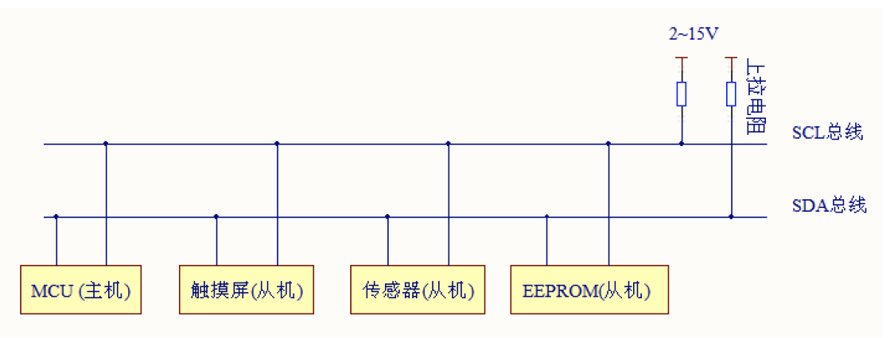

- 它是一个支持设备的总线。“总线”指多个设备共用的信号线。在一个I2C 通讯总线中，可连接多个I2C 通讯设备，支持多个通讯主机及多个通讯从机。
- 一个I2C 总线只使用两条总线线路，一条双向串行数据线(SDA) ，一条串行时钟线(SCL)。数据线即用来表示数据，时钟线用于数据收发同步。
- 每个连接到总线的设备都有一个独立的地址，主机可以利用这个地址进行不同设备之间的访问。
- 总线通过上拉电阻接到电源。当I2C 设备空闲时，会输出高阻态，而当所有设备都空闲，都输出高阻态时，由上拉电阻把总线拉成高电平。
- 多个主机同时使用总线时，为了防止数据冲突，会利用仲裁方式决定由哪个设备占用总线。
- 具有三种传输模式：标准模式传输速率为100kbit/s ，快速模式为400kbit/s ，高速模式下可达3.4Mbit/s，但目前大多I2C 设备尚不支持高速模式。
- 连接到相同总线的IC 数量受到总线的最大电容400pF 限制。

### 协议层(一主多从)

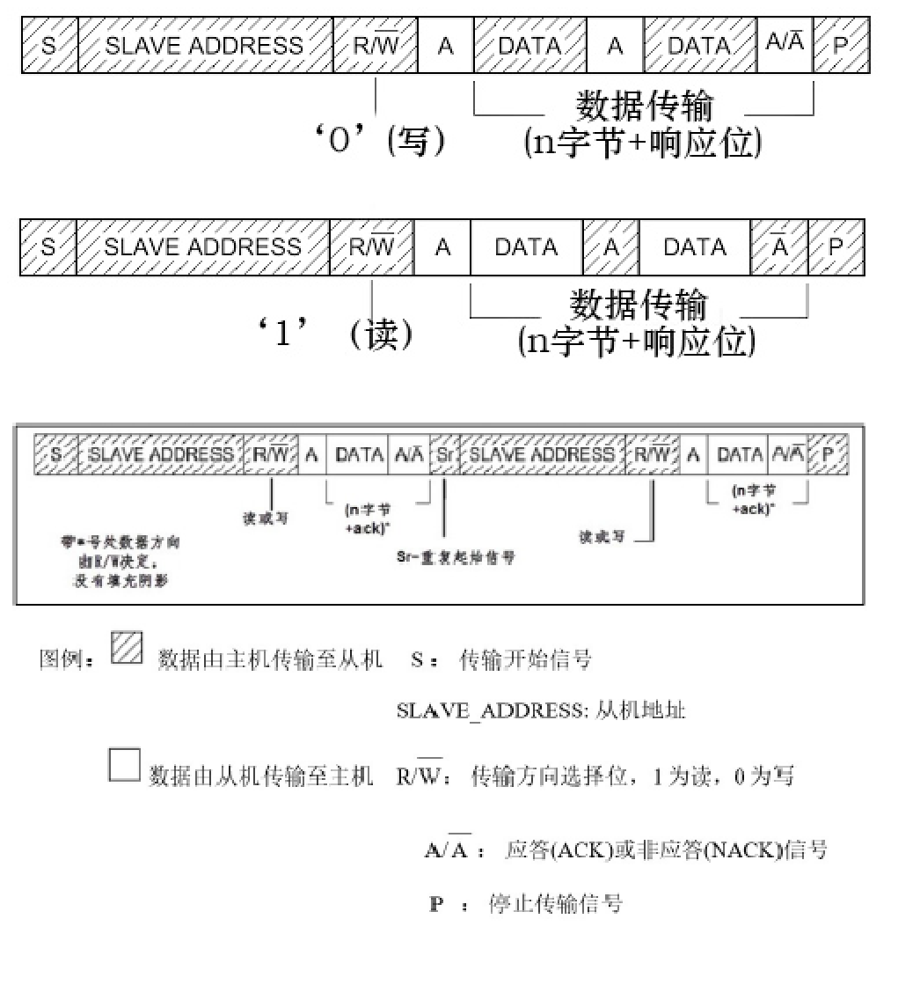

- 起始信号和终止信号

  起始信号：当SCL 线是高电平时SDA 线从高电平向低电平切换，这个情况表示通讯的起始。

  终止信号：当SCL 是高电平时SDA 线由低电平向高电平切换，表示通讯的停止。

  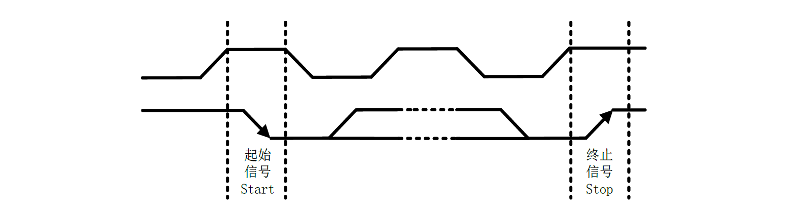

- 数据有效性

  传输时，SCL 为高电平的时候SDA 表示的数据有效，即此时的SDA 为高电平时表示数据“1”，为低电平时表示数据“0”；当SCL 为低电平时，SDA的数据无效，一般在这个时候SDA 进行电平切换，为下一次表示数据做好准备。

  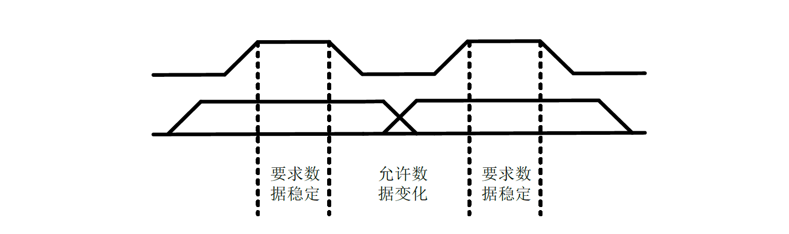

- 应答信号

  当数据发出方（不一定是主机还是从机）将8 位数据或命令传出后，会将数据总线（SDA）释放，即设置为输入，然后等待数据接收方将SDA 信号拉低以作为成功接收的应答信号；无论是什么状态，I2C 总线的SCL 信号始终由I2C 主机驱动。

  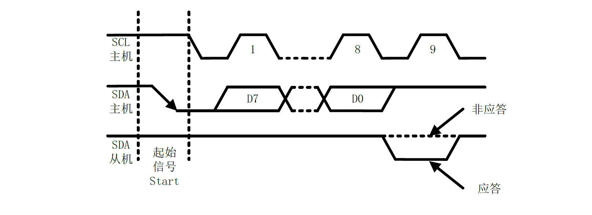

  

### 波形图

- 起始信号

  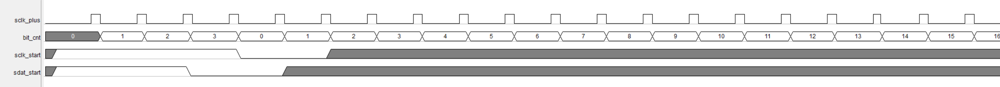

- 写数据

  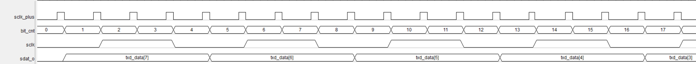

- 读数据

  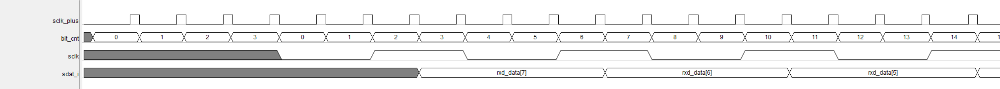

  

- 终止信号

  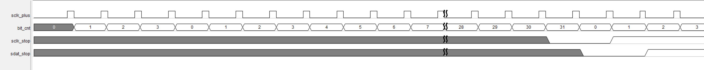

- 主机产生ACK/NACK

  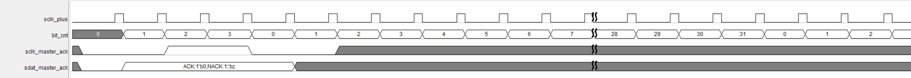

- 从机产生ACK

  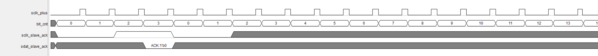

## 总结

---

**本文均为原创，欢迎转载，请注明文章出处：[CSDN:https://blog.csdn.net/ZipingPan/FPGA](https://blog.csdn.net/zipingpan/category_12609215.html)。百度和各类采集站皆不可信，搜索请谨慎鉴别。技术类文章一般都有时效性，本人习惯不定期对自己的博文进行修正和更新，因此请访问出处以查看本文的最新版本。**

**非原创博客会在文末标注出处，由于时效原因，可能并不是原创作者地址（已经无法溯源）。**

